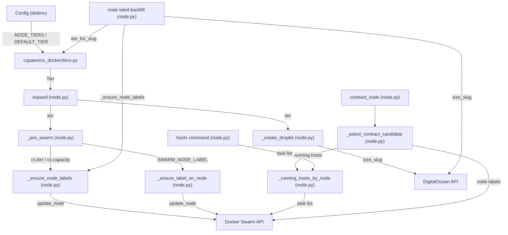

<!-- CLASI: Before changing code or making plans, review the SE process in CLAUDE.md -->

# Architecture Update — Sprint 003: Multi-size node provisioning

## What Changed

### New Module: `cspawn/cs_docker/tiers.py`

Introduces the `Tier` dataclass and all config-parsing helpers. This module is the single
place that reads `NODE_TIERS` / `DEFAULT_TIER` / `DEFAULT_CAPACITY` from config. No other
module reads these keys raw.

```
Tier(name: str, slug: str, capacity: int)   # frozen dataclass
load_tiers(cfg) -> list[Tier]               # parse NODE_TIERS JSON; fallback to DO_SIZE
default_tier(cfg) -> Tier                   # DEFAULT_TIER name, else tiers()[0]
tier_by_name(cfg, name) -> Tier | None
tier_for_slug(cfg, slug) -> Tier | None     # reverse lookup for backfill
default_capacity(cfg) -> int                # DEFAULT_CAPACITY, else 6
```

Fallback rule: if `NODE_TIERS` is absent, `load_tiers` synthesizes
`[Tier(name="default", slug=cfg["DO_SIZE"], capacity=default_capacity(cfg))]`.
This makes all new code branch-free for legacy configs.

### Modified: `cspawn/cli/node.py`

**New helpers (module-level functions):**

- `_ensure_node_labels(manager_client, node_name, labels: dict[str, str], log) -> bool`
  Merges key=value pairs into `Spec.Labels` using the same `inspect_node`/`update_node`
  API calls as `_ensure_label_on_node`. Idempotent: skips keys whose values already match.
  The existing `_ensure_label_on_node` is **not changed** — it continues to serve
  `SWARM_NODE_LABEL` (boolean `key=true` semantics).

- `_running_hosts_by_node(client) -> dict[str, int]`
  Extracts the per-node host count logic from the `hosts` command body into a reusable
  function. Returns `{short_name: running_count}`. Both `hosts` and `contract` call this.

- `_select_contract_candidate(client, cfg) -> tuple[int, str] | None`
  Encapsulates the selection policy: eligible workers (non-leader, non-manager, matching
  `DO_NAMES`) that have zero running hosts, sorted by `(capacity ASC, serial DESC)`.
  Returns `(serial, fqdn)` of the candidate or `None` if none qualify. The future
  autoscaler's scale-down path will call this directly.

**Modified: `expand` command (line ~1687)**

- New option: `@click.option("--tier", "tier_name", ...)`.
- Replaces `do_size = cfg.get("DO_SIZE", ...)` with tier resolution via `tiers.py`.
- Passes `tier` object through to `_create_droplet` (new `tier` keyword argument) and
  then to `_join_swarm` (new `tier: Tier | None = None` parameter).

**Modified: `_create_droplet` (line ~719)**

- Adds `tier: Tier | None = None` parameter.
- Reads `do_size = tier.slug if tier else cfg.get("DO_SIZE", "s-1vcpu-1gb")`.
- All other behavior unchanged.

**Modified: `_join_swarm` (line ~898)**

- Adds `tier: Tier | None = None` parameter.
- After the existing `SWARM_NODE_LABEL` block (line ~1073), calls
  `_ensure_node_labels(manager_client, name, {"cs.tier": tier.name, "cs.capacity": str(tier.capacity)})`
  when `tier is not None`.
- Skips `cs.*` labeling when `tier is None` (e.g. `expand --join` on a pre-existing node).

**New command: `node label-backfill`**

- `@node.command(name="label-backfill")`
- Options: `--apply` (write mode; default is dry-run).
- For each swarm node matching `DO_NAMES` that lacks `cs.tier`:
  resolves the DO droplet via the existing tag/project lookup pattern,
  reads `droplet.size_slug`, maps via `tier_for_slug`, prints a table row.
  With `--apply`: calls `_ensure_node_labels`.

**Modified: `contract_node` command (line ~1823)**

- Replaces inline selection logic with `_select_contract_candidate(client, cfg)`.
- Replaces inline host count query with `_running_hosts_by_node(client)`.
- Enforces empty-only gate: if `_select_contract_candidate` returns `None`, prints
  "No empty node to contract." and exits cleanly.

### Modified: Config files

Three files each gain three new keys:

```
# config/prod/public.env, config/local-prod/public.env, config/devel/public.env
NODE_TIERS=[{"name":"small","slug":"s-4vcpu-8gb-amd","capacity":6},{"name":"large","slug":"s-8vcpu-16gb-amd","capacity":14}]
DEFAULT_TIER=small
DEFAULT_CAPACITY=6
# DO_SIZE retained as-is for backward compat
```

The devel config may use placeholder/test slugs. Capacity values are provisional
pending stakeholder confirmation (see Open Questions).

### Modified: `config/cloud-init/swarm-node-init-v2.yaml`

- Removes `docker.io` from `packages:`.
- Adds docker-ce pin to `runcmd` before `systemctl enable --now docker`:

```yaml
runcmd:
  - apt-get update -qq
  - >-
    apt-get install -y --allow-downgrades --allow-change-held-packages
    docker-ce=5:27.4.1-1~ubuntu.20.04~focal
    docker-ce-cli=5:27.4.1-1~ubuntu.20.04~focal
  - apt-mark hold docker-ce docker-ce-cli
  - systemctl enable --now docker
  # ... remaining runcmd steps (do-agent, ufw, sshd) follow unchanged ...
```

---

## Component / Module Diagram



## Data-Flow: Tier Selection at `expand`

```
config NODE_TIERS (JSON)
        │
        ▼
   load_tiers(cfg)   ──────────────────────────────────────────────────────┐
        │                                                                   │
   tier_by_name(name) ← --tier flag                                        │  absent NODE_TIERS
        │                                                                   │
        │ None if name unknown → ClickException                             │
        │                                                                   │
   else default_tier(cfg) ← DEFAULT_TIER or tiers()[0] ◄───────────────────┘
        │
        ▼
   Tier(name, slug, capacity)
        │          │
        │          ▼
        │     _create_droplet(do_size=slug)
        │          │
        ▼          ▼
   _join_swarm(tier=Tier)
        │
        ├── SWARM_NODE_LABEL (unchanged, boolean)
        └── cs.tier=name, cs.capacity=capacity  (new, via _ensure_node_labels)
```

---

## Why

The current provisioning code has three compounding defects:

1. **Single size**: `do_size = cfg.get("DO_SIZE", ...)` is hardcoded — no path to
   provision a different slug per invocation.
2. **No capacity signal**: without per-node capacity in labels, `contract` and any
   autoscaler must guess how many hosts a node holds. The guess is always wrong for a
   mixed fleet.
3. **Unsafe contract**: `contract_node` selects the highest-serial worker with no
   emptiness check. A node with 12 live student sessions can be destroyed.
4. **Docker join failures**: the cloud-init `docker.io` package conflicts with the
   image-installed docker-ce, and the resulting version mismatch aborts joins at
   `node.py:974`. This is the most pressing operational defect — it blocks any automated
   provisioning.

The design keeps changes minimal and additive: `tiers.py` is purely new code, the two
new label helpers touch no existing callers, and the fallback rule in `load_tiers` makes
the feature fully backward-compatible with existing configs.

---

## Impact on Existing Components

| Component | Impact |
|-----------|--------|
| `cspawn/cli/node.py: expand` | New `--tier` option; `do_size` now derived via `tiers.py`; backward-compat via fallback tier |
| `cspawn/cli/node.py: _create_droplet` | New `tier: Tier | None` param; slug still passed as `do_size`; no other change |
| `cspawn/cli/node.py: _join_swarm` | New `tier: Tier | None` param; `cs.*` labels added after existing `SWARM_NODE_LABEL` block |
| `cspawn/cli/node.py: contract_node` | Selection logic replaced; emptiness check added; no change to stop/drain flow |
| `cspawn/cli/node.py: hosts` | Internal loop factored into `_running_hosts_by_node`; output identical |
| `cspawn/cli/node.py: _ensure_label_on_node` | Unchanged; continues to serve `SWARM_NODE_LABEL` |
| `cspawn/cs_docker/csmanager.py` | No changes this sprint; `PLACEMENT_CONSTRAINTS` reader is unaffected |
| Config files (3) | Additive keys only; `DO_SIZE` retained |
| cloud-init yaml | `docker.io` removed from packages; pin step added to `runcmd` |

### Dependency direction

```
cspawn/cli/node.py  →  cspawn/cs_docker/tiers.py  →  Config (dotenv)
                    →  cspawn/cs_docker/csmanager.py  (no new dependency; pre-existing)
                    →  DigitalOcean API
                    →  Docker Swarm API
```

No cycles introduced. `tiers.py` has no imports from `node.py` or other CLI modules.

---

## Migration Concerns

**cloud-init pin (operational, immediate)**
The yaml change only affects new droplets provisioned after the change is deployed.
Existing nodes (swarm1–swarm5) were already joined and are unaffected. The pin is
idempotent for fresh images.

**Label backfill (one-time, post-deploy)**
After deploying the code, run `cspawnctl node label-backfill` (dry run) to verify
slug-to-tier mapping, then `--apply` to stamp labels. Without this, `contract` cannot
distinguish small from large nodes and will fall back to `DEFAULT_CAPACITY` for all
unlabeled nodes.

**`contract` behavioral change**
Before this sprint: `contract` removes the highest-serial worker regardless of load.
After: it only removes an empty node. If the operator relied on the old behavior to force
drain-and-remove a loaded node, they now need `cspawnctl node stop <node>` directly.
Document in the command's help text.

**Backward compat**
All config changes are additive. If `NODE_TIERS` is absent:
- `expand` uses a synthetic `default` tier from `DO_SIZE` / `DEFAULT_CAPACITY`.
- `label-backfill` will still label correctly if `DO_SIZE` matches a real tier (via
  `tier_for_slug`); if not, it warns and skips.
- `contract` reads `cs.capacity` from labels (post-backfill) or falls back to
  `default_capacity(cfg)` (=6) for unlabeled nodes.

---

## Design Rationale

### DR-1: Single JSON key `NODE_TIERS` vs. parallel scalar keys

**Decision**: Use `NODE_TIERS=[{...},{...}]`.
**Context**: We need name, slug, and capacity grouped per tier. Parallel keys
(`DO_SIZE_SMALL`, `DO_SIZE_LARGE`, `MAX_HOSTS_SMALL`, `MAX_HOSTS_LARGE`) require
inventing N keys per tier and diverge silently when one is updated and another is not.
**Alternatives**: Parallel scalars; separate config file per tier.
**Why this choice**: JSON list keeps the three fields atomically coupled. It matches
the existing `ADMIN_EMAILS` and `PLACEMENT_CONSTRAINTS` JSON-in-flat-env precedent.
Scales to N tiers without new key names.
**Consequences**: A helper module (`tiers.py`) is required to parse the JSON.
Raw reads of `NODE_TIERS` elsewhere in the codebase must be prohibited.

### DR-2: New `_ensure_node_labels` vs. modifying `_ensure_label_on_node`

**Decision**: Add a new function; leave the existing one unchanged.
**Context**: `_ensure_label_on_node` hardcodes `value="true"`. It is called from
`_join_swarm` for `SWARM_NODE_LABEL`. If we generalize the existing function, we
must audit every call site to ensure the `=true` semantics are preserved.
**Alternatives**: Modify existing function to accept an optional value parameter.
**Why this choice**: A new function avoids touching the existing boolean label path.
The contract is narrow: `_ensure_node_labels` takes a `dict[str, str]` and merges
all entries. The old function can eventually be refactored to call the new one.
**Consequences**: Two similar-but-distinct label helpers exist temporarily. A follow-up
can consolidate them once the new one is validated in production.

### DR-3: Single serial sequence regardless of tier

**Decision**: Keep one `swarmN` serial sequence for all node sizes.
**Context**: `_get_next_serial` scans all hostnames matching the `swarm` prefix and
returns `max + 1`. DNS names (`swarmN.dojtl.net`), A-records, DO tag grouping, and
`contract`'s regex all rely on this single numeric identity.
**Alternatives**: Per-tier sequences (e.g. `swarmS1`, `swarmL1`).
**Why this choice**: Serial is identity, not classification. Splitting sequences would
complicate `_sync_domain_records`, `contract`'s pattern, and DNS. Tier is carried in
labels, where it belongs.
**Consequences**: Nodes are not identifiable by name alone as small or large; operators
must check labels or the DO console.

### DR-4: Static docker-ce version pin in cloud-init

**Decision**: Pin `docker-ce=5:27.4.1-1~ubuntu.20.04~focal` as a literal string.
**Context**: The manager currently runs 27.4.1. The cloud-init file is a static YAML
blob read from disk at droplet creation time.
**Alternatives**: Template the version from a new `DOCKER_CE_VERSION` config key
(requires interpolating the YAML in `_create_droplet` before upload).
**Why this choice**: Static pin is simple and correct for now. The version changes
infrequently. Templating adds a moving part — the interpolation logic in `_create_droplet`
and a new config key to manage.
**Consequences**: When the manager's Docker engine is upgraded, the cloud-init file
must be updated in lockstep. See Open Questions for a config-driven follow-up path.

---

## Open Questions

1. **Large tier slug**: Is `s-8vcpu-16gb-amd` the correct DO slug for the large tier?
   Verify with `doctl compute size list`. The capacity value (14) is also provisional.

2. **Small tier capacity**: Is 6 the correct max code-server host count for
   `s-4vcpu-8gb-amd`? This number flows into `cs.capacity` labels and becomes the
   autoscaler's scale signal in the next sprint.

3. **Unknown slug in backfill**: When a live droplet's slug isn't in `NODE_TIERS`,
   should `label-backfill` (a) skip the node with a warning, (b) apply `DEFAULT_TIER`
   labels, or (c) fail loudly? Recommended: skip with warning. Add `--assume-default`
   flag for (b) if needed.

4. **Config-driven docker pin**: Should the docker-ce version be templated from a
   `DOCKER_CE_VERSION` config key (deferred)? For now, static pin is sufficient.
   Flag for stakeholder: when should this be config-driven?

5. **`contract` drain escape hatch**: If an operator needs to force-remove a loaded
   node, they must call `cspawnctl node stop <node>` directly. Is this acceptable, or
   should `contract` support a `--force-drain` flag?
