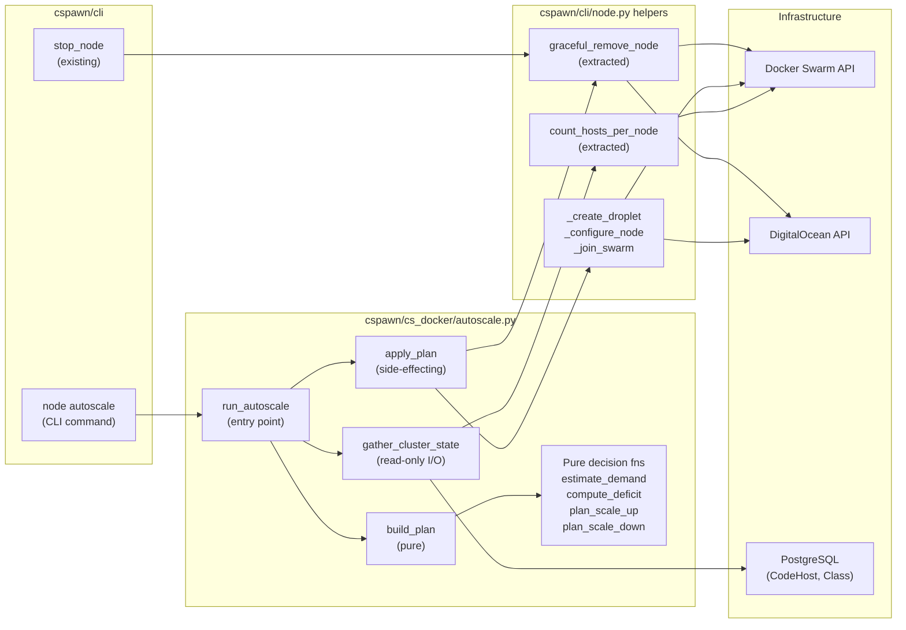
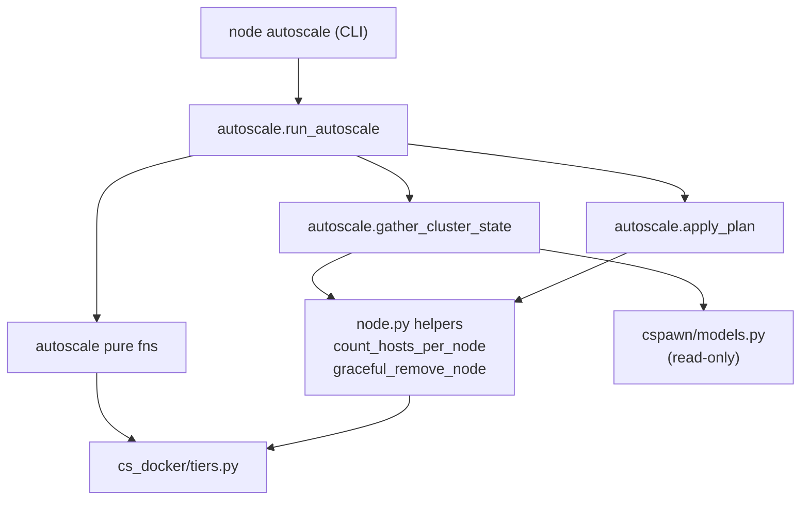

<!-- CLASI: Before changing code or making plans, review the SE process in CLAUDE.md -->

# Architecture Update — Sprint 004: Node Autoscaling Control Loop

## What Changed

### New Module: `cspawn/cs_docker/autoscale.py`

Introduces the autoscaling controller split into two layers:

**Pure decision functions (no I/O, unit-testable):**

| Function | Purpose |
|---|---|
| `estimate_demand(classes, hosts, cfg) -> int` | Combines pre-scale + live demand signals with headroom |
| `capacity_for_node(node_attrs, cfg) -> int` | Reads `cs.capacity` label; falls back to tier size map then `AUTOSCALE_DEFAULT_CAPACITY` |
| `assess_cluster(node_dicts, host_counts, pending, cfg) -> ClusterState` | Builds `ClusterState` from pre-fetched raw data |
| `compute_deficit(state, demand, cfg) -> int` | `max(0, demand - total_capacity)` |
| `plan_scale_up(deficit, cfg) -> tuple[int, int]` | Greedy bin-pack returning `(add_large, add_small)` clamped to `MAX_ADD_PER_CYCLE` |
| `plan_scale_down(state, demand, cfg, now) -> list[NodeView]` | Selects zero-load, cooled-down, non-manager workers; respects `MIN_WORKER_NODES` |
| `build_plan(state, demand, cfg, now) -> ScalePlan` | Decides up vs. down vs. hold; **never both up and down in one cycle** |

**Dataclasses:**

```
NodeView:
    short: str           # short hostname (e.g. "swarm2")
    fqdn: str            # fully-qualified (e.g. "swarm2.dojtl.net")
    size_slug: str|None  # DO droplet slug if known
    capacity: int        # from cs.capacity label or tier fallback
    running_hosts: int   # live Swarm task count
    is_manager: bool
    is_leader: bool
    serial: int|None     # numeric suffix of hostname

ClusterState:
    nodes: list[NodeView]
    pending_hosts: int          # CodeHost rows starting but not yet Swarm-placed
    @property total_capacity    # sum of worker (non-manager) capacities
    @property total_load        # sum of running_hosts across all nodes
    @property excess_capacity   # total_capacity - total_load

ScalePlan:
    add_large: int
    add_small: int
    remove_nodes: list[str]    # fqdns; only zero-load eligible nodes
    purge_first: bool          # always True when remove_nodes is non-empty
    reason: str                # human-readable for structured log
```

**Orchestrator (thin, side-effecting):**

| Function | Purpose |
|---|---|
| `gather_cluster_state(app, manager_client, cfg) -> tuple[...]` | Live reads only: swarm node list, per-node counts, DB queries. Read-only. |
| `apply_plan(ctx, plan, cfg, *, dry_run) -> ApplyResult` | Executes scale-up or scale-down per plan. Suppressed entirely when `dry_run=True`. |
| `run_autoscale(ctx, *, dry_run, force) -> ApplyResult` | Single entry point: kill-switch → lock → gather → build_plan → apply → log → release |

### Refactored: `cspawn/cli/node.py`

Two extractions from existing code (no behavior change to any existing CLI command):

1. **`count_hosts_per_node(client) -> dict[str, int]`** — extracted from the `hosts`
   command body. Returns `{short_node_name: running_host_count}` using the same Swarm
   task query. `_running_hosts_by_node` (added in sprint 003) already does this; this
   sprint renames/exposes it as the canonical public helper. `gather_cluster_state` reuses it.

2. **`graceful_remove_node(ctx, manager_client, mgr, fqdn, *, dry_run, log) -> None`** —
   extracted from the `stop_node` graceful path (lines ~1739-1791 in current node.py).
   Steps: `_drain_swarm_node` → `_wait_node_tasks_drained` → swarm node remove → droplet
   destroy. The `stop_node` command and `apply_plan` both call this helper; no duplication.

### New CLI Command: `cspawn/cli/node.py` → `node autoscale`

```
@node.command(name="autoscale")
@click.option("-N", "--dry-run", is_flag=True)
@click.option("--force", is_flag=True)          # bypass cooldown for manual ops
@click.option("--up-only/--down-only", default=None)
@click.pass_context
def autoscale_cmd(ctx, dry_run, force, up_only):
    from cspawn.cs_docker.autoscale import run_autoscale
    result = run_autoscale(ctx, dry_run=dry_run, force=force, up_only=up_only)
    click.echo(result.summary())
```

### Config Keys Added: all three `public.env` files

| Key | Default | Meaning |
|---|---|---|
| `AUTOSCALE_ENABLED` | `false` | Kill-switch. Merge does nothing until explicitly set `true`. |
| `AUTOSCALE_DRY_RUN` | `true` | Global dry-run override; cron runs read-only by default. |
| `AUTOSCALE_HEADROOM` | `2` | Spare host slots above demand. |
| `AUTOSCALE_ROSTER_FRACTION` | `0.8` | Expected attendance fraction for pre-scale. |
| `AUTOSCALE_MAX_ADD_PER_CYCLE` | `2` | Cap nodes added per cron run. |
| `AUTOSCALE_MAX_REMOVE_PER_CYCLE` | `1` | Cap nodes removed per cron run. |
| `AUTOSCALE_SCALEDOWN_COOLDOWN_MIN` | `30` | Minutes a node must be empty before removal. |
| `AUTOSCALE_MIN_WORKER_NODES` | `1` | Never shrink below this many workers. |
| `AUTOSCALE_DEFAULT_CAPACITY` | `6` | Fallback when a node has no `cs.capacity` label. |

Size slugs and capacities come from the existing `NODE_TIERS` (sprint 003). The autoscaler
reads `load_tiers(cfg)` to resolve large vs. small slugs; no new slug config keys needed.

### Cron Wiring: `docker/crontab`

A commented-out line is added alongside the existing `host reap` stub:

```
# */2 * * * * cspawnctl -d prod node autoscale >/proc/1/fd/1 2>/proc/1/fd/2
```

To activate: uncomment. The line is guarded by the `AUTOSCALE_ENABLED` kill-switch at
the application layer, so uncommenting alone (with defaults) still does nothing live.

### New Test File: `test/test_autoscale.py`

Unit tests for all pure functions; thin mocked coverage for `gather_cluster_state`
and `apply_plan`. No Docker/DO/DB infrastructure required.

---

## Why

All node scaling today is manual. Idle nodes accumulate cost, and class-start can
under-provision. The `/cron/*` Flask endpoints have a 5s curl timeout and are unsuitable
for minutes-long provisioning. Cron-driven `cspawnctl` is the intended pattern (established
by the commented `host reap` line). This sprint wires the decision loop without requiring
any operator action to be safe: the shipped defaults (`AUTOSCALE_ENABLED=false`,
`AUTOSCALE_DRY_RUN=true`) mean merging to master and deploying changes absolutely nothing.

The pure-function / orchestrator split keeps the math fully unit-testable with zero
infrastructure and makes `estimate_demand` a clean seam for the next sprint
(instructor-cluster-presize), which will re-point the demand source from `Class.running`
to instructor-stamped `purge_after`/`purge_by` timestamps. That swap is a drop-in
replacement of the function's inner logic; the signature and call site in
`gather_cluster_state` do not change.

---

## Impact on Existing Components

| Component | Impact |
|---|---|
| `cspawn/cli/node.py` | Two helper extractions (no behavior change to existing commands). New `autoscale` subcommand added to the `node` group. |
| `cspawn/cs_docker/tiers.py` | Read-only: autoscaler calls `load_tiers`, `node_capacity`, `tier_for_slug`. No changes to tiers.py. |
| `cspawn/models.py` | Read-only: autoscaler queries `Class.running`, `Class.students`, `Class.stops_at`, `CodeHost.is_mia`, `CodeHost.is_purgeable`, `CodeHost.node_name`. No schema changes. |
| `cspawn/cli/host.py` | Read-only: `apply_plan`'s purge-first step invokes the same logic as `host purge` (or calls the underlying `app.csm.sync`). No changes to host.py. |
| `docker/crontab` | One commented-out line added. No behavior change until uncommented. |
| `config/*/public.env` (3 files) | `AUTOSCALE_*` keys added with safe defaults. No existing keys removed or changed. |

---

## Diagrams

### Component Diagram



### Dependency Graph



No cycles. Dependency direction: CLI → controller → helpers → infrastructure.

---

## Design Rationale

### Decision: Pure function / orchestrator split

**Context:** The autoscaler needs to make complex math decisions (demand estimation,
bin-packing, scale-down eligibility) and also perform slow, failure-prone I/O (SSH to
nodes, DO API calls).

**Alternatives considered:**
- Monolithic: one function reads state and acts. Untestable without live infra.
- Full service object: pass an interface to pure functions. Over-engineering for a
  single-file controller.

**Why this choice:** Separate pure functions from orchestrator at the module level.
Pure functions take plain data (dicts, dataclasses) and return plain data; they are
unit-tested with zero infrastructure. Only `gather_cluster_state` and `apply_plan`
touch Docker/DO, and they get thin mocked coverage.

**Consequences:** All complex policy logic is covered by fast unit tests. The seam is
also where the next sprint (instructor-cluster-presize) plugs in a new demand source
without touching the decision math.

---

### Decision: `estimate_demand` as a clean, swappable seam

**Context:** The current demand signal uses `Class.running` + `Class.students`. The
next sprint (instructor-cluster-presize) will replace this with purge-window timestamps
(`Class.purge_after` / `Class.purge_by`).

**Why this choice:** All I/O happens in `gather_cluster_state`, which fetches the raw
`classes` and `hosts` lists. `estimate_demand(classes, hosts, cfg) -> int` is passed
that data and contains all the demand math. Swapping the demand source means changing
what fields `gather_cluster_state` fetches and how `estimate_demand` interprets them.
No signature changes; no cascade.

**Consequences:** The presize sprint is a drop-in. If the demand model changes again
(ML-based, etc.), the seam is still clean.

---

### Decision: `AUTOSCALE_ENABLED=false` and `AUTOSCALE_DRY_RUN=true` as shipped defaults

**Context:** Merging an autoscaler to master and deploying it must not provision or
destroy nodes without operator consent. The DO token is expired during development;
live DO calls will fail with 401.

**Why this choice:** Two independent kill-switches. `AUTOSCALE_ENABLED=false` causes
`run_autoscale` to log "disabled" and return before gathering state. `AUTOSCALE_DRY_RUN=true`
causes `apply_plan` to log but not act. Both must be overridden to live-scale. The cron
line is also commented out. Three independent layers of protection.

**Consequences:** Phased rollout is operationally simple: uncomment cron → set
`DRY_RUN=false` and watch logs → set `ENABLED=true` and `DRY_RUN=false` → enable
scale-down separately.

---

### Decision: `flock` file lock for single-manager deployment

**Context:** Cron fires every 2 minutes; a scale-up run can take >2 minutes (SSH, DO API
latency). Overlapping runs would create duplicate droplets or compete on the same serial.

**Alternatives considered:**
- DB advisory lock (`pg_try_advisory_lock`): requires a DB connection before kill-switch check.
- Swarm service label as mutex: brittle; requires Docker API for every cron attempt.

**Why this choice:** `fcntl.flock` on a fixed path under the container's writable volume
is the lowest-friction, no-dependency option for a single-manager deployment. Non-blocking:
`flock(fd, LOCK_EX | LOCK_NB)` returns immediately if held; the cycle logs "previous cycle
running" and exits 0.

**Consequences:** Does not work across multiple manager nodes. If multi-manager HA is
ever added, this must be replaced with a distributed lock. Flagged as an open question.

---

## Migration Concerns

None for this sprint. No database schema changes. No existing config keys removed.
Existing `node expand` / `node contract` / `node stop` commands are unchanged. The
`graceful_remove_node` extraction is behavior-preserving (same logic, same code path).

The `AUTOSCALE_*` keys are added to all three `public.env` files with safe defaults;
existing deployments that reload config will see these keys with values that suppress
all autoscale behavior.

---

## Open Questions (require stakeholder input before implementation)

1. **Manager node (`swarm1`) reserved from hosting students?**
   Current code: `PLACEMENT_CONSTRAINTS=node.role==worker` in prod config means code-server
   services already cannot schedule on the manager. The autoscaler excludes managers from
   capacity accounting by design. Recommend: confirm this is the intended policy (manager
   is never a scaling target) and document it. If the manager should sometimes host students,
   capacity accounting needs to change.

2. **Scale-up remainder rule: large vs. small for 7-13 host deficit?**
   Current plan: if `rem = D % CAP_LARGE` and `CAP_SMALL < rem <= CAP_LARGE`, add one more
   large node instead of one small. This minimizes node count at the cost of slightly higher
   per-cycle spend. Alternative: always add a small node for any remainder, minimizing spend
   per cycle but adding more nodes. Which does the stakeholder prefer?

3. **Pre-scale kick from `class_run_state` route?**
   Current plan: cron every 2 minutes is the only trigger. An instructor starting a class
   at T=0 waits up to 2 minutes before the autoscaler fires, then several more minutes for
   provisioning. If that latency is acceptable, no change needed. If not, the `class_run_state`
   route (`cspawn/main/routes/classes.py`) can fire a detached `subprocess.Popen(["cspawnctl",
   ..., "node", "autoscale"])` after committing the `running=True` state. This adds a process
   spawn from the web worker. Decision: accept 2-min cron latency, or add the pre-scale kick?

4. **Lock mechanism for future multi-manager HA?**
   `flock` is correct for single-manager. If the roadmap includes multi-manager HA (multiple
   spawner containers), `flock` must be replaced with a distributed lock (DB advisory, Redis,
   or Swarm leader election). No action needed this sprint; flag for architectural note.

5. **`AUTOSCALE_ROSTER_FRACTION` (0.8) and `AUTOSCALE_HEADROOM` (2) tuning.**
   These are starting values based on design intent, not observed attendance data.
   Recommend: validate during Phase 1 dry-run by comparing log output to actual class attendance.
   No stakeholder decision needed before implementation; they are config-tunable post-deploy.
