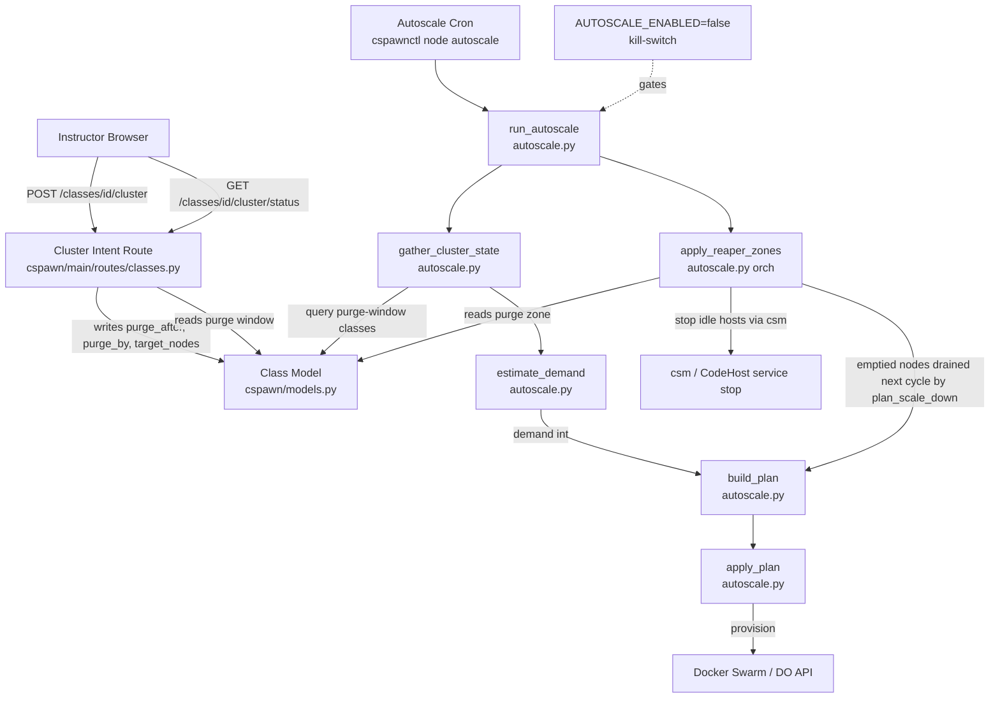
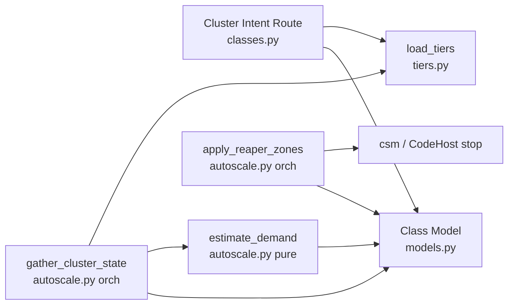

<!-- CLASI: Architecture update for sprint 005 -->

# Architecture Update — Sprint 005: Instructor-triggered cluster pre-sizing + time-windowed purging

## Step 1: Problem Understanding

`Class.running` is a sticky, never-falls flag. The autoscaler built in Sprint 004
has `estimate_demand` as a clean demand-signal seam (`autoscale.py:270-326`),
but the seam currently reads `Class.running` + `stops_at` via `gather_cluster_state`
(`autoscale.py:638-645`). There is no reliable falling edge on `running`, so the
autoscaler would never scale down.

This sprint installs a self-expiring, time-bounded demand signal by adding three
fields to `Class` and wiring the autoscaler to read them. The class page gets a
button that stamps those fields; the reaper gets zone-aware gating. Everything
stays inert behind `AUTOSCALE_ENABLED=false` until an operator flips the switch.

**Codebase anchor verification:**
- `Class.start_date` / `Class.end_date` confirmed at `models.py:166-167` — these
  are the term span, not a daily window. Time-of-day from `end_date` is used for
  the daily `purge_after` computation; the full datetime is never used as-is.
- `Class.update()` at `models.py:188-198` deactivates the class if `now` is
  outside `[start_date, end_date]`; this confirms the term-span gotcha.
- `class_run_state` non-blocking pattern at `classes.py:355-378` — commits and
  returns JSON immediately; same pattern for the new `/cluster` route.
- `gather_cluster_state` class query at `autoscale.py:638-645` — the exact lines
  to update to the purge-window filter.
- `estimate_demand` at `autoscale.py:270-326` — function signature unchanged;
  only internal dict key reads change.
- `is_quiescent` at `models.py:406-410` — checks `heart_beat_ago > 20 OR
  modified_ago > 15`. The 15-minute `modified_ago` check already satisfies the
  active-purge zone idle threshold.
- `host purge` at `host.py:190-221` — current implementation checks
  `is_mia or is_quiescent` with no zone awareness; this is the extension point.
- `node autoscale` and `run_autoscale` at `autoscale.py:855-1021` — kill-switch
  at line 917 (`AUTOSCALE_ENABLED=false` default); must remain unchanged.

## Step 2: Responsibilities

| Responsibility | Belongs To | Change |
|---|---|---|
| Persist purge-window intent | `Class` model (`cspawn/models.py`) | Add columns |
| Stamp timestamps + size nodes | `/cluster` route (`classes.py`) | New route |
| Show cluster status to instructor | Class detail template | New UI section |
| Compute demand from purge window | `estimate_demand` (`autoscale.py`) | Re-point signal |
| Fetch purge-window classes | `gather_cluster_state` (`autoscale.py`) | Change DB query |
| Gate reaping by zone | Reaper (`apply_reaper_zones` in `cspawn/cs_docker/autoscale.py`) | New gating |
| Force-remove at `purge_by` | Reaper dormant zone (`apply_reaper_zones`) | New zone |

These seven responsibilities are grouped into four modules below.

## Step 3: Modules

### M1 — Class Purge-Window Data Model (`cspawn/models.py`)

**Purpose:** Persist instructor intent — three timestamp/count fields that gate
all downstream scaling decisions.

**What is inside:** Three new `Column` declarations on `Class`:
- `purge_after: DateTime(timezone=True)` — start of the reap window
- `purge_by: DateTime(timezone=True)` — hard cutoff for force-remove
- `target_nodes: Integer` — computed requested node count

**What is outside:** The module does not read `NODE_TIERS`, perform timezone
math, or touch Docker. It is a dumb data container.

**Use cases served:** SUC-001, SUC-002, SUC-003, SUC-004, SUC-005

### M2 — Cluster Intent Route (`cspawn/main/routes/classes.py`)

**Purpose:** Accept the instructor's "arm" action and write purge-window
timestamps to the DB. Returns JSON immediately; never touches Docker or DO.

**What is inside:**
- `POST /classes/<id>/cluster` handler
- Timestamp computation: `purge_after = max(today @ time-of-day(end_date), click_time + 1h)`
- Node sizing: `target_nodes = ceil(len(class.students) / tier_capacity)` using
  `load_tiers(cfg)` from Sprint 003 (`cspawn/cs_docker/tiers.py`)
- Idempotent re-arm logic
- `GET /classes/<id>/cluster/status` — returns zone string for the UI

**What is outside:** The route does not call `run_autoscale`, `expand_node`, or
any Docker/DO primitive. It only writes `Class` columns.

**Use cases served:** SUC-001, SUC-005

### M3 — Demand Signal (`cspawn/cs_docker/autoscale.py`)

**Purpose:** Translate live purge-window class records into a numeric demand
figure that the control loop uses to size the cluster.

**What is inside (orchestrator section):**
- `gather_cluster_state` updated to query `Class` rows where
  `purge_after IS NOT NULL AND purge_after <= now AND purge_by > now`.
  Each class dict gains `purge_after` and `purge_by` keys; drops `running`.

**What is inside (pure section):**
- `estimate_demand` updated to read `purge_after`/`purge_by` instead of
  `running`/`stops_at`. The `prescale` loop becomes:
  ```
  for c in classes:
      if purge_after <= now < purge_by:
          prescale += ceil(len(students) * ROSTER_FRACTION)
  ```
  Function signature unchanged.

**What is outside:** No DB or network I/O inside `estimate_demand` — all I/O
remains in the orchestrator section (`gather_cluster_state`).

**Use cases served:** SUC-002, SUC-004

### M4 — Time-Windowed Reaper (`cspawn/cs_docker/autoscale.py` — orchestrator section)

**Purpose:** Apply three-zone reaping logic to CodeHosts inside the autoscaler
control loop; gate all reclamation behind `purge_after`; force-remove resources
at `purge_by`.

**Stakeholder decision:** Reaper zone-awareness is implemented in the autoscaler
orchestrator (`run_autoscale`) only this sprint. `host purge` (`host.py:190`)
stays a manual override and is NOT modified.

**What is inside:**
- New function `apply_reaper_zones(app, class_rows, host_rows, now)` in the
  orchestrator section of `autoscale.py`.
- Zone classification: protected (`now < purge_after`), active-purge
  (`purge_after <= now < purge_by`), dormant (`now >= purge_by`).
- Protected zone: no action on any CodeHost, regardless of idle state.
- Active-purge zone: 15-minute idle CodeHost → stop (uses existing
  `is_quiescent` / `csm` stop path).
- Dormant zone: force-remove all remaining CodeHosts; clear `purge_after`,
  `purge_by`, `target_nodes` on the Class row.
- Called from `run_autoscale` after `gather_cluster_state`, before `build_plan`.
- Node drain after force-remove is handled by `plan_scale_down` on the next
  cycle (existing cooldown mechanism).

**Inert-by-default:** `apply_reaper_zones` is only called from `run_autoscale`,
which exits early if `AUTOSCALE_ENABLED=false` (the default).

**What is outside:** The reaper does not re-implement `graceful_remove_node`.
Node-level draining is delegated to `plan_scale_down`. `host purge` and
`node purge` CLI commands are unchanged.

**Use cases served:** SUC-003, SUC-004

## Step 4: Diagrams

### Component Diagram



### Entity-Relationship Diagram (Class schema change)

```mermaid
erDiagram
    Class {
        int id PK
        string name
        datetime start_date "term start (not daily)"
        datetime end_date "term end; time-of-day used for purge_after"
        bool running "sticky flag; no longer used as demand signal"
        datetime running_at
        datetime stops_at
        datetime purge_after "NEW — start of reap window"
        datetime purge_by "NEW — hard force-remove cutoff"
        int target_nodes "NEW — requested cluster size"
    }
    Class ||--o{ Student : "students"
    Class ||--o{ Instructor : "instructors"
```

### Dependency Graph



No cycles. Dependency direction: Presentation/Route → Model; Orchestrator → Pure.

## Step 5: Complete Document

### What Changed

**`cspawn/models.py`**
- `Class` gets three new columns: `purge_after` (DateTime timezone-aware,
  nullable), `purge_by` (DateTime timezone-aware, nullable), `target_nodes`
  (Integer, nullable).
- Alembic migration adds the three columns.

**`cspawn/main/routes/classes.py`**
- New route `POST /classes/<id>/cluster` (decorator stack: `@main_bp.route`,
  `@instructor_required`) stamps purge-window timestamps and `target_nodes`.
  Pattern mirrors `class_run_state` at `classes.py:353-378` — immediate JSON
  return, `db.session.commit()`, no background threading.
- New route `GET /classes/<id>/cluster/status` returns the zone string for the
  class detail page JavaScript.

**`cspawn/cs_docker/autoscale.py`**
- `gather_cluster_state` (autoscale.py:586): changes the `class_rows` DB query
  from `Class.query.filter_by(running=True)` (autoscale.py:644) to
  `Class.query.filter(Class.purge_after != None, Class.purge_after <= now,
  Class.purge_by > now)` — active-window classes only.
  Each dict gains `purge_after` and `purge_by` keys; drops the `running` key.
- `estimate_demand` (autoscale.py:270): `prescale` loop reads `c['purge_after']`
  and `c['purge_by']` instead of `c['running']` / `c['stops_at']`. Docstring
  updated to reflect new dict schema. Function signature unchanged.

**`cspawn/cs_docker/autoscale.py` — reaper zones (orchestrator section)**
- New function `apply_reaper_zones(app, class_rows, host_rows, now)` classifies
  each class into protected / active-purge / dormant and applies zone logic.
- Called from `run_autoscale` after `gather_cluster_state`, before `build_plan`.
- `cspawn/cli/host.py` — `purge` command is NOT modified (stays manual override).

**`cspawn/main/templates/classes/detail.html`**
- New "Cluster" section in the class detail card (instructor-only visibility).
  Shows "Create my cluster" button when `purge_after` is null.
  Shows zone-specific status message and estimated expiry when purge window is set.
  JS POSTs to `/classes/<id>/cluster`, reads JSON response, updates status display
  without a page reload.

### Why

`Class.running` has no reliable falling edge; it cannot drive scale-down. The
purge-window model gives an explicit time-bounded demand signal with a
self-expiring hard cutoff — no instructor "stop" action is ever needed.

### Impact on Existing Components

| Component | Impact |
|---|---|
| `gather_cluster_state` | DB query changed; class dict shape changes. |
| `estimate_demand` | Reads new dict keys; old `running`/`stops_at` keys removed from dict. |
| `class_run_state` route | Unchanged; `Class.running` still exists for other callers. |
| `plan_scale_down` (`autoscale.py`) | Unchanged; node drain after purge_by is handled via the normal cooldown cycle. |
| `host purge` command (`host.py`) | Unchanged; stays a manual override per stakeholder decision. |
| `node purge` CLI (`expand_purge`) | Unchanged; this is a separate orphan-cleanup tool. |
| `run_autoscale` (autoscale.py) | Calls new `apply_reaper_zones` after gather, before build. |
| Sprint 003 tier primitives | Called (not changed) from the new `/cluster` route. |

`Class.running` is NOT dropped from the schema. It is left in place as an audit
field and for compatibility with existing code paths (e.g. `class_run_state`).
It is simply no longer read by the autoscaler.

### Migration Concerns

- **Alembic migration:** three nullable columns added; no backfill required.
  Existing rows have `NULL` for all three fields and are ignored by the
  autoscaler (correctly treated as unarmed).
- **Deployment order:** migration must run before the app is restarted.
  No downtime required — adding nullable columns is non-blocking on SQLite/Postgres.
- **Rollback:** columns are nullable; rolling back the app to the previous version
  leaves the columns in place but unused. Safe.

## Step 6: Design Rationale

### Decision: Three fields on `Class` rather than a separate `ClusterRequest` table

**Context:** The issue originally mentioned a `ClusterRequest` table. We collapsed
it into three fields on `Class`.

**Alternatives considered:**
1. Separate `ClusterRequest` table — one row per arm event, full history.
2. Three fields on `Class` — single "current window" only, replaces prior arms.

**Why this choice:** The autoscaler only needs to know the *current* active
window, not history. Three fields on `Class` keeps the query trivially simple
(`WHERE purge_after <= now < purge_by`) and avoids a join. History is not a
current requirement.

**Consequences:** If future requirements need per-arm audit history, a
`ClusterRequest` table can be added without schema breakage (the three fields
become a cache/summary of the latest request).

### Decision: Re-point `estimate_demand` dict contract; do not change signature

**Context:** The dict shape passed from `gather_cluster_state` to
`estimate_demand` changes from `{running, stops_at, students}` to
`{purge_after, purge_by, students}`.

**Why this choice:** The function signature and call site are unchanged; only
the dict keys inside the pure function body change. This is the "swappable seam"
design established in Sprint 004 and documented in `autoscale.py:18-25`.

**Consequences:** Any existing test that mocks `class_rows` with `running`/
`stops_at` must be updated to use `purge_after`/`purge_by`. This is a breaking
change to test helpers, not to the function signature.

### Decision: Reaper zone logic lives in `autoscale.py` orchestrator, not `host.py`

**Context:** Zone-aware reaping of CodeHosts could be placed in the autoscaler
orchestrator or in the existing `host purge` CLI command.

**Alternatives considered:**
1. Extend `host purge` (`host.py:190`) — keeps CodeHost lifecycle in one place,
   allows reaper to run on a separate cron schedule.
2. Add `apply_reaper_zones` inside `run_autoscale` — co-locates demand signal
   and reap signal in one cron cycle.

**Why this choice (stakeholder decision):** Reaper zone-awareness is autoscale-
only this sprint. `host purge` stays a manual override. This keeps the blast
radius small: zone-aware reaping only happens when the operator enables the
autoscaler (`AUTOSCALE_ENABLED=true`). A future sprint can promote `host purge`
to be zone-aware when confidence in the window logic is established.

**Consequences:** Zone-aware reaping is gated by `AUTOSCALE_ENABLED` (default
false). `host purge` remains a manual tool — it does not apply zone gating.
Node draining after `purge_by` is handled by `plan_scale_down` on the next
autoscale cycle (30-min cooldown applies).

## Step 7: Open Questions

1. **Click-fallback duration (stakeholder decision required):**
   The issue spec says `click_time + 1h`. A prior conversation mentioned
   "90 minutes" in the context of session length. The architecture implements
   1h as the canonical floor. Confirm if 90 min was intended for `purge_after`.

2. **`end_date` time-of-day quality (operator data verification recommended):**
   `end_date` may carry midnight or a created-at timestamp instead of a
   meaningful class-end time in some prod records. The `click_time + 1h` floor
   handles this, but confirm whether the `max(end_date_tod, click_time + 1h)`
   branch ever fires in practice.

3. **DB migration approach (stakeholder / operator decision required):**
   The project has Alembic infrastructure (`migrations/env.py`, `alembic.ini`,
   Flask-Migrate in `cspawn/init.py`) but `migrations/versions/` is absent —
   only `versions-old/` and `versions-old-2/` exist. Programmer should confirm
   whether to: (a) create `migrations/versions/` and write a standard Alembic
   migration file directly, (b) use `flask db migrate` auto-generation, or
   (c) use a manual `ALTER TABLE` script. This decision affects ticket 001.

4. **`target_nodes` on re-arm (stakeholder decision):**
   Current design recomputes `target_nodes` on every click using the live
   roster. Confirm: should `target_nodes` be frozen at first-arm and only
   updated on explicit re-arm, or always recomputed? Architecture implements:
   always recompute.

5. **Tier capacity denominator for sizing (operator confirmation):**
   The `/cluster` route uses the smallest tier's capacity as the divisor for
   `target_nodes = ceil(students / tier_capacity)`. This sizes for maximum
   density (worst case). Confirm this is the intent, or whether a specific
   named tier should be used.

6. **Node drain lag after purge_by (stakeholder decision):**
   After force-remove at `purge_by`, emptied nodes are drained by the next
   autoscaler cycle (up to 30-minute cooldown). Confirm this lag is acceptable,
   or whether a synchronous node drain should be triggered at `purge_by` as
   part of the reaper.

7. **Cron schedule for zone-aware reaping (informational):**
   Zone-aware reaping runs inside `node autoscale` (`run_autoscale`) via the
   new `apply_reaper_zones` call. No additional cron entry is needed beyond
   the existing `node autoscale` cron line. `host purge` remains a manual tool.
