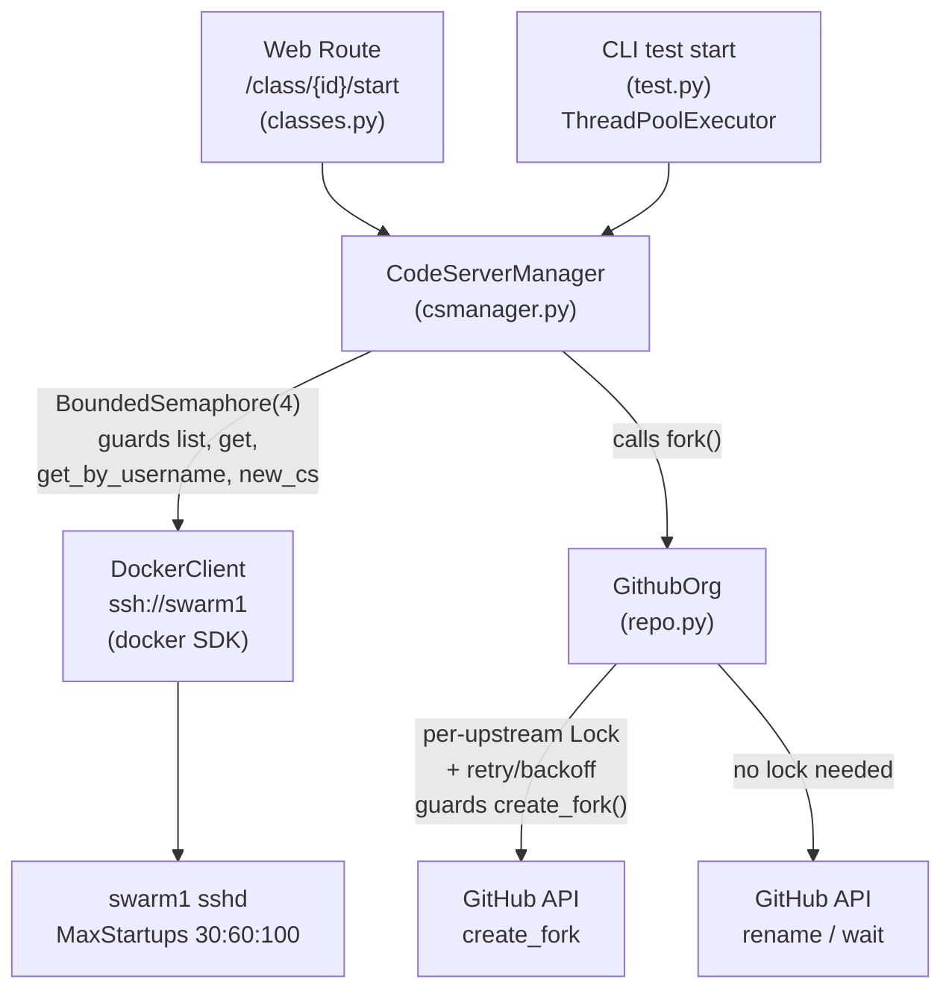

<!-- CLASI: Before changing code or making plans, review the SE process in CLAUDE.md -->

# Architecture Update -- Sprint 001: Concurrent Start Resilience

## Background: Existing Components

This is the first sprint. No consolidated architecture document exists yet.
This section describes the relevant existing modules as a baseline.

### GithubOrg (`cspawn/cs_github/repo.py`)

Responsible for forking upstream GitHub repositories into the League-Students
org on behalf of a student. The public entry point is `GithubOrg.fork(upstream_url,
username)`, which:

1. Checks whether `{org}/{base}-{username}` already exists (idempotent guard).
2. Calls `upstream_repo.create_fork(organization=org)` to create a fork.
3. Waits for the fork to appear using `_wait_repo_ready`.
4. Renames it from `{base}` to `{base}-{username}` via `_rename_with_retry`.

`GithubOrg` is instantiated per-request (via `GithubOrg.new_org(app)` inside
`CodeServerManager.new_cs`). All state is in the GitHub API; there is no shared
in-process state. Before this sprint, no concurrency controls exist. When 20
threads call `fork` on the same upstream simultaneously, GitHub returns
`403 Repository is already being forked` for all but the first, and `429`
secondary rate-limit responses for rapid retry attempts.

### CodeServerManager (`cspawn/cs_docker/csmanager.py`)

Responsible for all Docker Swarm lifecycle operations: creating, listing, finding,
and stopping code-server services. It wraps a single `DockerClient` connected to
the swarm manager via `ssh://root@swarm1` (configured as `DOCKER_URI`). The
client is created once at app startup and stored on `app.csm`.

Key methods called concurrently during host start:
- `new_cs(user, proto, class_)` — forks the repo, allocates ports, creates the
  Docker service, commits the `CodeHost` record.
- `list(filters)` — lists all Docker services matching a label filter (makes an
  SSH/Docker API call).
- `get(service_id)` — fetches one service by ID.
- `get_by_username(username)` — iterates `self.list()` to find a service by name.

Before this sprint, no semaphore or throttle exists. 20 concurrent `new_cs` calls
each call `get_by_username` (which calls `list`) and then `self.run(...)`, flooding
the single SSH channel. The sshd default `MaxStartups 10:30:100` drops connections
once 10 are in the handshake phase, causing `kex_exchange_identification: Connection
reset` errors.

### Swarm Node Init (`config/cloud-init/swarm-node-init-v2.yaml`, `config/host-scripts/`)

cloud-init YAML used when provisioning new DigitalOcean droplets. Sets up Docker,
UFW firewall rules (VPC-only for swarm ports; `ufw allow 22/tcp` for SSH — NOT a
rate-limited rule). `manager-setup-swarm.sh` is a separate script run manually on
the manager to configure UFW, overlay networks, and swarm initialization. Neither
file currently sets `MaxStartups` in sshd_config, so new nodes inherit the OS
default of `10:30:100`.

---

## What Changed

### 1. Per-Upstream Fork Serialization in `GithubOrg`

A module-level `threading.Lock` dictionary (`_fork_locks: dict[str, Lock]`) is
added to `cspawn/cs_github/repo.py`. The dictionary maps upstream URL to a
`threading.Lock`. Access to the dictionary itself is protected by a single
`_fork_locks_mu: threading.Lock`.

Inside `GithubOrg.fork`, before calling `upstream_repo.create_fork(...)`, the
method acquires the per-upstream lock. After the fork call returns (or retries
exhaust), the lock is released. The `_wait_repo_ready` and `_rename_with_retry`
calls remain outside the lock so rename operations for different users do not
block each other.

A bounded retry loop (up to 8 attempts, exponential backoff starting at 2 s,
capped at 30 s) is added around `create_fork`. It retries on:
- HTTP 403 with body containing `"already being forked"` (GitHub signals an
  in-flight fork for the same upstream).
- HTTP 429 (secondary rate limit).

All other exceptions propagate immediately.

### 2. SSH/Docker Throttle Semaphore in `CodeServerManager`

A `threading.BoundedSemaphore` is added as an instance attribute on
`CodeServerManager`. Its capacity is read from the app config key
`DOCKER_SSH_CONCURRENCY` (integer, default `4`).

The semaphore is acquired (with `try/finally` for safe release) at the entry of
each method that makes an outbound SSH/Docker call:
- `new_cs`
- `list`
- `get`
- `get_by_username`

**Deadlock prevention**: `new_cs` calls `get_by_username` on a 409 error path.
To avoid reentrant deadlock, `get_by_username` has an internal variant that calls
`self._list_raw()` (the underlying `super().list()` call) directly rather than
going through the semaphore-guarded public `list` method. The semaphore-guarded
`get_by_username` delegates to this variant. This keeps the public API safe and
avoids nested semaphore acquisition.

`make_user_dir` makes its own Paramiko SSH connection independently of
`DockerClient`; it is not guarded by the semaphore (it is already infrequent and
uses a separate channel). If it proves to be a bottleneck, it can be added later.

### 3. sshd MaxStartups in Cloud-Init and Manager Setup

`config/cloud-init/swarm-node-init-v2.yaml` gains a `write_files` entry that
writes `/etc/ssh/sshd_config.d/99-swarm.conf` with `MaxStartups 30:60:100` and
a `runcmd` step to restart sshd. New nodes provisioned with this cloud-init will
immediately have the higher limit.

`config/host-scripts/manager-setup-swarm.sh` gains a block that writes the same
`MaxStartups 30:60:100` line to `/etc/ssh/sshd_config.d/99-swarm.conf` and
restarts sshd. A comment notes that `swarm1` (the existing manager) must have
this script re-run manually (or the file written by hand) since cloud-init
already ran on that node.

The UFW port-22 rule in both `firewall.sh` and `swarm-node-init-v2.yaml` uses
`ufw allow 22/tcp`, which is a plain allow — not `ufw limit 22/tcp`. No rate-limit
rule exists on port 22 that would fire under concurrent SSH load. This is confirmed
and no change is needed to the UFW rules.

---

## Why

The first 20-concurrent `cspawnctl test start` run revealed two failure modes:

1. **GitHub 403/429**: GitHub's fork API rejects concurrent fork requests for
   the same upstream repository. Serializing the fork POST per upstream eliminates
   this while still allowing forks of different upstreams to proceed concurrently.

2. **SSH overrun**: The single `ssh://` Docker transport cannot handle 20
   simultaneous connections. The kernel's sshd `MaxStartups` drops new handshakes,
   and even below that limit the SSH multiplexing overhead collapses under load.
   An app-level semaphore caps active Docker calls at 4, well within sshd's
   tolerance, providing backpressure at the application layer where it is most
   controllable.

3. **sshd baseline too low**: The OS default `10:30:100` means sshd starts
   probabilistically rejecting new connections once 10 are in the handshake phase.
   Raising this to `30:60:100` adds a comfortable margin and ensures the app-level
   throttle (max 4) is the binding constraint, not the OS.

---

## Component Diagram

---

## Impact on Existing Components

| Component | Impact |
|---|---|
| `cspawn/cs_github/repo.py` | `GithubOrg.fork` gains per-upstream lock + retry loop around `create_fork`. Module gains two module-level globals (`_fork_locks`, `_fork_locks_mu`). No interface change. |
| `cspawn/cs_docker/csmanager.py` | `CodeServerManager.__init__` gains a `BoundedSemaphore`; `new_cs`, `list`, `get`, `get_by_username` gain semaphore guards. Internal `_list_raw` helper added to break deadlock. No interface change visible to callers. |
| `cspawn/main/routes/classes.py` | No code change. The `start_class` route calls `ca.csm.new_cs` and `ca.csm.get_by_username` as before; throttling is transparent. |
| `config/cloud-init/swarm-node-init-v2.yaml` | Gains sshd config write + restart step for new nodes. |
| `config/host-scripts/manager-setup-swarm.sh` | Gains sshd config write + restart block for existing manager. |
| `config/host-scripts/firewall.sh` | No change (port-22 rule is already a plain allow, not a rate limit). |

---

## Migration Concerns

**swarm1 (existing manager node)**: The cloud-init change only affects newly
provisioned nodes. The operator must manually apply the sshd `MaxStartups` change
to the existing `swarm1` manager by re-running `manager-setup-swarm.sh` or writing
the config file directly. This is noted in the ticket and in a comment added to
the script.

**Config key `DOCKER_SSH_CONCURRENCY`**: New optional config key with a hardcoded
default of `4`. No existing config files need updating unless the operator wants
to tune the value. The default is safe for a single-node swarm; increase it as
more nodes join and the manager's SSH capacity grows.

**No data migration**: Changes are all in Python module-level state and config
files. No schema changes. No DB migration.

---

## Design Rationale

### Per-Upstream Lock Rather Than Global Lock
A global lock across all `GithubOrg.fork` calls would serialize forks of
*different* upstreams (e.g. `Python-Apprentice` and `Web-Apprentice`) unnecessarily.
A lock dictionary keyed by upstream URL lets concurrent classes fork their repos
in parallel while still serializing the only case GitHub rejects: same-upstream
concurrency.

### Semaphore Capacity of 4
The sshd `MaxStartups 30:60:100` means handshakes beyond 30 are probabilistically
dropped. The app semaphore of 4 is deliberately conservative: it ensures the app
is always well below the sshd threshold regardless of how many student requests
arrive simultaneously. The value is configurable so operators can relax it if
throughput becomes a concern on a multi-node swarm with a more capable manager.

### Semaphore at Manager Layer, Not Route Layer
Placing the semaphore in `CodeServerManager` (rather than in the web route or CLI)
means all callers — web routes, CLI `test start`, cron reap — share the same
throttle without each needing to know about it. This is the tightest boundary that
protects the shared resource (the SSH Docker transport).

### No Per-Call Docker Client
Creating a new `DockerClient` per call would avoid semaphore complexity but adds
SSH handshake overhead on every Docker operation, including the high-frequency
`list` and `get` calls used for host readiness polling. The single shared client
with a semaphore is faster and simpler.

---

## Open Questions

None. All design decisions are within sprint scope and do not override upstream
architecture choices.
