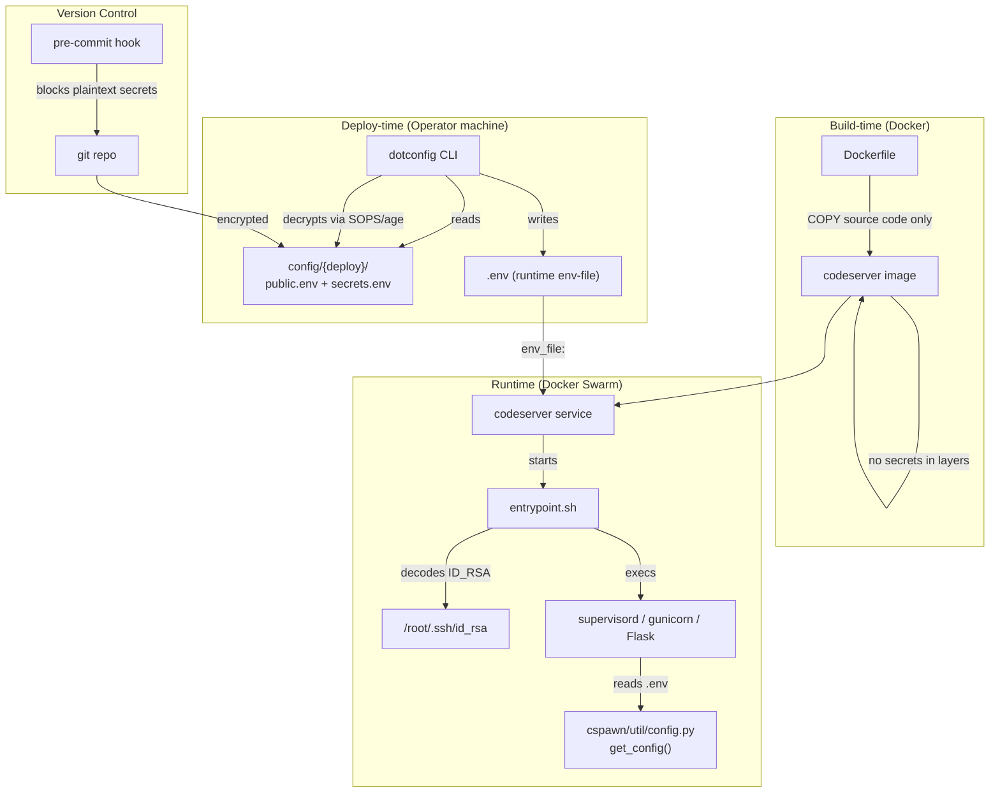
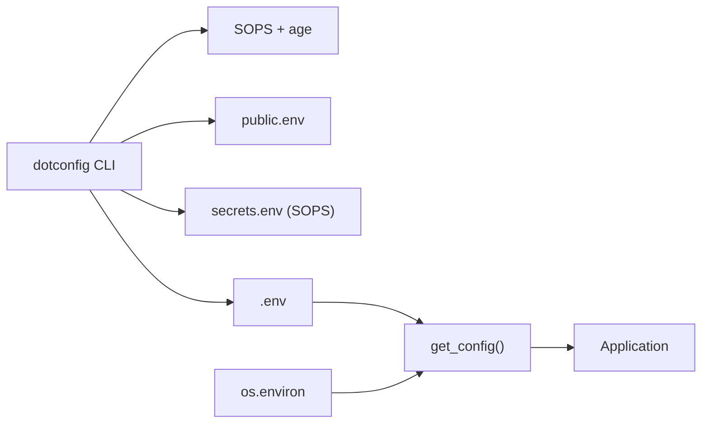

<!-- CLASI: Before changing code or making plans, review the SE process in CLAUDE.md -->

# Architecture Update — Sprint 002: dotconfig migration — runtime secrets, secret-free image

## What Changed

### New Module: Config Source (`config/{deploy}/`)

The flat `config/` layout (config.env, prod.env, secrets/secret.env,
secrets/prod.env) is replaced by the dotconfig layout:

```
config/
  sops.yaml                       # age key fingerprints for SOPS
  {deploy}/
    public.env                    # non-secret key=value pairs
    secrets.env                   # SOPS-encrypted secrets
  local/{user}/
    public.env                    # per-developer overrides (non-secret)
    secrets.env                   # per-developer secrets (SOPS-encrypted)
```

Supported deploys: `devel`, `prod`, `local-prod`.

### Modified Module: Config Loader (`cspawn/util/config.py`)

`get_config()` is superseded for runtime use. The new contract:

- At runtime (all environments), the app expects a pre-assembled `.env` file
  generated by `dotconfig load`. The loader reads this single file and applies
  `os.environ` on top (existing precedence: last file wins, then env).
- `JTL_CONFIG_DIR` environment variable may override the search location
  (preserved from existing behaviour).
- `CONFIG_DIR` and `SECRETS_DIR` synthetic keys are removed (no longer
  meaningful in the single-file model).
- The `get_config_files()` helper is superseded by the single-file path.

### Modified Module: Container Image (`docker/Dockerfile`)

Removed from the Dockerfile:
- `COPY config/config.env`, `COPY config/prod.env` (non-secret configs)
- `COPY config/secrets/secret.env`, `COPY config/secrets/prod.env`
- `COPY config/secrets/id_rsa`, `COPY config/secrets/id_rsa.pub`
- `RUN cat id_rsa.pub >> authorized_keys`, `RUN chmod 600/644 ...`

Added:
- An entrypoint shell wrapper script (`docker/entrypoint.sh`) that:
  1. Decodes `$ID_RSA` (base64) to `/root/.ssh/id_rsa` and sets chmod 600.
  2. Adds `id_rsa.pub` (derived or separately supplied) to `authorized_keys`.
  3. Unsets `$ID_RSA` from the environment.
  4. Execs the original CMD (`supervisord`).
- The `ENTRYPOINT` changes from bare `tini --` to
  `tini -- /app/docker/entrypoint.sh`.

### Modified Module: Stack Deployment (`docker/docker-stack.yaml`)

The `codeserver` service gains an `env_file:` key pointing to `.env`:

```yaml
env_file:
  - .env
```

The existing `environment:` block retains `JTL_DEPLOYMENT: "prod"` as an
override (env takes priority over env_file in Docker Compose/Stack).

### Modified Module: Deploy Makefile (`docker/Makefile`)

The `up` target gains a pre-step that generates the runtime env-file:

```
env-file:
    dotconfig load -d prod --no-export -e -o .env

up: networks env-file
    docker stack deploy --detach=true -c $(FILE) $(STACK)
```

`redeploy: build up` remains unchanged; `build` does not call env-file (image
must remain secret-free even before the env-file exists).

### Modified Module: Version Control Config (`.gitattributes`)

The line `**/secrets/* filter=git-crypt diff=git-crypt` is removed. No new
git-crypt rules are added. The `config/secrets/` directory is removed from git
tracking; its contents move into the dotconfig layout.

### New Artifact: Pre-commit Audit Hook (`.git/hooks/pre-commit`)

Installed via `dotconfig install-hooks`. Runs `dotconfig audit` before every
commit; blocks the commit if any unencrypted secret values are detected.

---

## Why

**SUC-001** — The current git-crypt setup is being retired. SOPS + age
(managed by dotconfig) provides equivalent encryption with broader toolchain
support and no per-checkout unlock step.

**SUC-002** — Baking secrets into image layers is a hygiene violation: anyone
with image pull access (all swarm nodes) can read credentials. The runtime
env-file model restricts secret access to the deploy operator and the running
container's memory.

**SUC-003** — The application's config loading must work consistently across
all three environments without requiring different code paths. A single `.env`
file produced by `dotconfig load` provides that consistency.

**SUC-004** — Without an automated gate, future developers could accidentally
commit plaintext secrets. The pre-commit audit hook closes this gap
permanently.

---

## Impact on Existing Components

| Component | Impact |
|---|---|
| `cspawn/util/config.py` | `get_config()` rewritten to read a single dotconfig-generated `.env`; multi-file search logic removed for runtime path |
| `docker/Dockerfile` | All `COPY config/secrets/*` and SSH key lines removed; entrypoint script added |
| `docker/docker-stack.yaml` | `env_file: .env` added to `codeserver` service |
| `docker/Makefile` | `env-file` target added; `up` depends on it |
| `.gitattributes` | git-crypt filter line removed |
| `cspawn/auth/`, `cspawn/main/`, `cspawn/cs_docker/` | No change; they call `get_config()` — the returned `Config` object interface is unchanged |
| `cspawn/cli/` | No change; CLI uses `get_config()` — same interface |

The `Config` class interface (`__getattr__`, `__getitem__`, `get()`, etc.) is
unchanged. Callers require no modification.

---

## Diagrams

### Component Diagram



### Dependency Graph (Config Loading)



---

## Design Rationale

### Decision: Single env-file model (over multi-file search in the app)

**Context**: The app currently searches for config files across multiple
directories and combines them. This logic must work in containers, local dev,
and prod.

**Alternatives considered**:
- (a) Keep multi-file search; have `get_config()` know about the dotconfig
  layout and read files directly.
- (b) Have `dotconfig load` produce one `.env`; the app reads that.

**Why this choice**: Option (b) decouples config assembly from the app. The
app becomes agnostic to how secrets are encrypted or where they live. The same
`dotconfig load` command works for all environments. The container image stays
secret-free because the app never reads secrets from inside the image.

**Consequences**: The operator must run `dotconfig load` before starting the
app locally (a one-time per-session step) and before every `make up` in prod.
This is a minor workflow change, mitigated by a Makefile target.

### Decision: Base64-embed SSH key in env-file (over volume mount or build-time COPY)

**Context**: The container must have `/root/.ssh/id_rsa` to SSH to worker
nodes. Env-files carry KEY=value, not files.

**Alternatives considered**:
- Volume mount: requires the key file to exist on every swarm node at a known
  path — fragile and harder to rotate.
- Docker secret (`docker secret create`): cleaner, but requires changes to the
  stack service definition and adds operational complexity.
- COPY in Dockerfile: current approach — bakes the key into the image (the
  problem being solved).

**Why this choice**: The `dotconfig --embed` (`-e`) convention is already
supported by dotconfig. It keeps the entire secret surface in the single
`.env` file, simplifying the deploy procedure. The entrypoint decode step is
small and auditable.

**Consequences**: `$ID_RSA` is briefly visible in the container environment
before the entrypoint unsets it. This is acceptable because the threat model
(secrets in image layers accessible to image readers) is the concern being
addressed; container-internal environment visibility is a separate, lower-risk
concern.

---

## Open Questions

1. **`authorized_keys` for the prod container**: The current Dockerfile appends
   `id_rsa.pub` to `/root/.ssh/authorized_keys`, enabling other nodes to SSH
   into the container. Should this be preserved? If so, `ID_RSA_PUB` should
   also be delivered via env and decoded by the entrypoint. This needs
   stakeholder confirmation before ticket 003 is implemented.

2. **Local devel workflow**: After this sprint, developers must run
   `dotconfig load -d devel -o .env` before `flask run`. Should a `make dev`
   target be added to the Makefile (or an equivalent) to automate this? This
   is in scope for ticket 002 as a nice-to-have.

3. **Age key distribution**: The age secret key must exist on every deploy
   machine. The mechanism for distributing it (e.g., 1Password, manual copy,
   `dotconfig gh-push`) is out of scope for this sprint but should be
   documented as an operator runbook step.
