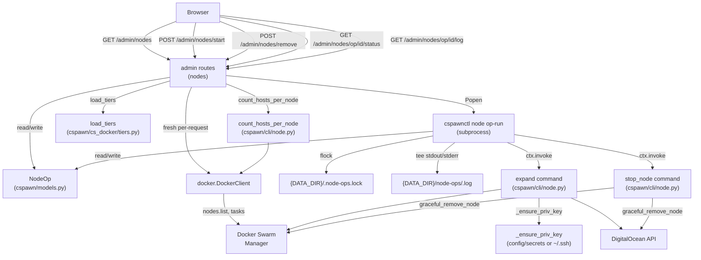
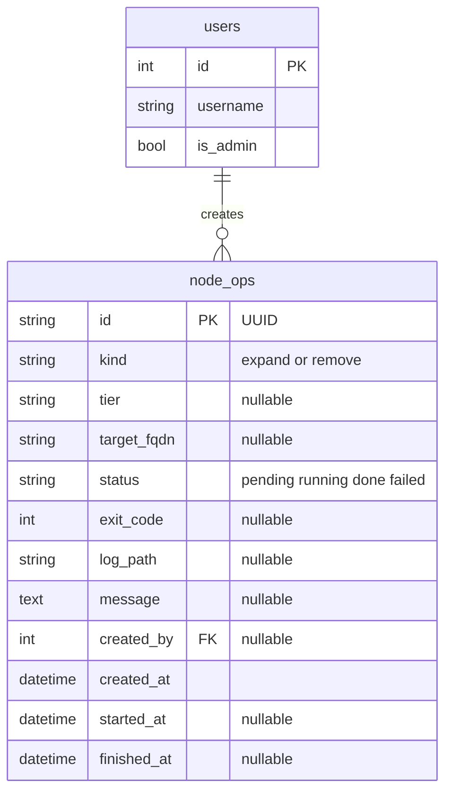

# Architecture Update — Sprint 006: Admin Nodes Tab — Manual Swarm Node Management

## What Changed

### New: `NodeOp` model (`cspawn/models.py`)

A new SQLAlchemy model tracking each node operation (start or remove) launched by the admin UI.

| Column | Type | Notes |
|---|---|---|
| `id` | UUID (String, PK) | Generated server-side via `uuid.uuid4()` |
| `kind` | String | `'expand'` or `'remove'` |
| `tier` | String (nullable) | Tier name for expand ops; null for remove |
| `target_fqdn` | String (nullable) | FQDN of node to remove; null for expand |
| `status` | String | `'pending'` / `'running'` / `'done'` / `'failed'` |
| `exit_code` | Integer (nullable) | Set when op completes |
| `log_path` | String (nullable) | Absolute path to the tee'd log file |
| `message` | Text (nullable) | Human-readable completion message or error |
| `created_by` | Integer (FK → users.id, nullable) | Admin who launched the op |
| `created_at` | DateTime | UTC, set at creation |
| `started_at` | DateTime (nullable) | Set when subprocess picks up the op |
| `finished_at` | DateTime (nullable) | Set when subprocess finishes |

### New: `v006_add_node_op_table` Alembic migration (`migrations/versions/`)

Hand-written idempotent migration following the `v001_add_class_purge_window_fields.py` style:
- PostgreSQL path: `CREATE TABLE IF NOT EXISTS node_ops (...)` via `op.execute(sa.text(...))`.
- SQLite path: `op.create_table(...)` inside a try/except (for test environments).
- Both `upgrade()` and `downgrade()` provided.

### New: `cspawnctl node op-run <op_id>` CLI command (`cspawn/cli/node.py`)

A new Click command under the `node` group. This is the subprocess worker target.

Responsibilities:
1. Load `NodeOp` by `op_id`; set `status='running'`, `started_at`.
2. Acquire an exclusive non-blocking `fcntl.flock` on `{DATA_DIR}/.node-ops.lock` (same idiom as `run_autoscale` in `autoscale.py`). If lock is held, exit immediately — ops serialize.
3. Open `{DATA_DIR}/node-ops/<id>.log` for writing (creates directory if needed); redirect stdout and stderr to the log file.
4. Dispatch based on `kind`:
   - `expand`: `ctx.invoke(expand, tier_name=op.tier)` — reuses the full expand flow (create droplet + configure + join swarm + `_sync_domain_records`).
   - `remove`: `ctx.invoke(stop_node, node_spec=op.target_fqdn, force=False, dry_run=False)` — delegates to `graceful_remove_node` (drain → wait → remove-from-swarm → destroy droplet).
5. On success: set `status='done'`, `exit_code=0`, `finished_at`.
6. On any exception: set `status='failed'`, `exit_code=1`, `message=str(exc)`, `finished_at`.

This command is the only subprocess target. All node management logic is already in `expand` / `stop_node` / `graceful_remove_node`; `op-run` is pure orchestration.

### Modified: `_ensure_priv_key()` (`cspawn/cli/node.py`)

Add a fallback when `config/secrets/id_rsa` is absent:
1. Check `config/secrets/id_rsa` (existing primary path).
2. If absent, check `/root/.ssh/id_rsa` (prod container key).
3. If neither exists, raise `ClickException` with a message naming both paths checked.

This unblocks `expand` in the deployed prod container, where `config/secrets/` is empty but `/root/.ssh/id_rsa` exists and is already registered with DigitalOcean.

### New: Admin nodes routes (`cspawn/admin/routes.py`)

Five new routes, all `@admin_required`:

| Route | Method | Purpose |
|---|---|---|
| `/admin/nodes` | GET | List all swarm nodes with host counts; render nodes.html |
| `/admin/nodes/start` | POST | Validate tier, create NodeOp (expand), launch op-run subprocess |
| `/admin/nodes/remove` | POST | Refuse manager/leader; create NodeOp (remove), launch op-run subprocess |
| `/admin/nodes/op/<id>/status` | GET | JSON status poll: `{status, exit_code, message, log_tail}` |
| `/admin/nodes/op/<id>/log` | GET | Full plain-text op log |

The list route opens a fresh `docker.DockerClient(base_url=DOCKER_URI, use_ssh_client=True)` per-request (not the app-level `ca.csm` client), calls `count_hosts_per_node(client)` and `client.nodes.list()`, then assembles per-node dicts and passes `load_tiers(cfg)` and recent `NodeOp` rows to the template.

The start/remove routes launch via:
```
subprocess.Popen(
    ["cspawnctl", "-d", deploy, "node", "op-run", str(op.id)],
    start_new_session=True,
    stdout=subprocess.DEVNULL,
    stderr=subprocess.DEVNULL,
)
```
`start_new_session=True` ensures the child process survives gunicorn worker recycling.

### New: `cspawn/admin/templates/admin/nodes.html`

Extends `admin/base.html`. Follows the `code_hosts.html` table + inline form-POST + flash conventions.

Sections:
- Flash messages (inherited from base).
- "Start a node" card: one form button per tier (POST `/admin/nodes/start` with hidden `tier` field).
- Node table: Name, IP, Role, Tier, Capacity, Hosts, State, Actions. Manager/leader rows show no Remove button (client-side guard); the server-side guard is authoritative.
- Operations panel: recent `NodeOp` rows. In-progress ops are polled via `fetch` every 2 seconds (same pattern as `polling_script.html`). Each row shows status badge, kind, target/tier, and a log tail that updates on each poll. Polling stops when status is `done` or `failed`; on completion the node table auto-refreshes.

### Modified: `cspawn/admin/templates/admin/base.html`

Add "Nodes" nav entry to the `<ul class="navbar-nav">` block:
```html
<li class="nav-item">
    <a class="nav-link" href="{{ url_for('admin.list_nodes') }}">Nodes</a>
</li>
```

---

## Why

The autoscaler (sprints 003–005) ships disabled by default. Rather than fix its demand logic now, the stakeholder wants direct manual control: an admin UI to list swarm nodes with live host counts, start a new node immediately, and drain+destroy a node — reusing the existing `expand`/`stop_node` CLI machinery. Node operations take 1–2 minutes, so the web route records a job, launches a detached subprocess, and returns immediately. The UI polls for live status.

The `_ensure_priv_key` fix is a prerequisite: without it, expand-from-prod fails because `/app/config/secrets/id_rsa` is absent in the deployed container.

---

## Diagrams

### Component diagram



### Entity-relationship diagram (NodeOp addition)



---

## Impact on Existing Components

| Component | Impact |
|---|---|
| `cspawn/models.py` | New `NodeOp` class added; no existing models changed |
| `cspawn/cli/node.py` | New `op-run` command; `_ensure_priv_key` gains fallback; existing commands unchanged |
| `cspawn/admin/routes.py` | Five new routes added; existing routes unchanged |
| `cspawn/admin/templates/admin/base.html` | One `<li>` added to nav; existing nav unchanged |
| `cspawn/cs_docker/tiers.py` | Read-only; `load_tiers` / `tier_by_name` reused without modification |
| `cspawn/cs_docker/autoscale.py` | No changes; continues to use `count_hosts_per_node` and `graceful_remove_node` as before |
| `migrations/versions/` | New migration file added; no existing migrations touched |

The autoscaler is left fully inert and unchanged. The admin tab is the manual alternative.

---

## Migration Concerns

1. **New table**: `node_ops` must be created in both SQLite (dev/test) and PostgreSQL (prod) via `flask db upgrade`. The migration is idempotent (`CREATE TABLE IF NOT EXISTS` on Postgres; try/except on SQLite).
2. **Deployment sequencing**: The migration must run before the new routes are live. Standard deploy order: apply migration → restart app container.
3. **Log directory**: `{DATA_DIR}/node-ops/` is created at runtime by `op-run` if absent. No migration needed.
4. **SSH key fallback**: No migration required, but ops team must verify that `/root/.ssh/id_rsa` in the prod container has its public key registered as a DigitalOcean SSH key. This is a one-time manual check (noted in ticket 005 smoke-test checklist).
5. **No backward incompatibility**: All changes are additive. Existing admin routes, models, and CLI commands are unmodified.

---

## Design Rationale

### Decision: detached subprocess, not Celery or threads

**Context**: Node ops take 1–2 minutes; the web request must return immediately.

**Alternatives**: (a) Celery task queue — requires a broker (Redis/RabbitMQ), adds infra complexity. (b) Background thread — complicated by gunicorn multi-worker model; thread is lost on worker recycle. (c) Detached `cspawnctl` subprocess — no new infra; subprocess survives worker recycle via `start_new_session=True`; logs to file; status tracked in DB.

**Choice**: Detached subprocess. Same pattern that `run_autoscale` uses for its lock idiom. Low operational surface area.

**Consequences**: No task queue means no retry logic. If `op-run` crashes before setting `status='failed'`, the `NodeOp` stays `running` forever. Acceptable for a manual admin tool; the log file is always available to diagnose.

### Decision: fresh Docker client per-request for list

**Context**: The app uses a shared `ca.csm` Docker client. Using it for the node list risks state bleed and is architecturally inappropriate (admin list is read-only, outside `csm`'s responsibility).

**Choice**: Instantiate `docker.DockerClient(base_url=DOCKER_URI, use_ssh_client=True)` fresh per GET `/admin/nodes` request. Close it after use.

**Consequences**: One SSH connection per page load. Acceptable for an admin-only page with low traffic.

### Decision: `_ensure_priv_key` fallback, not a config key

**Context**: Prod container has the working key at `/root/.ssh/id_rsa`; `config/secrets/id_rsa` is absent. Two options: (a) add a `SSH_KEY_PATH` config key; (b) fall back silently to `~/.ssh/id_rsa`.

**Choice**: Silent fallback to `/root/.ssh/id_rsa` when the primary path is absent. Simpler; local-prod is unaffected (it has `config/secrets/id_rsa`); prod just works without a new config key.

**Consequences**: Behavior is implicit. If neither path exists the error message names both paths checked, making diagnosis straightforward.

---

## Open Questions

1. **NodeOp retention**: How many completed ops should the admin panel display? The issue says "running/recent" — should there be a cap (e.g., last 20) or a time window (e.g., last 7 days)? Implementation defaults to last 20; can be tuned without a schema change.
2. **Concurrent ops**: The `fcntl.flock` in `op-run` serializes concurrent ops. If a second op is submitted while one is running, it will fail immediately (lock not available) and set `status='failed'`. This is acceptable for a manual admin tool, but should be surfaced in the UI ("another op is in progress").
3. **pub key registration check**: The issue notes that the prod container's `/root/.ssh/id_rsa.pub` must be registered as a DigitalOcean SSH key. This is a one-time manual prerequisite — should it be automated (e.g., `op-run` calls `_collect_do_ssh_keys` which auto-registers it) or left as a documented manual step? Current plan: manual, documented in ticket 005.
