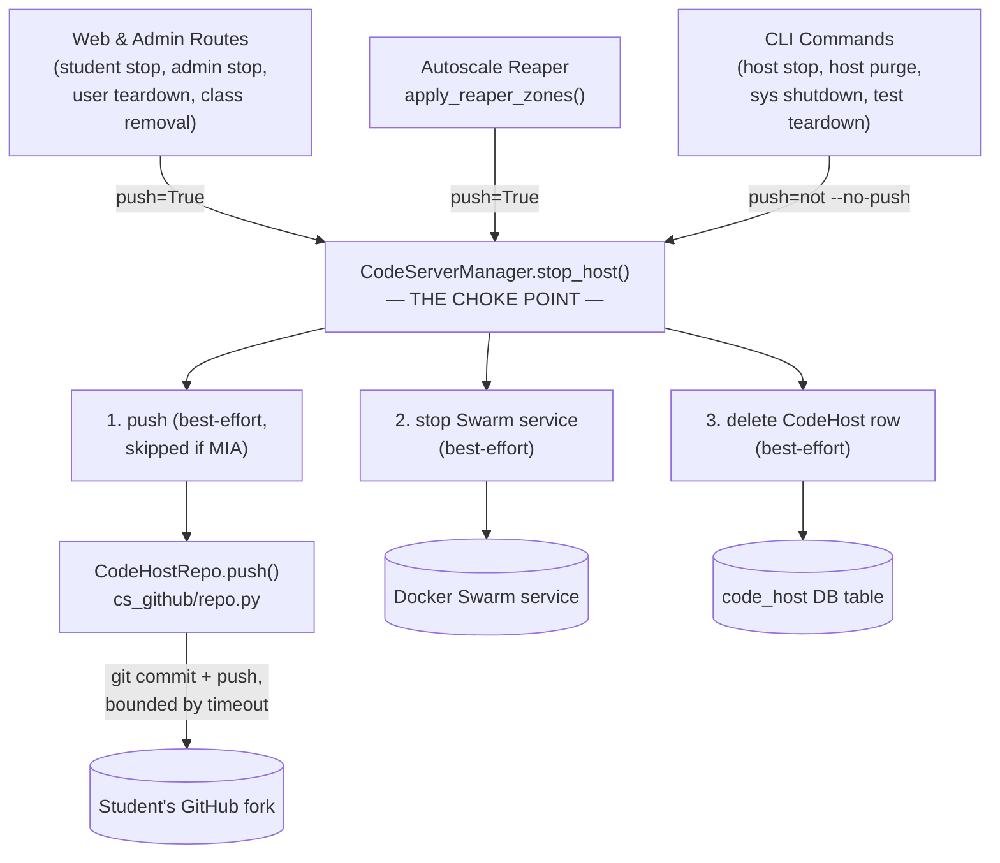
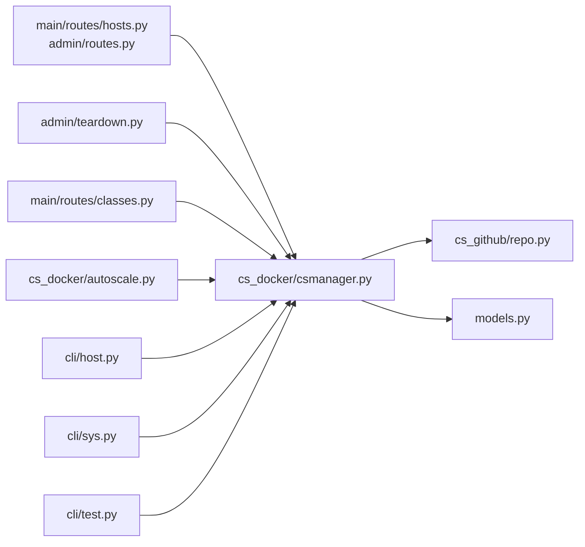

<!-- CLASI: Before changing code or making plans, review the SE process in CLAUDE.md -->

# Architecture Update — Sprint 007: Push-on-stop — commit and push student work on every code-host stop

## Step 1: Problem Understanding

Nine distinct places in the codebase stop a code host — remove its Docker
Swarm service and delete its `CodeHost` DB row — and only one of them
(`host purge`) pushes the student's local changes to GitHub first. A
tenth path, `node rebalance`, isn't a stop at all (it re-pins the service
to a different node and keeps the DB row) but already pushes as a safety
snapshot before the move.

**Codebase anchor verification (re-confirmed against current source):**
- `CodeHostRepo.push(branch)` — `cspawn/cs_github/repo.py:73-116`. Runs
  `git commit -a -m"Automated commit" || true && git push` inside the
  container via `docker -H ssh://<node> exec -u vscode`. Requires a
  `CodeHost` row (for `service_name`/`class_`) and an `App` (for
  `app_config["GITHUB_TOKEN"]`, `app_config["NODE_HOSTNAME_TEMPLATE"]`).
  Constructed either via `CodeHostRepo(codehost, app)` directly or via
  `CodeHostRepo.new_codehostrepo(app, username)` (does its own DB lookup).
  **Two hardening gaps confirmed by reading the code**: (a)
  `subprocess.run(argv, capture_output=True, text=True)` at line 109 has
  **no timeout** — a wedged SSH/docker-exec can hang the calling thread
  forever; (b) `_get_service_container()` (lines 53-60) calls
  `self.app.csm.get(self.service_name)`, which returns `None` (not an
  exception) when the service is gone — the next line, `service.containers`,
  raises a raw `AttributeError` on `None` rather than a clean, loggable
  `ValueError`.
- `CSMService.stop()` — `cspawn/cs_docker/csmanager.py:39-42`. `self.remove()`.
  No DB, no config, no GitHub knowledge — it is a one-line wrapper around
  `Service.remove()` (`cspawn/cs_docker/proc.py:30-32`), itself part of a
  generic Docker Swarm library (`ServicesManager`/`Service` in
  `manager.py`/`proc.py`) with zero Flask/app awareness.
- `CodeServerManager.__init__` — `cspawn/cs_docker/csmanager.py:422-469`.
  Already holds `self.app` (the `App` instance) and `self.config`
  (`app.app_config`). Already imports `GithubOrg`/`StudentRepo` from
  `cs_github.repo` for `new_cs()`'s forking step — adding `CodeHostRepo`
  to the same import is not a new module-dependency edge.
- **Nine stop paths without push, confirmed at their current line numbers:**
  1. Student UI stop — `main/routes/hosts.py:19-56` (`s.stop()` then
     `db.session.delete(code_host)`).
  2. Admin stop — `admin/routes.py:112-133` (same pattern).
  3. Admin user teardown — `admin/teardown.py:34-55`
     (`_stop_user_servers`, per-host try/except already isolates
     failures — a pattern this sprint reuses, not replaces).
  4. Class student removal — `main/routes/classes.py:326-350`
     (`remove_students`, calls `CodeServerManager.stop_cs(username)` then
     manual delete — `stop_cs` never touches the DB row itself).
  5. Autoscale reaper, active-purge zone —
     `cs_docker/autoscale.py:859-906` (idle-host stop inside
     `apply_reaper_zones`).
  6. Autoscale reaper, dormant zone — `cs_docker/autoscale.py:811-857`
     (force-remove-all inside the same function).
  7. CLI `host stop [name] / --all` — `cli/host.py:111-132`.
  8. CLI `sys shutdown` → `CodeServerManager.remove_all()` —
     `cli/sys.py:13-19`, `csmanager.py:831-836`. **Confirmed broken**:
     `remove_all()`'s body calls `self.repo.remove_by_id(c.id)` —
     `CodeServerManager` has no `self.repo` attribute anywhere in
     `__init__` or elsewhere in the class (verified by reading the full
     871-line file and grepping `self\.repo\b` across `cspawn/`, zero
     other definitions). Calling `sys shutdown` today would raise
     `AttributeError`. This sprint's rewrite is a functional fix, not a
     behavior change operators can currently be relying on.
  9. CLI `test teardown` — `cli/test.py:339-412` (load-test fixture
     cleanup; issue explicitly allows this one to skip push).
- **One already-pushing path being unified, not changed behaviorally:**
  CLI `host purge` — `cli/host.py:187-240`. Inline block: sync → for each
  MIA-or-quiescent host, `CodeHostRepo.new_codehostrepo(...).push()` →
  `app.csm.get(ch)` + `s.stop()` → `db.session.delete(ch)`, each step in
  its own try/except, `--no-push` / `--dry-run` flags. This is the
  reference implementation of the choke point's contract; ticket 3
  replaces its body with a single call while preserving its exact
  observable output.
- **One dead-code stop path found and confirmed out of scope**:
  `delete_class` (`main/routes/classes.py:160-188`) loops over
  `class_.students` calling `ca.csm.stop_cs(host.name)` — but the
  function returns early at line 170 (`if class_.students: ... return`)
  whenever `class_.students` is non-empty, so the loop only ever runs
  over an empty list. It is unreachable and also calls `host.name`,
  which doesn't exist on `CodeHost` (only `service_name` does) — would
  raise if it ever ran. Left untouched; not a real stop path.

## Step 2: Responsibilities

| Responsibility | Belongs To | Change |
|---|---|---|
| Push a host's workspace to GitHub, best-effort, bounded by a timeout | `CodeHostRepo.push()` (`cs_github/repo.py`) | Harden: add timeout, fix `None`-service crash |
| Decide whether to push, stop the Swarm service, and delete the DB row, as one atomic-from-the-caller's-view operation | `CodeServerManager.stop_host()` (`cs_docker/csmanager.py`, new) | New orchestrator |
| Report what happened (pushed? stopped? deleted? which errors?) back to the caller | `StopResult` (`cs_docker/csmanager.py`, new) | New value object |
| Remove every host in the system, pushing each first | `CodeServerManager.remove_all()` (`cs_docker/csmanager.py`) | Rewrite (current body is broken) |
| Trigger a stop from each of the nine call sites | Each of 9 call sites (routes, teardown, class removal, reaper x2, CLI x4) | Replace inline stop+delete with a `stop_host()` call |
| Let an operator opt out of pushing from the CLI | `host stop`, `host purge`, `sys shutdown` (`cli/host.py`, `cli/sys.py`) | Add/preserve `--no-push` |

These six responsibilities group into two modules (repo.py stays a
module of one; csmanager.py absorbs the new orchestration) plus a set of
call-site edits that carry no new architectural weight of their own.

## Step 3: Modules

### M1 — `CodeHostRepo.push()` hardening (`cspawn/cs_github/repo.py`)

**Purpose:** Push one code host's local git state to GitHub without ever
hanging the caller.

**What is inside:** The existing `push()` method, with two additions:
a `timeout` parameter (default sourced from `app_config["CODEHOST_PUSH_TIMEOUT_S"]`,
falling back to 30 seconds) passed to `subprocess.run(...)`, catching
`subprocess.TimeoutExpired` and re-raising as the same `RuntimeError`
contract callers already expect; and a `None`-guard in
`_get_service_container()` that raises `ValueError(f"No service found for
{self.service_name}")` instead of letting a bare `AttributeError` escape.

**What is outside:** `push()` still knows nothing about `CodeHost`
deletion, Swarm service removal, or which of the nine call sites invoked
it. It remains a single-purpose git operation.

**Use cases served:** SUC-001 through SUC-009 (every use case's push
step ultimately calls this method); also `node rebalance`, unchanged,
inherits the timeout for free since it calls the same method.

### M2 — `CodeServerManager.stop_host()` orchestrator (`cspawn/cs_docker/csmanager.py`)

**Purpose:** Turn "push, stop, delete" into one call every stop path
makes instead of three.

**What is inside:**
- `StopResult` — a small `@dataclass` with `service_name`, `pushed`,
  `push_error`, `stopped`, `stop_error`, `deleted`, `skipped_push_mia`.
- `stop_host(self, code_host: CodeHost, *, push: bool = True, branch: str
  = "master") -> StopResult` — the choke point. Sequence:
  1. If `push` and not `code_host.is_mia`: call `CodeHostRepo(code_host,
     self.app).push(branch=branch)` inside a try/except; log ERROR on
     failure, never raise.
  2. If `push` and `code_host.is_mia`: skip with an INFO log
     (`skipped_push_mia=True`), no push attempt.
  3. Resolve the live service via `self.get(code_host)` (existing
     method, already resolves `CodeHost -> service_id`) and call
     `.stop()` inside a try/except; log ERROR on failure, never raise.
     If `self.get()` returns `None` (service already gone), this counts
     as a successful stop (`stopped=True`, `stop_error=None`) — the goal
     state, "no live service," already holds.
  4. Delete the `CodeHost` row and commit, inside a try/except (rollback
     + log ERROR on failure); never raise.
  5. Return the populated `StopResult`.

`code_host.is_mia` is read from the DB row as-is (not re-synced against
live Docker state first) — it is an optimization to skip a doomed push
attempt cleanly and quietly, not a correctness requirement. A stale
"not MIA" row still behaves correctly: the push attempt fails inside
`CodeHostRepo.push()` (caught, logged as a push error, not a crash) and
the sequence proceeds exactly as the push-failure alternate flow
describes.
- `remove_all(self, *, push: bool = True) -> list[StopResult]` — rewritten
  to iterate `CodeHost.query.all()` and call `stop_host(ch, push=push)`
  per row, replacing the broken `self.repo.remove_by_id(...)` body.

**What is outside:** `stop_host()` does not resolve a bare username or
service name to a `CodeHost` row — callers that only have a name (CLI
`host stop <name>`) look it up first, the same way every other caller
already has (or cheaply obtains) the row. `stop_host()` does not decide
*whether* a host is eligible to be stopped (idle thresholds, zone
classification, ownership checks) — that logic stays in each caller
(reaper zone math, route ownership checks, `is_mia`/`is_quiescent`
filters in `host purge`), unchanged.

**Use cases served:** SUC-001 through SUC-009.

## Step 4: Diagrams

### Component diagram

### Dependency graph

No cycles. No new edges: every caller already depended on
`cs_docker/csmanager.py` (via `app.csm`) before this sprint; `csmanager.py`
already depended on `cs_github/repo.py` (for `GithubOrg`/`StudentRepo`)
before this sprint. This sprint centralizes behavior inside an existing
edge rather than adding a new one. Dependency direction unchanged:
Presentation/CLI/Orchestrator → `cs_docker` → `cs_github` / `models`.

No entity-relationship diagram — no schema/data-model change this sprint.

## Step 5: Complete Document

### What Changed

**`cspawn/cs_github/repo.py`**
- `CodeHostRepo.push()` gains a bounded `timeout` (default from
  `app_config["CODEHOST_PUSH_TIMEOUT_S"]`, else 30s); `TimeoutExpired` is
  caught and re-raised as `RuntimeError` (same contract as other push
  failures).
- `CodeHostRepo._get_service_container()` raises `ValueError` instead of
  crashing with `AttributeError` when the service can't be found.

**`cspawn/cs_docker/csmanager.py`**
- New `StopResult` dataclass.
- New `CodeServerManager.stop_host(code_host, *, push=True,
  branch="master") -> StopResult`.
- `CodeServerManager.remove_all()` rewritten to route through
  `stop_host()` per `CodeHost` row (replaces the broken
  `self.repo.remove_by_id(...)` body) and gains a `push: bool = True`
  parameter.
- `stop_cs()` is left in place, unchanged, for any caller not migrated
  this sprint (none remain after ticket 2/3, but it is not deleted — see
  Migration Concerns).

**`cspawn/main/routes/hosts.py`, `cspawn/admin/routes.py`**
- Both `stop_host` route handlers replace `s.stop(); db.session.delete(...);
  db.session.commit()` with `result = ca.csm.stop_host(code_host)`, and
  adjust their flash messages based on `result.push_error`.

**`cspawn/admin/teardown.py`**
- `_stop_user_servers()` replaces its manual `s.stop()` + delete with a
  call to `app.csm.stop_host(ch)` per host, mapping the `StopResult` onto
  the existing `TeardownReport.servers_stopped` / `.failures` lists (the
  continue-and-collect contract is preserved, not changed).

**`cspawn/cs_docker/autoscale.py`**
- `apply_reaper_zones()`'s active-purge and dormant loops both replace
  `app.csm.get(ch)` + `s.stop()` + `db.session.delete(ch)` with
  `app.csm.stop_host(ch)`; the zone classification and idle-threshold
  logic above them is untouched.

**`cspawn/main/routes/classes.py`**
- `remove_students()` replaces `ca.csm.stop_cs(host.service_name)` +
  manual `db.session.delete(host)` with `ca.csm.stop_host(host)`.

**`cspawn/cli/host.py`**
- `stop` command gains `--no-push`; resolves a `CodeHost` row per target
  (via DB lookup for a named host, via `CSMService.rec` for `--all`) and
  calls `stop_host(ch, push=not no_push)`. A target with no matching
  `CodeHost` row (orphan Swarm service) falls back to a direct
  `s.stop()` with a logged warning, since `stop_host()` requires a row.
- `purge` command's inline push/stop/delete block is replaced by
  `app.csm.stop_host(ch, push=not no_push)` per targeted host, preserving
  its existing per-host print statements and `--dry-run` behavior.

**`cspawn/cli/sys.py`**
- `shutdown` command gains `--no-push`, passed through to
  `app.csm.remove_all(push=not no_push)`.

**`cspawn/cli/test.py`**
- `teardown` command's `s.stop()` call is replaced with
  `app.csm.stop_host(ch, push=False)` (test-student work is never
  pushed, per the issue's explicit allowance).

**`cspawn/cli/node.py`**
- No change. `rebalance` keeps its own direct `CodeHostRepo(...).push()`
  call (it re-pins, not stops, so `stop_host()` doesn't apply) and
  inherits the M1 timeout hardening automatically since it calls the
  same `push()` method.

### Why

See Step 1. The commit+push safety net that already protects `host
purge` needs to protect every other way a host can be stopped, without
duplicating the push/stop/delete sequence nine times over (the exact
duplication the issue's acceptance criteria calls out: "Existing `host
purge` push behavior is refactored onto the shared choke point rather
than duplicated").

### Impact on Existing Components

| Component | Impact |
|---|---|
| `CodeHostRepo.push()` | New optional `timeout` parameter (backward compatible default); `_get_service_container()` failure mode changes from `AttributeError` to `ValueError` (a strict improvement — no caller currently depends on the `AttributeError` type, since every current caller wraps `push()` in a bare `except Exception`). |
| `CodeServerManager.stop_cs()` | Unchanged, left in place. No longer called by any in-scope path after this sprint, but not deleted — some future narrow use may still want a stop-without-DB-touch primitive, and deleting it is out of scope. |
| `CSMService.stop()` / `Service.stop()` / `Service.remove()` | Unchanged. Still the low-level primitive `stop_host()` calls internally. |
| `CodeServerManager.remove_all()` | Behavior change: previously broken (`AttributeError` on any call), now a working push-then-stop-then-delete over every `CodeHost` row. Not a regression — nothing today can be exercising the old body successfully. |
| `admin/teardown.py` `TeardownReport` | Field semantics unchanged (`servers_stopped`, `failures`); now populated from `StopResult` instead of inline try/except bookkeeping. |
| `cs_docker/autoscale.py` `apply_reaper_zones()` | Zone classification and idle-threshold math untouched; only the stop mechanism inside each zone's loop changes. |
| CLI `host stop`, `sys shutdown` | Gain a new `--no-push` flag (additive, default `False` i.e. push happens, matching every other path's default). |
| CLI `host purge` | No externally observable behavior change — same flags, same dry-run/print output — only its internal implementation now delegates to `stop_host()`. |
| `node rebalance` | Unchanged externally; inherits the M1 timeout hardening transitively. |

### Migration Concerns

- **No database schema change.** No Alembic migration needed.
- **No backward-incompatible signature changes.** `CodeHostRepo.push()`'s
  new `timeout` parameter has a default; `CodeServerManager.remove_all()`'s
  new `push` parameter has a default (`True`) that preserves "push
  before every removal," which is the desired new behavior, not a
  compatibility shim for old behavior (the old behavior was broken).
- **Deployment sequencing:** pure application code change, no data
  migration — deploy as a single release. Ticket 1 alone is safe to ship
  standalone (it only adds new code paths, `stop_host()`/`remove_all()`
  are not yet called by anything). Tickets 2 and 3 must ship together
  with ticket 1 in the same release for the "single choke point, every
  path covered" claim to hold; shipping ticket 1 without 2/3 leaves the
  system exactly as it is today (safe, just incomplete).
- **Operational latency note:** after this sprint, every stop path
  incurs a docker-exec-over-SSH round trip (bounded at
  `CODEHOST_PUSH_TIMEOUT_S`, default 30s) that most paths did not pay
  before. Bulk operations (`sys shutdown` on many hosts, dormant-zone
  force-removal of a large class) will take noticeably longer
  wall-clock time than before. No path is asynchronous; see Open
  Questions.
- **New config key**: `CODEHOST_PUSH_TIMEOUT_S` (int, optional, default
  `30`). No config file changes are required to adopt the default.

## Step 6: Design Rationale

### Decision: Orchestrator lives in `CodeServerManager` (manager level), not inside `CSMService.stop()` (low level)

**Context:** The issue names both candidates and asks the planner to
decide with layering in mind.

**Alternatives considered:**
1. Put the push call inside `CSMService.stop()` / `Service.remove()`.
   Every stop path already ends up calling `.stop()` on some object, so
   this would catch everything with a one-line change... to the wrong
   layer. `Service`/`ServicesManager`/`ContainersManager`
   (`cs_docker/manager.py`, `cs_docker/proc.py`) form a generic Docker
   Swarm wrapper with **no** Flask, DB, or GitHub imports today, and no
   handle to the `App` instance (they hold `manager`/`client`, not
   `app`). Pushing there would mean threading `app_config` and a
   `CodeHost` row into a class whose entire reason to exist is to be a
   thin, swarm-only Docker wrapper — a leaky abstraction and a new,
   unwanted dependency edge from `cs_docker/manager.py`/`proc.py` into
   `cs_github` and `models`.
2. A new free-standing function or service class (e.g. `HostLifecycle`)
   outside `CodeServerManager`. Rejected: `CodeServerManager` (`app.csm`)
   is already the single object every caller holds to do anything
   host-related (`new_cs`, `stop_cs`, `sync`, `get`, `list`); adding a
   second object for "the other half" of the host lifecycle would split
   a cohesive concept across two places for no benefit.
3. `CodeServerManager.stop_host()` (chosen). `CodeServerManager` already
   holds `self.app` and already imports `cs_github.repo` symbols. It is
   the natural coordination point between Docker (via inherited
   `ServicesManager` methods), the DB (`CodeHost` model), and GitHub
   (`CodeHostRepo`).

**Choice:** 3.

**No new Flask/DB boundary crossed:** `cspawn/cs_docker/csmanager.py`
already imports `db` from `cspawn.models` and already calls
`db.session.commit()` in several existing methods (`update()`,
`sync_to_db()`, `sync()`) — it has never been Flask/DB-context-free.
`stop_host()`'s `db.session.delete(...)`/`commit()` calls are consistent
with that existing pattern, not a new boundary violation. The boundary
this decision protects is specifically the `cs_docker/manager.py` +
`cs_docker/proc.py` generic Swarm-wrapper layer (`Service`,
`ServicesManager`, `ContainersManager`), which remains untouched and
still has zero Flask/DB/GitHub imports.

**Watch item — `CodeServerManager` breadth:** `CodeServerManager` already
carries creation (`new_cs`, which forks a GitHub repo via `GithubOrg`),
sync (`sync`, `sync_converge`), query (`list`, `get`,
`get_by_username`), and teardown (`stop_cs`, now `stop_host`,
`remove_all`) responsibilities. `stop_host()` mirrors `new_cs()`'s
existing shape (Docker + DB + GitHub coordination) rather than adding a
new category of coupling, so this is judged consistent with the class's
established scope, not a new god-component risk. If a future sprint adds
another orthogonal responsibility to this class, that is the point to
reconsider splitting host-lifecycle orchestration out of
`CodeServerManager`.

**Consequences:** `CSMService.stop()` stays a dumb one-line
`service.remove()` — still directly callable, and still used internally
by `stop_host()`. The "every stop must push" guarantee is a *convention*
enforced by this architecture doc and code review (every stop path is
migrated to call `stop_host()` in tickets 2/3), not a technical
impossibility to bypass — a future stop path that calls `.stop()`
directly would silently skip the push. This is judged an acceptable
trade-off: making `.stop()` push-aware would corrupt the low-level
wrapper's single responsibility for a benefit (compile-time enforcement)
that a generic library class can't practically buy in Python anyway.

### Decision: Best-effort push, never blocks the stop

**Context:** Issue's leaning recommendation, confirmed here.

**Alternatives considered:** (a) block the stop until push succeeds or
retries are exhausted — rejected, a GitHub outage would then also take
down the reaper's ability to reclaim capacity and every stop button in
the UI; (b) best-effort, log loudly, always proceed — chosen, matches
`host purge`'s existing, already-shipped behavior.

**Choice:** (b), implemented uniformly inside `stop_host()` so every
call site inherits it without repeating the try/except.

**Consequences:** A failed push has no automatic retry. Recovery is
manual (`cspawnctl host push <username>`) and only possible while the
NFS-backed `/workspace` directory for that user still exists on disk —
workspace retention/cleanup policy after a stop is explicitly out of
scope for this sprint (see sprint.md Out of Scope) and is the implicit
safety net this design leans on.

### Decision: Add a bounded timeout to `CodeHostRepo.push()`

**Context:** `subprocess.run(argv, capture_output=True, text=True)` has
no timeout today. A wedged node SSH connection or a hung git process
would block the calling thread forever — incompatible with "best-effort,
never blocks the stop" once two of the nine call sites are synchronous
Flask request threads (student stop, admin stop).

**Alternatives considered:** (a) leave unbounded — rejected, directly
violates the best-effort contract; (b) add `timeout=` to `subprocess.run`,
catch `TimeoutExpired` as a push failure — chosen; (c) make the push
asynchronous (background thread/task queue) — deferred as a larger
change (see Open Questions); would also complicate `StopResult`
(pushed/not-yet-known would need a third state).

**Choice:** (b). New config key `CODEHOST_PUSH_TIMEOUT_S`, default 30s.

**Consequences:** Worst-case added latency to any single stop is bounded
at ~30s. `host push --all`'s existing outer `--timeout` (default 90s per
host, for a different reason — see next decision) already assumed a
single push could take tens of seconds, so 30s as the hard per-push
ceiling is consistent with that existing assumption.

### Decision: In-process per-host isolation for bulk `stop_host()` loops, not subprocess-per-host

**Context:** `host push --all` (`cli/host.py:324-382`, unchanged this
sprint) isolates each push in its own `cspawnctl host push <name>`
subprocess specifically because rapid, repeated `app.csm` service
lookups during a large push batch have been observed to poison the
cached SSH connection to the swarm manager for the remainder of the
in-process batch (see that function's docstring). Several of this
sprint's bulk paths (`sys shutdown`, reaper dormant-zone force-remove,
`host stop --all`) loop over many hosts too.

**Alternatives considered:** (a) mirror `host push --all`'s
subprocess-per-host isolation for every bulk `stop_host()` caller —
rejected for this sprint: infeasible for the autoscale reaper (a
long-running Python process, not a fresh CLI invocation per host), and a
large complexity/blast-radius increase for the web/admin/teardown paths
that would need it too for consistency; (b) rely on `stop_host()`'s
built-in per-host exception isolation (push/stop/delete each individually
try/excepted, never raising) plus the existing retry-once-on-
`ConnectionError` logic already in `ContainersManager.get`
(`cs_docker/manager.py:147-166`) — chosen.

**Choice:** (b).

**Consequences:** A pathological SSH-tunnel-poisoning event during a
very large batch (e.g. `sys shutdown` on dozens of hosts) could degrade
push success for the tail of the batch even though each `stop_host()`
call is individually safe (stop+delete still succeed; only the push
step degrades). This is flagged as an open question to monitor after
rollout rather than solved preemptively — `host push --all`'s
subprocess isolation remains available as a manual recovery tool
(`cspawnctl host push --all`) regardless.

### Decision: `stop_host()` requires a `CodeHost` row, not a bare name

**Context:** Most call sites already hold a `CodeHost` row. CLI `host
stop <name>` is the one exception — it only has a service name today.

**Alternatives considered:** (a) accept `CodeHost | str` and resolve
internally — rejected, would duplicate the differing lookup strategies
callers already use (`CodeHost.query.get(id)`, `.filter_by(service_name=...)`,
`.filter_by(user_id=...)`, `CSMService.rec`) inside `stop_host()` for no
shared benefit; (b) require a `CodeHost` row, push the (cheap, one-line)
lookup responsibility to the one CLI command that doesn't already have
it — chosen, keeps `stop_host()` a single-responsibility orchestrator
with one input shape.

**Choice:** (b).

**Consequences:** `host stop <name>` gains a short DB lookup step before
calling `stop_host()`, with an explicit fallback (direct `.stop()`,
logged warning) for the orphan-Swarm-service-with-no-DB-row edge case,
which `stop_host()` cannot handle by construction.

## Step 7: Open Questions

1. **Synchronous latency on web routes (stakeholder input welcome):**
   Student and admin stop routes now block for up to
   `CODEHOST_PUSH_TIMEOUT_S` (default 30s) instead of returning near-
   instantly. This sprint bounds the latency rather than eliminating it
   (see Design Rationale). Confirm 30s is an acceptable worst case for
   the UI, or flag for a future async+spinner sprint.

2. **Bulk-path SSH tunnel isolation (monitor after rollout):** Decision
   made to rely on `stop_host()`'s per-host exception isolation rather
   than mirroring `host push --all`'s subprocess-per-host isolation for
   `sys shutdown` / reaper dormant-zone / `host stop --all`. If push
   failures cluster at the tail of large batches in production logs
   after this ships, promote those paths to subprocess isolation in a
   follow-up sprint.

3. **Redundant push before user teardown (stakeholder decision):**
   `_stop_user_servers()` pushes each host immediately before
   `_delete_user_repos()` deletes the same GitHub repo. In the success
   case this push is pure overhead — the repo it pushed to is deleted
   moments later. It only has value if repo deletion subsequently fails
   or `force=True` leaves things partially done. The issue's stop-path
   list explicitly includes user teardown, so this design keeps
   push-then-delete-repo as the default; confirm this is still wanted,
   or whether teardown specifically should skip the push.

4. **`CODEHOST_PUSH_TIMEOUT_S` default value (operator confirmation):**
   30 seconds is a starting estimate with no production data behind it.
   Confirm or tune after observing real push durations in `local-prod`/`prod`.

5. **Formal deprecation of `stop_cs()` (informational, low priority):**
   `CodeServerManager.stop_cs()` becomes unused internally once tickets
   2/3 land, but is left in place (see Design Rationale, decision 1).
   No action requested this sprint; flagged in case a future cleanup
   sprint wants to add a docstring deprecation note or remove it once
   confirmed unused externally too.
