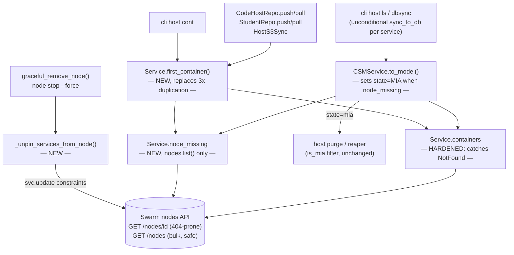
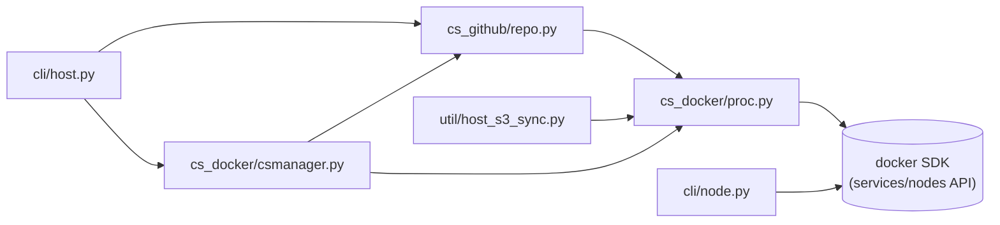

<!-- CLASI: Before changing code or making plans, review the SE process in CLAUDE.md -->

# Architecture Update — Sprint 008: Stale swarm node references — treat NotFound as MIA, detect and repair orphaned tasks

## Step 1: Understand the Problem

**The bug, confirmed by reading the code (not live clusters).** Docker
Swarm task records outlive the node they were scheduled on. When a Swarm
task's `NodeID` refers to a node that has since been removed from the
cluster, `client.nodes.get(<id>)` — a single-node fetch — 404s
(`docker.errors.NotFound`). The entire codebase makes exactly **one**
call of that shape:

- [`cspawn/cs_docker/proc.py:159`](cspawn/cs_docker/proc.py#L159) —
  `Service.containers` (a generator): `node = self.manager.client.nodes.get(node_id)`,
  where `node_id = t["NodeID"]` for each of the service's `container_tasks`.

Every other node-touching call in the codebase uses `client.nodes.list()`
(a bulk call that never 404s on a missing ID) — confirmed by grepping
every `.nodes.` and `container.node` usage in `cspawn/` (see the full
sweep table in Step 3). This means the fix has exactly one true source,
and every consumer of `Service.containers` inherits safety automatically
once that one generator is hardened — the same "single choke point"
pattern sprint 007 used for `stop_host()`.

**Consumers of `Service.containers` (who breaks today), confirmed by
reading each call site:**

1. `CSMService.to_model()` — `cs_docker/csmanager.py:185`
   (`next(self.containers)`). Its surrounding `try/except` catches
   `(KeyError, StopIteration)` and `(ConnectionError, OSError)` but not
   `docker.errors.NotFound` — so a stale-node service can blow up `sync()`,
   not just push, exactly as the issue states. **Additional, more subtle
   gap found in this sweep**: even where the exception is added, `to_model()`
   would only ever set `container_id=None`/`node_id=None` for a `None`
   container — it does **not** touch `state`, which comes from
   `self.status` (the *Swarm-reported* task state, still `"running"` for
   an orphaned pinned task — see root cause below). So a naive "catch and
   set c=None" fix would still leave the host looking healthy in `host ls`.
   This is the actual reason `to_model()` needs a dedicated `node_missing`
   signal, not just a broader except clause.
2. `CodeHostRepo._get_service_container()` — `cs_github/repo.py:59`
   (`list(service.containers)`), used by `push()` (issue's named site,
   `repo.py:113` `container.node.attrs[...]` — see note below) and by
   `pull()` **once its pre-existing bug is fixed** (see Step 3, M2).
3. `StudentRepo._get_service_and_container()` — `cs_github/repo.py:320`
   (`list(service.containers)`) — used by `StudentRepo.push()`/`pull()`
   (load-test / non-`CodeHostRepo` git paths). **Not named in the issue,
   found by this sprint's sweep.**
4. `HostS3Sync.get_service_and_container()` —
   `cspawn/util/host_s3_sync.py:27` (`list(service.containers)`) — used by
   `cspawnctl host sync` (S3 workspace sync). **Not named in the issue,
   found by this sprint's sweep.**
5. `cli/host.py:cont` command, line 93: `list(s.containers)[0].o` — prints
   a service's container for debugging. **Not named in the issue, found
   by this sprint's sweep.** Its existing `except NotFound:` (line 94)
   happens to catch today's raw `docker.errors.NotFound` from the node
   lookup (both "service not found" and "node not found" raise the same
   exception type in docker-py), but prints the misleading message
   "Service {name} not found" for a service that *does* exist. **After
   this sprint's `proc.py` fix, this call site would instead get an
   `IndexError` on an empty list** (since `Service.containers` will no
   longer raise, it will just yield nothing) — a regression this
   architecture update explicitly fixes (Step 3, M2).

**Note on `container.node.attrs[...]` in `push()` (`repo.py:113`, the
issue's named line):** by the time `push()` has a `container` object in
hand, `Container.node` was already attached inside `Service.containers`
(`cont.node = node`, `proc.py:228`) using an already-resolved `Node`
object with `.attrs` populated. Once `Service.containers` is fixed to
never yield a container whose node failed to resolve, line 113 becomes
provably safe **without being touched itself** — the fix is fully
absorbed by the lower layer. `push()`'s only exposure is that
`_get_service_container()` might now raise a clean `ValueError` (no
container found) instead of reaching line 113 at all, which `push()`
already lets propagate to its caller (unchanged — every caller already
wraps `push()` in `except Exception`, per sprint 007).

**Root cause — confirmed by reading `cli/node.py` and `cli/node.py`'s
callers in `autoscale.py`, not observed live:**

- `_pin_service_to_node()` (`cli/node.py:145-158`, used by `node
  rebalance`) sets a **hard** Swarm placement constraint,
  `node.hostname==<fqdn>`, on a service. A hard constraint means Swarm's
  scheduler can *only* place that service's task on the named node —
  never on any other, even if the named node is drained or gone.
- `graceful_remove_node()` (`cli/node.py:1993-2085`, shared by `node
  stop`'s non-force path, `node contract --force-drain`, and the
  automated autoscale scale-down path via `apply_reaper_zones`'s sibling
  scale-down code in `autoscale.py:1024-1071`) does: drain → wait up to
  600s for tasks to drain (`_wait_node_tasks_drained`,
  `cli/node.py:769-803`) → remove the node from Swarm (`force=True`) →
  destroy the droplet. If a service is hard-pinned to the node being
  drained, Swarm **cannot** reschedule its task anywhere else — no other
  node satisfies the constraint — so the task simply never transitions;
  `_wait_node_tasks_drained` will most likely time out, log a warning,
  and the code proceeds to force-remove the node and destroy the droplet
  **anyway**. The pinned task's last-known `Status.State` (`"running"`)
  and its now-permanently-invalid `NodeID` persist in Swarm's task
  history — nothing ever supersedes it, because no replacement task can
  ever be scheduled while the impossible constraint remains.
- `node stop --force` (`cli/node.py:2088-2132`) is worse: it destroys the
  droplet directly, with **no drain step at all** ("required until
  drain/remove is implemented" per its own docstring) — a service
  hard-pinned to that node has no chance to be evacuated before the node
  simply vanishes.
- **The automated autoscale scale-down path is not exposed to this**:
  `plan_scale_down()` (`autoscale.py:403-490`) only ever selects nodes
  with `running_hosts == 0`, and the orchestrator (`autoscale.py:1046-1061`)
  re-checks `count_hosts_per_node()` immediately before draining as a
  race guard. `count_hosts_per_node()` (`cli/node.py:53-76`) counts task
  `NodeID`s directly from `svc.tasks()` — it never calls `nodes.get()`, so
  it cannot itself be fooled by a stale reference, and it would correctly
  show `>0` for a node genuinely still hosting a pinned service. So the
  two exposed vectors are specifically the **manual** `node contract
  --force-drain` and `node stop --force` operator commands — both
  explicit, documented escape hatches for moving/removing a *loaded*
  node, which is exactly when a hard pin becomes dangerous.
- This matches the observed production symptom precisely: `gavin-morris`
  was very likely relocated onto its now-destroyed node by a prior `node
  rebalance` (which pins), and that node was later removed by one of the
  two exposed vectors, leaving the pinned task orphaned with a stale
  `NodeID` and a Swarm-reported `"running"` status that never changes on
  its own.

**Sprint 007 composition requirement.** Sprint 007 added
`CodeServerManager.stop_host()` (push → stop → delete, every step
best-effort, never raises) and hardened `CodeHostRepo.push()`'s subprocess
with a timeout. This sprint's fixes must compose with that: a push that
hits a stale node must surface as `StopResult.push_error`, never crash
`stop_host()` or the batch it's part of. Verified by reading
`stop_host()` (`csmanager.py:701-766`): its push step already wraps
`CodeHostRepo(...).push()` in a bare `except Exception`, so **this already
works today** for any exception type, including a raw
`docker.errors.NotFound` — sprint 007's resilience is not itself broken.
What's missing is (a) a clean, typed, informative failure instead of a
raw docker exception bubbling out of *non-`stop_host()`* callers (`host
push` used standalone, `host cont`, `HostS3Sync`, `StudentRepo`), and (b)
detection — `to_model()` never marking the row MIA, so the healing paths
that already exist (`is_mia`-gated purge/reap) never trigger.

## Step 2: Responsibilities

| Responsibility | Belongs To | Change |
|---|---|---|
| Resolve a Swarm task's node without ever raising `docker.errors.NotFound`; skip a stale task cleanly | `Service.containers` (`cs_docker/proc.py`) | Harden (single choke point) |
| Answer "does this service have a task whose node no longer exists?" | `Service.node_missing` (`cs_docker/proc.py`, new) | New property |
| Return a service's first live container, or a clear, typed reason why not | `Service.first_container()` (`cs_docker/proc.py`, new) | New method, replaces 3x duplicated `list(...); if not: raise ValueError` |
| Mark a `CodeHost` row MIA when its live task's node is gone, without misclassifying a not-yet-started host | `CSMService.to_model()` (`cs_docker/csmanager.py`) | Harden |
| Surface a stale-node condition as a clean `ValueError` to git-push/pull and S3-sync callers | `CodeHostRepo`, `StudentRepo` (`cs_github/repo.py`), `HostS3Sync` (`util/host_s3_sync.py`) | Delegate to `Service.first_container()` |
| Fix a pre-existing unrelated bug in the same method group being touched | `CodeHostRepo.pull()` (`cs_github/repo.py`) | Bugfix (see Step 6) |
| Print a clean message instead of crashing when inspecting a stale-node host | `cli/host.py` `cont` command | Harden |
| Prevent a hard node-pin from making a task permanently unreschedulable when its node is removed | `graceful_remove_node()`, `node stop --force` (`cli/node.py`) | New guard, shares `_service_constraints()` with existing pin logic |

These group into three modules: **M1** (the `cs_docker` foundation:
`proc.py` + the `to_model()` consumer, since MIA-marking is inseparable
from the node-resolution fix that enables it), **M2** (the remaining
consumers: `cs_github`, `util`, `cli/host.py`, all mechanically delegating
to M1's new `Service` methods), and **M3** (the unrelated node-lifecycle
subsystem in `cli/node.py` that owns pinning and removal).

## Step 3: Subsystems and Modules

### M1 — Safe node/container resolution + MIA detection (`cspawn/cs_docker/`)

**Purpose:** Resolve a Swarm service's live container and node without
ever raising on a destroyed node, and make that fact visible in the
`CodeHost` row's state.

**What is inside:**

- `Service.containers` (`proc.py`, existing generator, hardened): wraps
  `self.manager.client.nodes.get(node_id)` in
  `try/except docker.errors.NotFound`, logs an ERROR naming the task,
  service, and stale `NodeID`, and `continue`s — the same treatment the
  generator already gives a missing `container_id` or a
  `ConnectionError`/`OSError` a few lines above it (consistent style, same
  function, no new pattern introduced).
- `Service.node_missing` (`proc.py`, new property): `True` if any of the
  service's `container_tasks` has a `NodeID` not present in
  `self.manager.client.nodes.list()`. Uses the bulk `list()` call
  (already the pattern used by `count_hosts_per_node()` in `cli/node.py`
  and by `_pin_service_to_node()`'s siblings), never `nodes.get()`, so
  this check can never itself throw `NotFound`. Cheap: one Docker API
  call, only evaluated when `to_model()`/`first_container()` already
  found no live container.
- `Service.first_container()` (`proc.py`, new method): returns
  `list(self.containers)[0]` if non-empty; otherwise raises `ValueError`
  with a message that distinguishes "task exists but its node is gone"
  (`self.node_missing`) from "no container yet" — replacing three
  independent copies of `list(service.containers); if not: raise
  ValueError(...)` (in `CodeHostRepo`, `StudentRepo`, `HostS3Sync`) with
  one definition that also carries the new diagnostic.
- `CSMService.to_model()` (`csmanager.py`, hardened): after the existing
  `next(self.containers)` try/except leaves `c = None`, additionally
  check `self.node_missing`. If `True`, set `state=HostState.MIA.value`
  and `app_state=HostState.MIA.value` on the returned `CodeHost` —
  overriding `self.status` (which would otherwise still report the
  Swarm-stale `"running"`). If `False` (e.g., a fresh service with no
  task yet), `state` is left as `self.status` exactly as today — a
  starting host is not misclassified as MIA.

**What is outside:** `Service.containers`/`node_missing`/`first_container()`
know nothing of `CodeHost`, GitHub, or Flask — they stay inside the
existing "generic Swarm wrapper" boundary sprint 007 identified and
protected (`cs_docker/proc.py` + `manager.py` have zero Flask/DB/GitHub
imports today; this sprint adds none). `to_model()` remains the one place
that translates Swarm-level facts into `CodeHost`/`HostState` — it does
not change *how* `sync_to_db()`/`sync()` decide which services to visit,
only what it records once visited.

**Use cases served:** SUC-001 (primary), SUC-002/003/004/005 (all depend
on `Service.containers`/`first_container()` never raising).

### M2 — Consumer wiring (`cspawn/cs_github/repo.py`, `cspawn/util/host_s3_sync.py`, `cspawn/cli/host.py`)

**Purpose:** Replace each of the three duplicated "get a service's first
container or explain why not" blocks with a call to `Service.first_container()`,
and fix the one CLI command whose existing exception handling would
otherwise regress once M1 stops raising `NotFound`.

**What is inside:**

- `CodeHostRepo._get_service_container()`: body becomes `service =
  self.app.csm.get(self.service_name); ...; return service,
  service.first_container()`. `push()` itself is **not modified** (see
  Step 1 note — its safety is fully absorbed by M1).
- `CodeHostRepo.pull()`: fixes the pre-existing bug where it calls
  `self._get_container()` (a method that does not exist anywhere in the
  class — confirmed by grep, this is a dormant `AttributeError` today,
  unrelated to node resolution but in the same method group this ticket
  is already touching) by switching to `_, container =
  self._get_service_container()`, matching `push()`'s existing pattern.
  See Step 6 for why this is bundled here rather than deferred.
- `StudentRepo._get_service_and_container()`: same delegation to
  `service.first_container()`.
- `HostS3Sync.get_service_and_container()`: same delegation.
- `cli/host.py` `cont` command: guards `s is None` (service genuinely not
  found) before use, and replaces `list(s.containers)[0].o` with
  `s.first_container().o`, catching `ValueError` for a clean "no
  resolvable container" message — fixing the `IndexError` regression M1
  would otherwise introduce at this one call site (see Step 1).

**What is outside:** M2 does not change any of these methods' external
contracts — `push()`, `pull()`, `StudentRepo.push()`/`pull()`, and
`HostS3Sync`'s sync operations still return/raise exactly what callers
already handle (a `ValueError`/`RuntimeError` caught by an outer
`except Exception`, per sprint 007's established pattern at every call
site). No new configuration, no new public API.

**Use cases served:** SUC-002, SUC-003, SUC-004, SUC-005.

### M3 — Orphaned-task prevention at node removal (`cspawn/cli/node.py`)

**Purpose:** Ensure a service hard-pinned to a node being removed is
unpinned first, so Swarm can reschedule it instead of leaving it
permanently stuck once the node is gone.

**What is inside:**

- `_unpin_services_from_node(client, node_fqdn, *, log=None) -> int` (new
  function, next to `_pin_service_to_node`/`_service_constraints`):
  lists `jtl.codeserver` services, finds any whose constraints include
  `node.hostname==<fqdn>` (matching both FQDN and short-name forms, the
  same normalization `_pin_service_to_node` already applies when
  replacing a prior pin), strips just that constraint via
  `svc.update(constraints=kept)`, and returns the count unpinned.
  Failures on an individual service are caught and logged as warnings —
  never fatal, matching this file's existing defensive style throughout
  `graceful_remove_node()`.
- `graceful_remove_node()`: calls `_unpin_services_from_node()` once
  `node_obj` is resolved, immediately before `_drain_swarm_node()`.
- `stop_node --force` branch: calls `_unpin_services_from_node()`
  best-effort (own try/except, never blocks the destroy) immediately
  before `droplet.destroy()`, constructing a `manager_client` the same
  way the non-force branch already does if `DOCKER_URI` is configured.

**What is outside:** M3 does not change `_pin_service_to_node()` itself
(rebalance's own re-pin-replaces-old-pin behavior is correct and
untouched), does not change node *selection* policy
(`_select_contract_candidate`/`_select_drain_candidate`/`plan_scale_down`),
and does not add a new CLI command. The automated autoscale scale-down
path needs no separate change — it already calls the shared
`graceful_remove_node()`, so it inherits the fix for free (same
choke-point principle as sprint 007's `stop_host()`).

**Use cases served:** SUC-006.

## Step 4: Diagrams

### Component diagram

### Dependency graph

No cycles. No new edges: `csmanager.py` and `cs_github/repo.py` already
depended on `proc.py`'s `Service`/`Container` classes before this sprint
(they're how a service's containers are ever obtained); `cli/node.py`
already talked to the Docker SDK directly for constraints (`svc.update`)
in `_pin_service_to_node`. `cli/node.py` does not gain a dependency on
`proc.py`/`csmanager.py` — M3 is self-contained within the existing
raw-docker-SDK style `cli/node.py` already uses throughout (it never
imports `Service`/`CSMService`). Dependency direction unchanged:
Presentation/CLI → `cs_docker`/`cs_github` (domain-ish orchestration) →
generic Swarm wrapper (`proc.py`/`manager.py`) → Docker SDK.

No entity-relationship diagram — no schema change this sprint (`state`/
`app_state` are existing `CodeHost` columns; this sprint changes what
value they're set to under a specific new condition, not the schema).

## Step 5: Complete Document

### What Changed

**`cspawn/cs_docker/proc.py`**
- `Service.containers`: wraps the single `self.manager.client.nodes.get(node_id)`
  call in `try/except docker.errors.NotFound`; logs and `continue`s
  instead of raising.
- New `Service.node_missing` property.
- New `Service.first_container()` method.

**`cspawn/cs_docker/csmanager.py`**
- `CSMService.to_model()`: when the container-resolution try/except
  leaves `c = None`, additionally consults `self.node_missing`; if
  `True`, sets `state`/`app_state` to `HostState.MIA.value` in the
  returned `CodeHost`'s constructor kwargs (built conditionally — `app_state`
  is only ever included in the kwargs when forcing MIA, so the
  non-MIA/non-container path's existing behavior of leaving `app_state`
  untouched on an existing row is preserved exactly — see Step 6 for why
  this conditional-kwargs detail matters).

**`cspawn/cs_github/repo.py`**
- `CodeHostRepo._get_service_container()`: delegates to
  `service.first_container()`.
- `CodeHostRepo.pull()`: fixes the `self._get_container()` →
  `self._get_service_container()` bug (Step 6).
- `StudentRepo._get_service_and_container()`: delegates to
  `service.first_container()`.

**`cspawn/util/host_s3_sync.py`**
- `HostS3Sync.get_service_and_container()`: delegates to
  `service.first_container()`.

**`cspawn/cli/host.py`**
- `cont` command: guards `s is None`; replaces `list(s.containers)[0].o`
  with `s.first_container().o`; catches `ValueError` for a clean message.

**`cspawn/cli/node.py`**
- New `_unpin_services_from_node(client, node_fqdn, *, log=None) -> int`.
- `graceful_remove_node()`: calls it before draining.
- `stop_node --force` branch: calls it (best-effort) before destroying
  the droplet.

### Why

See Step 1. The issue's own two named call sites (`repo.py:114`,
`csmanager.py:225-226`) are downstream symptoms of one upstream cause
(`proc.py:159`); fixing there, plus wiring the three additional call
sites this sprint's sweep found (`StudentRepo`, `HostS3Sync`, `cli host
cont`), closes every path that can currently crash on a stale node.
Marking `to_model()`'s result MIA closes the "looks healthy until it
breaks" visibility gap the issue specifically calls out, by reusing
`host purge`/reaper machinery that already exists and needs no changes.
The `cli/node.py` unpin fix addresses the issue's explicit ask to
"investigate whether graceful_remove_node/drain can leave tasks pinned to
dead NodeIDs" — confirmed yes, and fixed at the point where the constraint
is created's inverse is needed.

### Impact on Existing Components

| Component | Impact |
|---|---|
| `Service.containers` | Behavior change: a task on a destroyed node is now silently skipped (logged) instead of raising. Every existing caller (`to_model()`, `_get_service_container()`, `_get_service_and_container()`, `get_service_and_container()`, `cli host cont`) already tolerates "zero containers" as a normal case (empty list / `StopIteration`) — this is a strict reliability improvement, not a new failure mode any caller needs to learn. |
| `CSMService.to_model()` | New: can now set `state`/`app_state` to `mia` for a service it previously would have reported with `state=self.status` (typically `"running"`, wrongly). No caller depends on the old (wrong) value — `sync()`, `sync_to_db()`, `host ls`, `host purge`'s sync step all read `state`/`is_mia` expecting exactly this correction. |
| `CodeHostRepo.pull()` | Bugfix: previously always raised `AttributeError` (undefined method) on any call; now works, using the same hardened path as `push()`. No caller currently depends on the `AttributeError` (it is dead/unreachable code today — confirmed by grep, `pull()` has no test coverage and no known working caller). |
| `cli/host.py cont` | Failure mode changes from a raw `docker.errors.NotFound` (today, coincidentally caught by the existing `except NotFound` but with a misleading message) to a clean `ValueError` message — a strict improvement, and necessary to avoid the `IndexError` regression M1 would otherwise cause here. |
| `host purge` / reaper / `stop_host()` / `remove_all()` | No code change. Their existing `is_mia`/`is_quiescent` filters and best-effort push/stop/delete sequencing (sprint 007) now receive *correct* input for this failure class — this is the payoff of M1's detection fix, not a new dependency. |
| `graceful_remove_node()` / `node stop --force` | New pre-step (unpin). Existing drain/remove/destroy sequence and all its existing error tolerance (drain timeout warnings, remove-node fallback to low-level API, destroy-failure raising `ClickException`) are unchanged. |
| Automated autoscale scale-down | No code change (calls the shared `graceful_remove_node()`); inherits the unpin fix transitively, consistent with it never being exposed to this bug in the first place (Step 1). |

### Migration Concerns

- **No database schema change.** No Alembic migration needed — `state`/
  `app_state` are existing `CodeHost` columns.
- **No backfill needed.** Existing broken production rows (e.g.
  `gavin-morris`) self-correct the next time any code path calls
  `sync_to_db()` for them — and `host ls` already does this
  unconditionally for every live Swarm service on every invocation. The
  first `host ls` (or `host purge`, or `host dbsync`) run after this
  ships will mark them MIA; the very next `host purge` will clean them
  up.
- **No backward-incompatible signature changes.** `first_container()` and
  `node_missing` are new additions to `Service`; existing methods
  (`push()`, `to_model()`'s public signature, `cont`'s CLI interface)
  keep their existing signatures.
- **Deployment sequencing:** pure application code change, single
  release. Ticket 001 (M1) is safe to ship alone — it only changes
  behavior for a condition (`docker.errors.NotFound` on node lookup) that
  currently crashes callers anyway, so there is no working behavior to
  regress. Ticket 002 (M2) depends on ticket 001's new `Service` methods
  existing. Ticket 003 (M3) is independent of 001/002 (different
  subsystem, `cli/node.py`'s pinning/removal machinery) and could ship in
  any order, but is sequenced last since detection/defense (the
  stakeholder's most acute pain — "hosts look healthy until they break")
  is the priority.
- **Operational note:** after this sprint, a stale-node host that today
  would eventually get manually noticed (via a crash) will instead
  quietly flip to `mia` on the next `host ls`/sync and get swept by the
  next `host purge`/reaper cycle. Operators who were used to a crash as
  their signal to investigate should be told this now happens silently —
  flagged in Open Questions (log visibility).

## Step 6: Design Rationale

### Decision: Fix `Service.containers` at its one true source, not at each of the five consumers

**Context:** The issue names two call sites; this sprint's sweep found
three more. A per-consumer fix (five separate `try/except
docker.errors.NotFound` blocks) was the naive alternative.

**Alternatives considered:**
1. Wrap each of the five consumer call sites in its own
   `try/except docker.errors.NotFound`. Rejected: duplicates the same
   three lines five times, and a sixth future consumer (anything else
   that ever calls `service.containers`) would silently reintroduce the
   bug — exactly the "scattering try/excepts" the sprint brief warned
   against.
2. Fix `Service.containers` once, at `proc.py:159` (chosen). Every
   consumer already funnels through this one generator to get a
   container at all — there is no way to obtain a `Container` object in
   this codebase without going through it. Fixing it here is not a
   broader-than-needed change; it is the narrowest possible fix that
   still covers every current and future consumer.

**Choice:** 2.

**Consequences:** `Service.containers` gains one more `except` clause
alongside its two existing ones (`KeyError`-on-missing-container-id,
`ConnectionError`/`OSError`-on-unreachable-node) — same function, same
established style, not a new pattern. Any future code that calls
`service.containers` inherits the safety automatically, with no action
required.

### Decision: `node_missing` as an explicit, separate signal — not inferred from `to_model()`'s existing `c is None` branches

**Context:** `to_model()` already has a `c = None` fallback for three
distinct reasons today (no container yet, `KeyError`/`StopIteration`,
`ConnectionError`/`OSError`) and would gain a fourth (node destroyed) if
`Service.containers` simply swallowed the new exception too. All four
collapse to the same `c = None`, but only one of them (node destroyed)
should force `state=mia` — the others are legitimately transient
("starting", "network blip").

**Alternatives considered:**
1. Treat every `c is None` case as MIA. Rejected: would misclassify a
   host that is merely starting up, or hit a transient connection blip
   during an otherwise-healthy sync pass, as permanently dead —
   `sync()`'s own retry-on-next-pass design (and `sync_converge()`)
   exists specifically to tolerate exactly these transient cases without
   flagging them.
2. A dedicated `node_missing` property, checked only when `c is None`,
   using a bulk `nodes.list()` call independent of whatever caused
   `Service.containers` to yield nothing (chosen). This correctly
   distinguishes "there was a task Swarm still considers live, but its
   node is provably gone" (the one case that should be MIA) from every
   other `c is None` reason.

**Choice:** 2.

**Consequences:** One extra Docker API call (`nodes.list()`) per
`to_model()` invocation, but only on the already-uncommon path where no
container was resolved — negligible cost, and it is the same call
`count_hosts_per_node()` already makes routinely elsewhere in the
codebase.

### Decision: `Service.first_container()` as a new shared method, replacing three duplicated call sites

**Context:** `CodeHostRepo._get_service_container()`,
`StudentRepo._get_service_and_container()`, and
`HostS3Sync.get_service_and_container()` each independently implement
`containers = list(service.containers); if not containers: raise
ValueError(...)`. This sprint must add the same `node_missing`-aware
error message to all three regardless of approach.

**Alternatives considered:**
1. Add the `node_missing` check to each of the three copies
   independently. Rejected: perpetuates a pre-existing (not introduced by
   this sprint) triplication this sprint is already touching all three
   call sites of; three copies to keep in sync going forward for no
   benefit.
2. One `Service.first_container()` method on the class that already owns
   `containers` and `node_missing` (chosen). Consistent with this
   codebase's existing convention that `Service`/`Container` (the generic
   Swarm wrapper) owns "how do I get my container, and what's wrong if I
   can't."

**Choice:** 2.

**Consequences:** `CodeHostRepo`, `StudentRepo`, and `HostS3Sync` each
shrink by a few lines and gain the diagnostic for free. This is a small,
in-sprint cleanup of a pre-existing pattern, not a speculative/broader
refactor — it is strictly the minimum needed to give all three call sites
the same clear error message without copy-pasting it three times.

### Decision: Bundle the `CodeHostRepo.pull()` `_get_container()` bugfix into this sprint

**Context:** `pull()` calls `self._get_container()`, a method that does
not exist anywhere on `CodeHostRepo` (confirmed by grep across
`cspawn/`) — every call to `pull()` today raises `AttributeError`
immediately, before ever touching node resolution. This is a pre-existing
bug, not introduced by and not strictly a stale-node symptom.

**Alternatives considered:**
1. Leave it untouched — out of scope, a different bug class (missing
   method vs. stale node). This is the default per "do not fix unrelated
   pre-existing bugs."
2. Fix it as part of M2, since `pull()`'s evident intent (mirroring
   `push()`) was always to call the same service/container resolution
   helper this sprint is already hardening, and the fix is a one-line
   rename to the method M2 is already modifying in the same file, in the
   same class, in the same ticket (chosen).

**Choice:** 2. Sprint 007 set a precedent for noting (and, when trivial
and directly adjacent, fixing) pre-existing defects discovered while
sweeping a related area (its dead-code finding in `delete_class`).
Leaving `pull()` calling a nonexistent method while simultaneously
teaching its sibling `push()` (and `_get_service_container()`, which
`pull()` should have been calling all along) to handle stale nodes
correctly would mean `pull()` remains 100% broken for an unrelated
reason, undermining confidence in "every git-exec path is now hardened."

**Consequences:** `CodeHostRepo.pull()` becomes callable for the first
time. This is a strict fix, not a behavior change any caller currently
depends on (it could not have succeeded before). Flagged explicitly in
Migration Concerns and called out in the ticket so the reviewer does not
mistake it for scope creep.

### Decision: Repair = correct detection + existing purge/reap, not a new in-place reschedule command

**Context:** The issue's suggested direction asks whether Swarm should be
"nudged to reschedule" orphaned tasks, and the sprint brief asks for
either an automated repair command or a documented manual path.

**Alternatives considered:**
1. Build a `cspawnctl host repair <name>` command that forces Swarm to
   reschedule the task in place (e.g., a no-op `service.update()` to
   trigger reconciliation). Rejected: `service.stop()` (already used by
   `stop_host()`) is a pure `DELETE /services/{id}` control-plane
   operation — it does not need to contact the dead node at all (verified
   by reading `CSMService.stop()` → `Service.remove()` →
   `self._object.remove()`, and `ServicesManager.get()`, neither of which
   touch `.node`). Once the row is correctly marked MIA (M1), `host
   purge`/the reaper already remove the orphaned service and DB row with
   zero new code — "nudging Swarm to reschedule in place" would recreate
   the *same* container, on the *same* now-stale node reference, solving
   nothing; the actually-useful outcome (a fresh container on a live
   node) is exactly what `new_cs()` already does on the student's next
   login.
2. Correct detection (M1) + rely on existing purge/reap (chosen), with
   the student's next login as the recovery path, documented explicitly.

**Choice:** 2.

**Consequences:** No new command, no new operational surface to learn or
maintain. The tradeoff: a student whose host went stale must explicitly
restart it (log back in) rather than having it silently and
transparently "fixed" while they were away — judged acceptable, since
the underlying container was unreachable and unrecoverable regardless of
which repair strategy was chosen (the workspace itself survives via the
shared NFS mount, independent of this decision, same as every other stop
path in sprint 007).

### Decision: Unpin before drain/destroy, not a broader "never destroy a loaded node" policy change

**Context:** The root cause is enabled specifically by `node contract
--force-drain` and `node stop --force` being willing to touch a *loaded*
node at all, combined with hard pins from `rebalance` making eviction
impossible.

**Alternatives considered:**
1. Prevent `--force-drain`/`--force` from ever targeting a node with any
   `jtl.codeserver` service on it, full stop. Rejected: `--force-drain`
   exists precisely for the operator to relocate load off a node they
   need to remove for other reasons (capacity right-sizing, hardware
   issues) — removing that capability entirely is a bigger, riskier
   policy change than "cheap prevention" calls for, and isn't what either
   command is for if load can never be present.
2. Strip the specific hard pin that makes the *specific* node
   unreschedulable, immediately before removal, leaving everything else
   about the commands unchanged (chosen). This is the minimal
   intervention that directly targets the mechanism that turns "drain a
   loaded node" (intended, working) into "permanently orphan a task"
   (the bug).

**Choice:** 2.

**Consequences:** `--force-drain`/`--force` still relocate/destroy a
loaded node's workload, as designed — the fix only ensures Swarm is
*able* to reschedule rather than constrained not to. A node with many
pinned services now has all of them freed for rescheduling at once; this
is the same blast radius the operator already accepted by choosing
`--force-drain`/`--force` on a loaded node in the first place.

## Step 7: Open Questions

1. **Silent self-healing vs. operator visibility (stakeholder input
   welcome):** today, a stale-node host eventually surfaces as a crash
   (loud, but ugly and undebounced). After this sprint, it quietly
   becomes `mia` on the next `host ls`/sync and is later purged — correct,
   but easy to miss if no one is watching logs. Consider whether `host
   ls`/the admin UI should distinguish "MIA via stale node" from other
   MIA causes (e.g., a `reason` column), or whether the ERROR-level log
   line added in `Service.containers`/`to_model()` is sufficient signal
   for now. This sprint adds the log line but does not add a `reason`
   column — flagged for a future sprint if the log line proves
   insufficient in practice.
2. **Periodic re-verification of already-`ready` hosts (stakeholder
   decision):** `sync()`'s "not-ready" filter intentionally skips hosts
   already at `state=running, app_state=ready` (`csmanager.py:824-826`),
   so a host that goes stale *after* being marked ready is only caught by
   `host ls` (which unconditionally re-syncs every live service) — not by
   a cron'd `host dbsync`/`sync_converge` alone. Confirm whether the
   stakeholder wants `sync()` to also periodically re-verify a sample (or
   all) of the already-ready fleet, trading cron cost for faster
   automatic detection without requiring an operator to run `host ls`.
   Left out of this sprint's scope pending that input.
3. **`--force-drain`/`--force` node-loaded-removal policy (informational,
   low priority):** this sprint fixes the *consequence* (permanent
   orphaning) of removing a loaded, pinned node; it does not revisit
   whether these commands should warn more loudly, require an extra
   confirmation, or log a summary of what got unpinned/rescheduled. Worth
   a UX pass in a future sprint if `--force-drain` sees more operator use.
4. **Verification on the production master node (stakeholder-owned, per
   the sprint brief):** the stakeholder intends to test the `host
   purge`/`host ls` self-healing path against the real `gavin-morris`
   host once this ships. No action needed from planning beyond flagging
   it here as the expected verification step.
