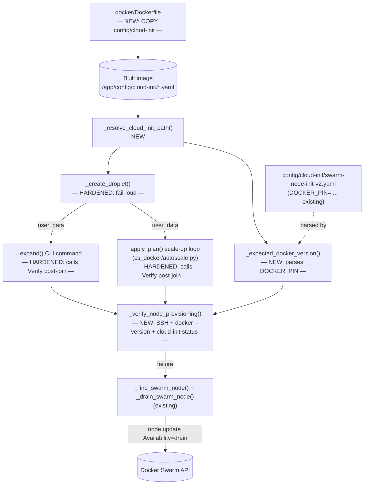
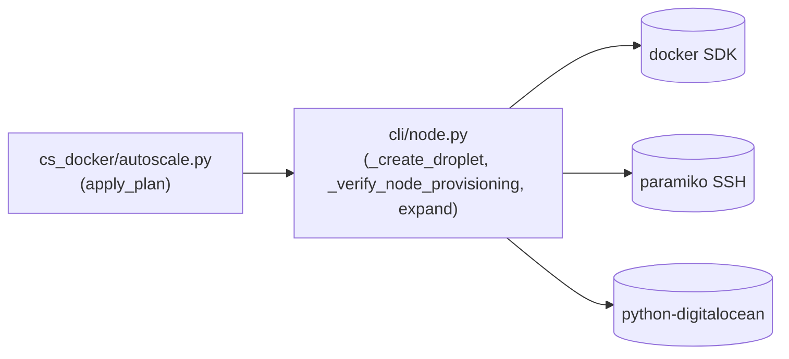

<!-- CLASI: Before changing code or making plans, review the SE process in CLAUDE.md -->

# Architecture Update — Sprint 009: Ship cloud-init in image, fail loudly on missing user-data, verify node provisioning

## Step 1: Understand the Problem

**The bug, confirmed by reading the code (and reproduced live on prod
2026-07-05).** `_create_droplet` (`cspawn/cli/node.py:1171-1188`) resolves
the configured cloud-init file as
`find_parent_dir()/config/cloud-init/<DO_CLOUD_INIT>`. `find_parent_dir()`
(`cspawn/util/config.py:52`) walks up from `JTL_APP_DIR` (or cwd) looking for
a `config/` directory or `.env` file — inside the deployed container,
`JTL_APP_DIR=/app`, and `/app` does contain a `config/` directory (created by
`COPY docker/gunicorn_config.py /app/config/gunicorn_config.py`,
`docker/Dockerfile:70`), so `find_parent_dir()` happily returns `/app`. The
resolved path `/app/config/cloud-init/swarm-node-init-v2.yaml` then simply
doesn't exist, because `docker/Dockerfile` never copies
`config/cloud-init/` — only `cspawn/`, `requirements.txt`, `pyproject.toml`,
`migrations/`, `docker/supervisord.conf`, `docker/gunicorn_config.py`,
`docker/ssh-config`, `data/`, and `docker/entrypoint.sh`. This omission was
deliberate for `config/` as a whole (sprint 002 made the image secret-free —
`config/{prod,local-prod,devel}/secrets.env` and `config/prod/id_rsa` live
there too), but `config/cloud-init/*.yaml` is plain, non-secret cloud-config
YAML that got swept into the same blanket exclusion.

Today, when the resolved path doesn't exist, `_create_droplet` does:

```python
if cip.exists():
    user_data = cip.read_text()
else:
    log.warning(f"[expand] CLOUD_INIT_FILE not found at {cip}; proceeding without user-data")
```

— a warning, not an abort. `DO_CLOUD_INIT=swarm-node-init-v2.yaml` is set in
every deployment's `public.env` (`config/devel/public.env:21`,
`config/local-prod/public.env:24`, `config/prod/public.env:21`), so this is
the live path for every in-container node creation, not an edge case. The
resulting droplet boots as a raw `docker-20-04` DigitalOcean marketplace
image with none of `swarm-node-init-v2.yaml`'s fixes: the factory `ufw limit
22/tcp` rule stays in place (rate-limits the spawner's own SSH-over-Docker
tunnels until sshd flaps and every code host on the node sticks at
"starting"), the docker-ce version pin never runs (a node can join with a
docker-ce version that mismatches the swarm manager's), and the sshd
`MaxStartups`/swarm-dataplane UFW tuning never applies. Confirmed live on
prod 2026-07-05 (`swarm3`, hosts `bilkton`/`eric-busboom` stuck "starting",
docker 29.6.0 instead of the pinned 29.6.1).

**Two other findings from reading the code, both confirmed, one resolved
during planning:**

- **Domain-record sync (resolved, no code change needed).**
  `_sync_domain_records` (`cspawn/cli/node.py:1792-1933`) was suspected of
  creating A records for new nodes but never updating an existing record's
  IP when a node name is reused. Reading the update branch
  (`cspawn/cli/node.py:1886-1911`) shows it already does: `if
  getattr(primary, "data", "") != ip: primary.data = ip; ...; primary.save()`.
  This was confirmed live during planning — the operator's own `node expand`
  run on 2026-07-05 logged `[domains] Updated A swarm3.dojtl.net ->
  64.23.130.10 (ttl=60s)`. The earlier stale-DNS observation was a timing
  artifact: `_sync_domain_records` runs as the *last* step of the `expand`
  flow (`cspawn/cli/node.py:2362-2367`), so it simply hadn't run yet when the
  stale IP was observed. **No architecture or ticket for this item.**
- **`os.environ` shadowing `.env`** (`cspawn/util/config.py:174-177`, noted
  in the issue): real, but orthogonal to node provisioning — out of scope,
  deferred per the issue's own "optional, may split" framing.

**Root cause, restated as the actual gap to close:** the container image is
missing a file its own code depends on, and the code that depends on it
degrades silently instead of failing loudly. Both halves need fixing — ship
the file, *and* stop tolerating its absence when it's supposed to be there
— because fixing only one leaves the other failure mode open (a future
Dockerfile regression would silently reintroduce today's exact bug if the
code still just warns-and-proceeds).

A third, related gap: even with both of those fixed, cloud-init failing
*after* boot (a transient UFW/SSH race, an apt failure mid-provisioning) is
invisible to `_create_droplet` — cloud-init runs asynchronously after the
droplet becomes SSH-reachable. `_wait_for_cloud_init`
(`cspawn/cli/node.py:510-553`) already waits for cloud-init to report done,
but it is explicitly **best-effort** ("proceeding anyway" on timeout or
unavailable status) — by design, so a slow-but-eventually-fine node isn't
blocked forever. That design is correct for *waiting*, but it means nothing
today hard-fails when cloud-init genuinely never finishes or finishes with
the wrong docker version. This sprint adds that hard-fail gate as a
separate, explicit post-join verification step — distinct from (and after)
the existing best-effort wait.

## Step 2: Identify Responsibilities

| Responsibility | Belongs To | Change |
|---|---|---|
| Ship the plain-YAML cloud-init templates inside the image without shipping secrets | `docker/Dockerfile` | New `COPY` + build-time self-check |
| Resolve the configured cloud-init file path (single definition, reused by creation and verification) | `_resolve_cloud_init_path()` (`cli/node.py`, new) | New helper, extracted from `_create_droplet`'s inline logic |
| Refuse to create a droplet when cloud-init is configured but unavailable | `_create_droplet` (`cli/node.py`) | Harden: warning → `click.ClickException`, moved earlier (before SSH-key upload / `droplet.create()`) |
| Determine the docker-ce version a freshly-provisioned node is expected to report | `_expected_docker_version()` (`cli/node.py`, new) | New helper — parses the existing `DOCKER_PIN=` line already documented in the cloud-init YAML; no new config key |
| Verify a newly-joined node was actually provisioned (SSH, docker version, cloud-init done) | `_verify_node_provisioning()` (`cli/node.py`, new) | New function; reuses `_ssh_exec` |
| Prevent a verified-defective node from ever being scheduled | `expand()` (`cli/node.py`), `apply_plan()` (`cs_docker/autoscale.py`) | Both call the new verification and, on failure, drain via existing `_find_swarm_node`/`_drain_swarm_node` |
| Report a verification failure appropriately for the caller's context | `expand()` → hard CLI failure (non-zero exit); `apply_plan()` → recorded error + skip-and-continue | New branches in each, using each function's existing error-reporting convention (`click.ClickException` vs. `ApplyResult.errors`) |

These group into two modules, matching the two files that change: **M1**
(image contents — `docker/Dockerfile`, no Python) and **M2** (node
provisioning logic — `cspawn/cli/node.py`, consumed by both the manual
`expand` CLI and the automated `cspawn/cs_docker/autoscale.py` scale-up
path, exactly as `_create_droplet`/`_configure_node`/`_join_swarm` already
are today).

## Step 3: Define Subsystems and Modules

### M1 — Image contents (`docker/Dockerfile`)

**Purpose:** Make the plain-YAML cloud-init templates present inside the
built image, at the exact path `_create_droplet` resolves, without
widening the image's secret-free boundary.

**Boundary:** Inside — a new `COPY config/cloud-init /app/config/cloud-init`
line and an adjacent `RUN` self-check that fails the build if the directory
is empty. Outside — the rest of `config/` (`secrets.env`, `id_rsa`,
`dotconfig.yaml`, `known_hosts`, `host-scripts/`, `sops.yaml`) stays
uncopied, exactly as sprint 002 established; `.dockerignore` is read, not
changed (confirmed it already has no rule that would exclude `config/` or
`config/cloud-init/`).

**Use cases served:** SUC-001.

### M2 — Node provisioning logic (`cspawn/cli/node.py`, consumed by `cspawn/cs_docker/autoscale.py`)

**Purpose:** Make node creation refuse to proceed without its declared
provisioning input, and make node *joining* refuse to declare success
without confirming that provisioning actually took effect.

**Boundary:** Inside — the three new/changed functions (`_resolve_cloud_init_path`,
`_expected_docker_version`, `_verify_node_provisioning`) and the two call
sites that invoke them (`_create_droplet`, `expand()`). Outside — the
autoscaler's own scheduling/demand logic (`assess_cluster`, `build_plan`,
`plan_scale_up`) is untouched; `apply_plan()` only gains a new post-join
check inside its existing scale-up loop, using functions it already imports
by dotted reference from `cli.node` (the same pattern it already uses for
`_create_droplet`/`_configure_node`/`_join_swarm`). M2 does not touch
`_wait_for_cloud_init` (the existing best-effort wait) — the new
verification is a separate, later, hard-fail gate, not a replacement.

**Use cases served:** SUC-001 (unchanged happy path), SUC-002 (fail-loud),
SUC-003 (post-join verification, both manual and automated call sites).

## Step 4: Diagrams

### Component diagram



### Dependency graph



No cycles. No new edges beyond what already exists: `autoscale.py` already
depends on `cli/node.py` for `_create_droplet`/`_configure_node`/`_join_swarm`
(imported locally inside `apply_plan` to avoid a module-level circular
import); this sprint adds three more names to that same existing import,
not a new dependency direction. `cli/node.py` gains no new external
dependency — `_verify_node_provisioning` reuses the already-imported
`paramiko`/`re` and the existing `_ssh_exec` helper.

No entity-relationship diagram — no data model change this sprint (no new
DB tables/columns; `ApplyResult.errors` is an existing `list[str]` field
that gains more possible message content, not a schema change).

## Step 5: Complete the Document

### What Changed

**`docker/Dockerfile`**
- New `COPY config/cloud-init /app/config/cloud-init` line, placed next to
  the existing `COPY docker/gunicorn_config.py /app/config/gunicorn_config.py`
  (both populate `/app/config/`).
- New `RUN` step immediately after, asserting at least one `*.yaml` file
  exists under `/app/config/cloud-init/` — fails the build (and therefore
  the existing `docker build` step in `.github/workflows/docker-publish.yml`,
  which runs on every PR to `master`) if the copy silently produced an
  empty directory.

**`cspawn/cli/node.py`**
- New `_resolve_cloud_init_path(cfg) -> Path | None`: returns `None` when
  `DO_CLOUD_INIT`/`DO_CLOUD_INIT_FILE` is unset; otherwise returns
  `Path(find_parent_dir()) / "config" / "cloud-init" / <configured file>`
  without checking existence (callers decide what "missing" means for their
  context).
- `_create_droplet`: the cloud-init resolution block moves earlier (before
  `_ensure_priv_key()`/`_collect_do_ssh_keys()`) and changes from
  warn-and-proceed to: unset → proceed with `user_data=None` (unchanged);
  configured + resolvable → read and use (unchanged); configured +
  missing/unreadable → `raise click.ClickException(...)` naming the
  resolved path, before any DigitalOcean side effect.
- New `_expected_docker_version(cfg) -> str | None`: resolves the same
  cloud-init file via `_resolve_cloud_init_path`, regex-parses the
  `DOCKER_PIN="5:X.Y.Z-..."` pattern already present and documented in
  `config/cloud-init/swarm-node-init-v2.yaml:88-105`. Returns `None` if
  unconfigured or the pattern isn't found — callers treat `None` as "skip
  the version check," not as an error.
- New `_verify_node_provisioning(ip, key_path, *, expected_docker_version, ssh_checks=3, retry_delay=2.0, log=None) -> list[str]`:
  returns a list of failure strings (empty = healthy). Runs three checks
  over SSH using the existing `_ssh_exec` helper: (a) `ssh_checks`
  consecutive connect attempts, (b) `docker --version` contains
  `expected_docker_version` (skipped when `None`), (c) `cloud-init status`
  contains `"status: done"`. Never raises for an expected failure mode —
  mirrors `_wait_for_cloud_init`'s existing best-effort style for individual
  SSH/command failures, but *aggregates into a hard verdict* rather than
  logging-and-continuing.
- `expand()`: after the existing "verify node appears in swarm membership"
  block, when `last_ip`/`last_shortname` are known (i.e. this invocation
  ran configure+join), calls `_verify_node_provisioning`. On any failure:
  logs `ERROR` with the full failure list, best-effort looks up the node via
  `_find_swarm_node` and drains it via `_drain_swarm_node` (both existing),
  then raises `click.ClickException` summarizing the failures and noting the
  node was drained. On success: logs an info confirmation; existing
  summary/domain-sync output is unchanged.

**`cspawn/cs_docker/autoscale.py`**
- `apply_plan()`'s scale-up loop: after `_join_swarm(...)` succeeds for a
  tier, calls the same `_verify_node_provisioning` (imported alongside the
  existing `_create_droplet`/`_configure_node`/`_join_swarm`/`_get_next_serial`
  import at the top of the scale-up block). On failure: appends a message to
  `errors`, logs `ERROR`, best-effort drains the node, and `continue`s to
  the next planned tier (does **not** `break` — unlike the existing
  `ClickException`/generic-`Exception` branches, which `break` because they
  indicate a systemic problem such as a bad DO token; a verification
  failure is specific to the one node just created, and the next node might
  provision fine). On success: unchanged (`result.added += 1`).

### Why

See Step 1 for the full root-cause chain. In short: the image is missing a
file its own code assumes exists (fix: ship it), the code that assumes it
exists degrades silently rather than failing (fix: fail loudly, before this
sprint's Dockerfile fix, this raises immediately in every deployment's
current config — which is correct, since every deployment already sets
`DO_CLOUD_INIT`), and even a shipped, correctly-referenced cloud-init file
can fail to apply at runtime for reasons outside this sprint's control
(transient boot-time races, apt failures) — fix: verify the outcome, not
just the input, before declaring a node ready for load.

### Impact on Existing Components

| Component | Impact |
|---|---|
| `_create_droplet` | Behavior change for every deployment today (all three `public.env` files set `DO_CLOUD_INIT`): once this ships, in-container node creation goes from "silently bare" to "correctly provisioned" (the Dockerfile fix) — the fail-loud path only fires if a *future* regression reintroduces the missing-file condition, or if an operator sets `DO_CLOUD_INIT` to a nonexistent filename. No caller depends on today's silent-proceed behavior (that behavior is the bug being fixed). |
| `expand()` CLI | New failure mode: a run that used to always report "Created and joined node" (even for a defectively-provisioned node) can now exit non-zero after a successful swarm join, if post-join verification fails. This is intentional per the issue's acceptance criteria ("fail/alert loudly... so a defective node can never silently receive hosts"); operators running `expand` in scripts should check the exit code (they already should, since `expand` already raises `click.ClickException` for several other conditions). |
| `apply_plan()` / autoscaler | New failure mode: a scale-up cycle can now report fewer `result.added` than droplets actually created (a verification-failed node is created and joined, but drained and not counted). `run_autoscale`'s existing `autoscale_cmd` CLI already just echoes `result.summary()` without inspecting `result.errors` for exit-code purposes — unchanged in this sprint (out of scope; the alert channel is the existing `errors` list + `ERROR`-level log line, matching the issue's own "log results... loudly" framing without adding new alerting infrastructure). |
| `_wait_for_cloud_init` | No change. Remains the existing best-effort *wait*, used earlier in the flow (`_configure_node`). The new `_verify_node_provisioning` is a separate, later, hard-fail *check* — the two are complementary, not overlapping: one buys time for a slow-but-fine node, the other refuses to trust a node that still isn't right afterward. |
| `_drain_swarm_node` / `_find_swarm_node` | No signature change — reused as-is by the two new failure branches. Their existing callers (`graceful_remove_node`) are unaffected. |
| Docker image size/contents | Small increase: two YAML files (`swarm-node-init-v1.yaml`, `swarm-node-init-v2.yaml`, both well under 10KB). No secrets added — verified against `config/dotconfig.yaml`/`sops.yaml` scope, which cover `secrets.env`/`id_rsa`, not `cloud-init/`. |

### Migration Concerns

- **No database schema change.** No Alembic migration.
- **No backward-incompatible signature changes** for any existing public
  function. `_create_droplet`'s external signature and return tuple
  (`droplet, ip, fqdn, shortname`) are unchanged — only its *internal*
  cloud-init handling and the *timing* of a possible exception change.
- **Deployment sequencing:** single application + image release. Ticket 001
  (Dockerfile + fail-loud) must ship before Tickets 002/003 are meaningful
  in production — verification's `_expected_docker_version` depends on the
  cloud-init file actually being resolvable in-container, which Ticket 001
  provides. Tickets are already sequenced this way (001 → 002 → 003).
- **Immediate production effect on next deploy:** because every
  deployment's `public.env` already sets `DO_CLOUD_INIT`, the very next
  `node expand`/autoscaler scale-up after this ships will, for the first
  time in-container, actually apply cloud-init. This is the intended fix,
  not a regression risk — but it does mean the *next* new node will take
  the cloud-init boot-time cost (docker-ce reinstall/pin, `do-agent`
  install, UFW reconfigure) that in-container node creation has been
  silently skipping. No action needed; flagged so it isn't mistaken for a
  new problem when observed.
- **Existing nodes are unaffected.** This sprint changes node *creation*
  and *post-join verification* only; it does not touch, re-provision, or
  re-verify already-running swarm nodes (e.g. the already-fixed `swarm3`).

## Step 6: Document Design Rationale

### Decision: Fail loudly by raising before any DigitalOcean side effect, not after `droplet.create()`

**Context:** `_create_droplet`'s existing code resolves cloud-init *after*
preparing SSH keys (which can create a new DO SSH-key resource) but
*before* `droplet.create()`. The straightforward fix would be to just
change the existing `log.warning(...)` line to `raise` in place, without
moving it.

**Alternatives considered:**
1. Raise in place (after SSH-key prep, before `droplet.create()`).
   Rejected: still leaves one avoidable side effect (a new SSH key
   resource uploaded to the DigitalOcean account) on every failed attempt,
   which accumulates orphaned keys in the DO account across repeated
   failed runs (e.g. an operator iterating on a config typo).
2. Move cloud-init resolution to the very first thing done inside the
   `else` (not-`existing`) branch, before `_ensure_priv_key()`/
   `_collect_do_ssh_keys()` (chosen). Zero DigitalOcean API calls occur
   before the check that can abort the whole operation.

**Choice:** 2.

**Consequences:** A misconfigured `DO_CLOUD_INIT` now fails fast with zero
side effects, matching the issue's own framing ("no droplet is better than
a broken one" — extended here to "no side effect is better than a partial
one").

### Decision: Parse the expected docker version from the cloud-init file, not a new config key

**Context:** Post-join verification needs to know what docker-ce version a
correctly-provisioned node *should* report, to compare against `docker
--version`. The pin is already declared once, as a shell variable inside
`config/cloud-init/swarm-node-init-v2.yaml`'s `runcmd` section, with an
explicit maintainer comment: "when the manager's docker-ce major version
changes, update DOCKER_PIN below."

**Alternatives considered:**
1. Add a new config key (e.g. `DOCKER_CE_EXPECTED_VERSION`) that operators
   keep in sync with the cloud-init YAML by hand. Rejected: creates a
   second place to update on every version bump, with no enforcement that
   the two stay consistent — exactly the kind of drift the existing
   maintainer comment is already trying to prevent for the *first* copy of
   this value.
2. Parse the version out of the cloud-init file itself via regex on the
   existing `DOCKER_PIN=` pattern (chosen). One source of truth; updating
   the pin (already a required manual step when the manager's docker
   version changes) automatically updates what verification expects, with
   no second edit.

**Choice:** 2.

**Consequences:** `_expected_docker_version` is coupled to the current
`DOCKER_PIN="5:X.Y.Z-..."` string shape in `swarm-node-init-v2.yaml`. If a
future cloud-init rewrite changes that shell-variable format, the regex
needs a matching update — judged acceptable since (a) it's a single regex
in one function, (b) a parse miss degrades to `None` (skip the check), not
a false failure or a crash, and (c) the alternative (a second config key)
has a strictly worse failure mode (silent drift, not just a skipped check).

### Decision: Verification returns a failure list rather than raising directly

**Context:** `_verify_node_provisioning` runs three independent checks. The
two call sites (`expand()`, `apply_plan()`) need to react differently to a
failure — one raises `click.ClickException` for a non-zero CLI exit, the
other records the error in `ApplyResult.errors` and continues the batch.

**Alternatives considered:**
1. Have `_verify_node_provisioning` itself raise on any failure. Rejected:
   forces both call sites to catch and re-interpret the same exception type
   just to implement their different (correct, already-established)
   error-reporting conventions — `click.ClickException` for the CLI,
   `ApplyResult.errors` accumulation for the autoscaler.
2. Return a plain `list[str]` of failure descriptions; let each caller
   decide severity and reporting (chosen). Matches this file's existing
   convention of small, mockable helper functions (`_ssh_exec` returns a
   tuple, doesn't raise on non-zero exit; `_wait_for_cloud_init` is
   similarly best-effort/non-raising) composed by call-site-specific logic.

**Choice:** 2.

**Consequences:** Both call sites stay in charge of their own error
semantics without new exception-translation code; unit tests can assert on
the returned list directly without needing `pytest.raises`.

### Decision: Drain, don't destroy, a node that fails post-join verification

**Context:** The issue's acceptance criteria say a defective node must
"never silently receive hosts," but doesn't mandate destroying it.

**Alternatives considered:**
1. Automatically destroy the droplet and remove it from the swarm on
   verification failure. Rejected: destroys evidence needed to diagnose
   *why* verification failed (was it a transient SSH blip, a real
   docker-version mismatch, a cloud-init script bug?) — and DigitalOcean
   droplet creation/destruction is not free; auto-destroying on a possibly
   transient failure (e.g. one bad SSH probe) trades a cheap mistake
   (leaving a drained node around) for an expensive one (repeatedly
   destroying and recreating droplets in a flaky-network loop).
2. Drain the node (existing `_drain_swarm_node` primitive — same one
   `graceful_remove_node` already uses) so Swarm's scheduler stops
   considering it for new work, but leave the droplet running and joined
   for operator inspection (chosen).

**Choice:** 2.

**Consequences:** A failed node accumulates as swarm cruft until an
operator manually investigates and either fixes it (undrain) or removes it
(`node stop`) — consistent with this sprint's explicit non-goal of
"automated remediation of a failed/drained node" (see sprint.md Out of
Scope). This is the same operational pattern sprint 008 established for
stale-node handling: detect and make safe, don't auto-heal.

### Decision: Autoscaler continues the batch on a per-node verification failure, but still `break`s on `ClickException`/generic exceptions

**Context:** `apply_plan`'s existing scale-up loop already distinguishes
`click.ClickException` (e.g. a DO auth failure) — `break`, stop trying more
nodes — from... nothing else; every other exception also currently
`break`s. This sprint adds a third case: verification failure, which is
per-node, not systemic.

**Alternatives considered:**
1. Treat verification failure the same as any other exception in the loop
   (`break`). Rejected: a single flaky node (e.g. one that hit a transient
   SSH hiccup during its three-attempt window) would abort provisioning for
   every other tier the plan intended to add this cycle, even though
   nothing suggests the *next* node would also fail.
2. `continue` past a verification failure, `break` only for
   `ClickException`/generic exceptions as today (chosen) — matches the
   existing distinction the loop already draws between "this one node had a
   problem" (implicit today, not yet a real case) and "something systemic
   is wrong, stop trying" (explicit today, for auth/config errors).

**Choice:** 2.

**Consequences:** A single bad node no longer blocks the rest of a
multi-node scale-up cycle; `result.errors` still surfaces every failure for
the operator/monitoring to review, and `result.added` accurately reflects
only nodes that are actually safe to receive load.

## Step 7: Flag Open Questions

1. **Alerting channel for autoscaler verification failures (stakeholder
   input welcome):** this sprint routes a scale-up verification failure
   through the existing `ApplyResult.errors` + `ERROR`-level log line — the
   same channel `apply_plan` already uses for DO-auth and scale-down
   re-check failures. `autoscale_cmd` (the cron-invoked CLI command) does
   not currently turn a non-empty `errors` list into a non-zero exit code
   or any push notification. If cron failures aren't already monitored via
   log scraping, consider whether a future sprint should add an explicit
   alert (email/Slack) or a non-zero exit when `errors` is non-empty. Left
   out of this sprint's scope — no new alerting infrastructure was
   requested, and the sprint brief explicitly said not to over-engineer
   this.
2. **SSH-check tuning (`ssh_checks=3`, `retry_delay=2.0`):** these defaults
   are a judgment call, not derived from an SLA. If they prove too strict
   (false positives on a slightly slow-booting node) or too loose, they're
   trivially adjustable — flagging so a first-week-of-production tuning
   pass isn't mistaken for a design flaw.
3. **Drained-node cleanup workflow:** this sprint deliberately leaves a
   failed node drained-but-present for manual investigation (see Step 6),
   with no new tooling to list/triage "drained due to failed verification"
   nodes specifically (they show up in `docker node ls` as drained, same as
   any manually-drained node, with the reason only in the log line).
   Consider a future sprint adding a `reason` label or admin-UI surfacing if
   this proves hard to spot in practice — same pattern as sprint 008's Open
   Question #1 about MIA-reason visibility.
