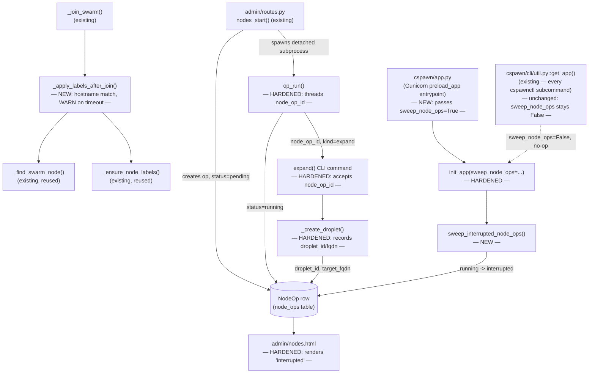
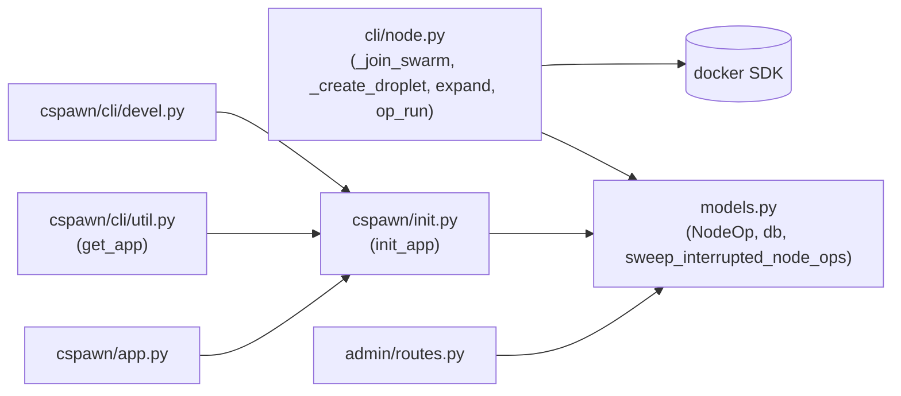

<!-- CLASI: Before changing code or making plans, review the SE process in CLAUDE.md -->

# Architecture Update — Sprint 010: Node op reliability — stamp tier labels on VPC-advertised expands + recover orphaned NodeOps on restart

## Step 1: Understand the Problem

This sprint fixes two independent, live-confirmed reliability defects in
node operations. They share no code paths but do share one file
(`cspawn/cli/node.py`) and one theme: **a node operation silently reports
success (or silently vanishes) instead of surfacing its actual state.**

**Defect 1 — tier labels never stamp (root cause confirmed live 2026-07-06).**
The `cs.tier`/`cs.capacity` labeling block at the end of `_join_swarm`
(`cspawn/cli/node.py:1651-1678`) finds the just-joined node by comparing
each swarm node's `Status.Addr` to the droplet's **public** IP:

```python
info = manager_client.api.inspect_node(n.id)
addr = ((info or {}).get("Status", {}) or {}).get("Addr")
if addr == ip:   # ip is the droplet's PUBLIC IP
    ...
```

But every node joins with `--advertise-addr <10.124.x.x>` (`node.py:1602-1606`,
`worker_vpc_ip` resolved at `node.py:1548`), so Docker Swarm always reports
`Status.Addr` as the **private VPC address** — the comparison can never
succeed. The loop spins its full 90s deadline, then falls through a bare
`except: pass` — no log, no error, nothing. Every VPC-advertised expand
(i.e., every expand in every deployment today) leaves `cs.tier`/
`cs.capacity` unset. The admin Nodes tab shows `---` for Tier/Capacity, and
`tiers.py::node_capacity()` (`tiers.py:101-109`) falls back to
`DEFAULT_CAPACITY` (6) when the label is absent — so a large-tier node
(true capacity 14) is under-counted by the autoscaler until an operator
runs `node label-backfill --apply` by hand. Confirmed live twice on
2026-07-06 (swarm3, swarm4), both requiring manual backfill.

The `code-host-user` labeling block immediately above
(`node.py:1620-1647`) has the *identical* IP-matching bug in its own
polling loop, but survives it via a **name-guess fallback** that fires
once the 90s deadline expires: `name_guess = target.split(".")[0]` (roughly)
then `_ensure_label_on_node(manager_client, name_guess, label, log=log)`.
That fallback is *why* `code-host-user=true` reliably gets applied today
(after wasting the full 90s polling for a match that can never happen)
while `cs.tier`/`cs.capacity` — which has no such fallback — simply never
gets applied at all.

**Root cause, restated:** the tier-labeling step trusts `Status.Addr` as a
public-IP-comparable field. It never was, for any VPC-advertised node.
Hostname-based lookup (via the file's own `_find_swarm_node`, already used
by drain and `label-backfill`) is the correct, already-proven mechanism —
the code-host-user block's *fallback* path is really the *only* path that
ever works, wrapped in 90 seconds of dead polling that never contributes to
success.

**Defect 2 — NodeOps orphaned as "running" forever on container restart
(root cause confirmed live 2026-07-06).** Admin-triggered node operations
(`expand`/`remove`/`rebalance`) run as a detached subprocess
(`op-run`, `node.py:2842-2994`): it sets `node_ops.status='running'`, does
the work, and writes the terminal status (`done`/`failed`) in a `finally`
block. If the container dies mid-run — a deploy restart, an OOM kill, a
host reboot — the subprocess is killed, the `finally` never executes, and
the row stays `status='running'` forever. Nothing ever corrects it: no PID
tracking, no heartbeat, no liveness check. The admin Nodes tab shows a
phantom in-flight operation indefinitely, and its "spinning" state hides
the fact that nothing is actually happening.

Observed live 2026-07-06: op `633ad23d-...` (`expand`, tier=large) had
already created droplet `swarm4.dojtl.net` in DigitalOcean when the
sprint-009 deploy force-restarted the container mid-run, before
configure/join. The droplet never joined the swarm — an orphaned, billed
resource, invisible to the cluster — and the op row stayed `running` for
40+ minutes (would have been forever) until manually noticed.

Two things need to be true for this defect to be fully closed: (a) a
`running` row can never survive a restart unnoticed, and (b) when an
`expand` op is the one interrupted, the operator needs to know *which*
droplet it might have orphaned — the row alone doesn't say, because
today's `NodeOp` schema records a target FQDN only for `remove` ops, and
the `expand` code path that creates the droplet has no way to write back to
the specific `NodeOp` row that triggered it (`op-run` invokes `expand()` by
calling the plain CLI command via `ctx.invoke`, with no linkage passed
through).

**A hazard found while designing the fix, not in either issue as written:**
`op-run` and every other `cspawnctl` subcommand boot the Flask app the same
way — `cspawn/cli/util.py::get_app(ctx)` calls
`cspawn/init.py::init_app(...)`, the *same* function `cspawn/app.py` calls
to boot the actual long-lived web server process. If the "mark all
`running` rows as `interrupted`" sweep were placed unconditionally inside
`init_app()`, it would run on **every** `cspawnctl` invocation — including
routine, frequent commands like `node info` or the cron-triggered
`node autoscale`, and even inside `op-run` itself, *before* that op-run
sets its own row to `running`. Because the file lock in `op-run`
(`node.py:2910-2928`) only guarantees one `op-run` subprocess is *actually*
executing at a time, an operator running an unrelated `cspawnctl` command
while a real op-run is mid-flight would trigger the sweep and falsely mark
the genuinely-running op `interrupted` — a straightforward false-positive
race, not a hypothetical one. The sweep must run **only** at true
process/container boot (the one `cspawn/app.py` import, which thanks to
Gunicorn's `preload_app = True` executes exactly once per container start,
before workers fork) — never from the CLI bootstrap path. This is the
single most important design constraint in this sprint's Defect-2 fix and
is called out explicitly in Step 6.

## Step 2: Identify Responsibilities

| Responsibility | Belongs To | Change |
|---|---|---|
| Locate a just-joined swarm node by hostname (not IP) and apply a label set | `_apply_labels_after_join()` (`cli/node.py`, new) | New helper, extracted from the cs.tier block's broken IP-matching loop |
| Stamp `cs.tier`/`cs.capacity` after join | `_join_swarm()` (`cli/node.py`) | Replace the IP-matching loop with a call to the new helper; log a `WARNING` on timeout instead of silent `except: pass` |
| Track a DigitalOcean droplet id/fqdn against the `NodeOp` row that created it | `NodeOp` model (`models.py`) | New nullable `droplet_id` column; `target_fqdn` documented as dual-purpose (remove target OR expand's created droplet) |
| Persist the schema change | new Alembic migration (`migrations/versions/`) | Additive, nullable column — no backfill, no data loss on downgrade |
| Record the created droplet against a `NodeOp` row as soon as creation succeeds | `_create_droplet()` (`cli/node.py`) | New optional `node_op_id` parameter; best-effort DB write, never raises |
| Thread the op identity from the admin-triggered worker into `expand()` | `op_run()` (`cli/node.py`) | Pass `node_op_id=op.id` into `ctx.invoke(expand, ...)` for `kind='expand'`, wrapped in an app context |
| Detect and correct any `NodeOp` row that cannot legitimately still be `running` | `sweep_interrupted_node_ops()` (`models.py`, new) | New function: `running` → `interrupted`, composing an orphan-droplet note when available |
| Trigger the sweep exactly once, only at true process boot | `init_app()` (`cspawn/init.py`), `cspawn/app.py` | New `sweep_node_ops: bool = False` parameter on `init_app`; only `cspawn/app.py` passes `True` |
| Render `interrupted` distinctly and surface its message | `admin/templates/admin/nodes.html` | New badge case + tooltip; excluded from the poll-trigger condition |

These group into four modules, matching the two issues' independent code
seams:

- **M1 — Tier-label matching** (`cli/node.py`'s `_join_swarm` and the new
  `_apply_labels_after_join` helper). Fixes Defect 1 only.
- **M2 — NodeOp schema** (`models.py`'s `NodeOp`, one migration). Foundation
  for M3/M4.
- **M3 — NodeOp lifecycle** (`sweep_interrupted_node_ops`, `init_app`,
  `cspawn/app.py`, `_create_droplet`'s new optional recording, `op_run`'s
  threading of `node_op_id`). Fixes Defect 2.
- **M4 — Admin UI rendering** (`admin/templates/admin/nodes.html`).
  Surfaces M3's new `interrupted` state to the operator.

## Step 3: Define Subsystems and Modules

### M1 — Tier-label matching (`cspawn/cli/node.py`)

**Purpose:** Make post-join label application find the node it just
created.

**Boundary:** Inside — the new `_apply_labels_after_join()` helper and the
cs.tier/cs.capacity block inside `_join_swarm` that calls it. Outside —
the `code-host-user`/`SWARM_NODE_LABEL` block directly above it
(`node.py:1618-1649`) is **not** touched. It has the identical underlying
IP-matching defect, but its name-guess fallback already makes it work
today (see Step 1); refactoring it is out of scope for this sprint (see
Step 6 rationale) and is flagged as a candidate cleanup in Step 7. `_ensure_node_labels`
and `_find_swarm_node` (both pre-existing) are reused unchanged.

**Use cases served:** SUC-001, SUC-002.

### M2 — NodeOp schema (`cspawn/models.py`, `migrations/versions/`)

**Purpose:** Give a `NodeOp` row a place to record which DigitalOcean
droplet it created.

**Boundary:** Inside — one new nullable column (`droplet_id`) on the
existing `node_ops` table, and the migration that adds it. Outside — no
other columns change shape; `status` stays `String(16)` (the new
`'interrupted'` value is 11 characters, well within the existing width —
no column-width migration needed for that part).

**Use cases served:** SUC-004 (foundation).

### M3 — NodeOp lifecycle (`cspawn/cli/node.py`, `cspawn/models.py`, `cspawn/init.py`, `cspawn/app.py`)

**Purpose:** Make sure a `NodeOp` row's status always reflects reality,
even across a container restart, and that an interrupted `expand` names
what it might have orphaned.

**Boundary:** Inside — `sweep_interrupted_node_ops()` (new, in
`models.py`, next to `NodeOp`, following that file's existing pattern of
small free functions like `ensure_database_exists`/`export_dict`); the new
`sweep_node_ops` parameter on `init_app()`; the single call site in
`cspawn/app.py` that enables it; `_create_droplet`'s new optional
`node_op_id` parameter and best-effort write-back; `op_run`'s threading of
`node_op_id` into `expand()` for `kind='expand'`. Outside — every other
`init_app()` call site (`cspawn/cli/util.py::get_app`, used by *all*
`cspawnctl` subcommands including `op-run` itself; `cspawn/cli/devel.py`'s
dev-server command; every test fixture) keeps the default `False` and is
**not** changed to opt in — this boundary is load-bearing, not incidental
(Step 1, Step 6). `expand()`'s and `_create_droplet()`'s existing
signatures/behavior for every caller that doesn't pass `node_op_id` (bare
CLI `node expand`, the autoscaler's `apply_plan`) are unchanged — the new
parameter defaults to `None` and is a no-op when absent.

**Use cases served:** SUC-003, SUC-004.

### M4 — Admin UI rendering (`cspawn/admin/templates/admin/nodes.html`)

**Purpose:** Show an operator, at a glance, that an op is `interrupted`
(and why) rather than genuinely in-flight.

**Boundary:** Inside — the status-badge Jinja block and its JS mirror in
the same template. Outside — `admin/routes.py`'s `list_nodes`/
`node_op_status` handlers are unchanged (they already pass through
`op.status`/`op.message` as-is; `interrupted` is just a new value for an
already-generic field). No new route.

**Use cases served:** SUC-005.

## Step 4: Diagrams

### Component diagram



### Dependency graph



No cycles. `cli/node.py`'s existing local-import-of-models pattern (already
used inside `op_run` today) extends to `_create_droplet` and
`sweep_interrupted_node_ops`'s call site — no new dependency *direction*,
just one more function on each side of an edge that already exists.
`init.py` gaining a dependency on `models.py` (for
`sweep_interrupted_node_ops`) is not new either: `init.py` already imports
`from .models import db` inside `init_app()`.

No entity-relationship diagram beyond the single additive column
described in Step 3 (M2) — no relationships change.

## Step 5: Complete the Document

### What Changed

**`cspawn/cli/node.py`**
- New `_apply_labels_after_join(manager_client, target, labels, *,
  deadline_seconds=90.0, poll_interval=3.0, log=None) -> bool`: polls
  `manager_client.nodes.list()` for a node matching `target`'s hostname or
  short name (via the existing `_find_swarm_node`), and once found, applies
  `labels` via the existing `_ensure_node_labels`. Returns `False` and logs
  a `WARNING` naming `target` and the unapplied label keys if the deadline
  passes with no match. Never raises.
- `_join_swarm`'s cs.tier/cs.capacity block (`node.py:1651-1678`) is
  replaced by a single call: `_apply_labels_after_join(manager_client,
  target, {"cs.tier": tier.name, "cs.capacity": str(tier.capacity)},
  log=log)` when `tier is not None`.
- `_create_droplet`: new optional parameter `node_op_id: str | None =
  None`. Immediately after the droplet is created and `fqdn` is computed
  (existing return point, `node.py:1381`), if `node_op_id` is set: best-effort
  (try/except, `log.warning` on failure, never raises) load the `NodeOp`
  row by id (local import of `NodeOp, db` from `cspawn.models`, mirroring
  `op_run`'s existing local-import pattern) and set
  `droplet_id=droplet.id`, `target_fqdn=fqdn`, then commit. Requires an
  active Flask app context — provided by the caller (see `op_run`, below).
  No-op (skips entirely) when `node_op_id` is `None` — the default for
  every existing caller (bare CLI `expand`, the autoscaler's `apply_plan`).
- `expand()`: new optional parameter `node_op_id: str | None = None`
  (not a `@click.option` — only reachable via `ctx.invoke(expand,
  node_op_id=...)`, never from the CLI's own argument parsing), threaded
  straight through to the `_create_droplet(...)` call.
- `op_run()`: for `kind == 'expand'`, wraps `ctx.invoke(expand,
  tier_name=tier, node_op_id=op_id)` in `with app.app_context():` (needed
  because `_create_droplet`'s new DB write requires one). `remove`/
  `rebalance` invocations are unchanged (no `node_op_id` passed — those
  kinds don't create droplets).

**`cspawn/models.py`**
- `NodeOp`: new column `droplet_id = Column(Integer, nullable=True)` —
  "DigitalOcean droplet id, recorded once `_create_droplet` succeeds for an
  `expand` op launched via `op-run`; used to name a possible orphan if the
  op is later marked `interrupted`." `target_fqdn`'s existing comment is
  extended to note its dual use: FQDN for `remove` ops (existing), or the
  created droplet's FQDN for `expand` ops (new).
- New function `sweep_interrupted_node_ops(app) -> int`: inside
  `app.app_context()`, finds every `NodeOp` with `status='running'`, sets
  `status='interrupted'`, `exit_code=1`, `finished_at=now()`, and a
  `message` of `"spawner restarted while op was in flight"`, appended with
  `f"; droplet {target_fqdn} (id={droplet_id}) may be orphaned — verify it
  joined the swarm"` when `target_fqdn`/`droplet_id` are present on the row.
  Commits once; returns the number of rows updated. Rows in any other
  status are untouched.

**`migrations/versions/`**
- One new revision (`down_revision` = `v006_add_node_op_table`), following
  the existing dialect-branching idempotent style (`ALTER TABLE ... ADD
  COLUMN IF NOT EXISTS` on PostgreSQL; `op.add_column` wrapped in
  `try/except OperationalError` for SQLite/tests): adds `node_ops.droplet_id
  INTEGER NULL`. `downgrade()` drops the column (PostgreSQL: `DROP COLUMN
  IF EXISTS`; SQLite: `op.drop_column`).

**`cspawn/init.py`**
- `init_app(..., sweep_node_ops: bool = False)`: after `setup_database(app)`
  succeeds, when `sweep_node_ops` is `True`, calls
  `sweep_interrupted_node_ops(app)` and logs the returned count at `INFO`
  (`0` logs quietly; the intent is visibility into how often this actually
  fires, not just correctness).

**`cspawn/app.py`**
- `app = init_app(sweep_node_ops=True)` — the only call site that opts in.
  Every other `init_app(...)` call site in the codebase (`cli/util.py`,
  `cli/devel.py`, `util/test_fixture.py`, every test's own app fixture)
  keeps the default `False` and requires no change.

**`cspawn/admin/templates/admin/nodes.html`**
- Status badge Jinja block: new `
  bg-dark text-white` branch (distinct from `bg-secondary` used for
  `pending`/unknown), plus a `title="{{ op.message or '' }}"` attribute on
  the badge span so the orphan note (if any) is visible on hover without
  opening the full log.
- The `pollOp()` JavaScript's terminal-state check
  (`data.status === 'done' || data.status === 'failed'`) does not need a
  code change to *exclude* `interrupted` from polling, because polling is
  only ever *started* for rows where `op.status in ('pending', 'running')`
  at page-render time (`interrupted` is never in that set) — but the JS
  color-mapping `if/else` chain gains the same `interrupted` → dark
  branch, for consistency if a row somehow transitions client-side (e.g. a
  future op ever legitimately reached `interrupted` while a tab was open
  mid-poll, which cannot happen today but keeps the two color mappings from
  silently diverging).

### Why

Defect 1: see Step 1's root-cause chain — hostname matching is what
already works (via the code-host-user block's fallback); using it directly
for `cs.tier`/`cs.capacity`, plus replacing the silent `except: pass` with
a named `WARNING`, closes both the correctness gap and the observability
gap the issue reports.

Defect 2: see Step 1 — a `running` row can never legitimately survive a
container restart, so a boot-time sweep is always correct by construction.
Recording the droplet id/fqdn at creation time is the only way to make an
interrupted op's message *specific* (which droplet to check) instead of
generic (something, somewhere, might be wrong) — the issue's own framing
("costing money, invisible to the cluster") is about a *specific* orphaned
resource, not a vague warning.

### Impact on Existing Components

| Component | Impact |
|---|---|
| `_join_swarm` | Behavior change for every tier-aware expand/scale-up: `cs.tier`/`cs.capacity` now actually get applied. No caller depends on today's silent-failure behavior (that's the bug). The `code-host-user` block's timing (up to 90s of dead polling before its fallback fires) is unchanged — out of scope. |
| `_create_droplet` | New optional parameter, default `None` — no behavior change for the autoscaler (`apply_plan`, sprint 009's verification flow) or bare CLI `expand` runs, neither of which pass `node_op_id`. |
| `expand()` CLI | New optional parameter not exposed as a `--option` — no change to documented CLI usage or `--help` output. |
| `op_run()` | Now opens an app context around the `expand` invocation for `kind='expand'` specifically (was previously invoked outside any explicit context for that branch). Nested `app.app_context()` calls are safe (Flask/Werkzeug context stack). `remove`/`rebalance` branches unchanged. |
| `init_app()` | New optional parameter, default `False` — every existing call site (tests, CLI, dev server) is behaviorally unchanged. Only `cspawn/app.py` opts in. |
| `admin/routes.py` | No code change. `op.status`/`op.message` were already passed through generically; `interrupted` is a new value flowing through existing plumbing. |
| `tiers.py::node_capacity()` | No code change, but its `DEFAULT_CAPACITY` fallback branch will now be exercised far less often in production, since labels will actually be present — a behavior improvement, not a code change. |
| `node label-backfill` | Unchanged — remains available for any node that predates this fix or otherwise still lacks labels. Its `tier_for_slug` mapping is untouched. |

### Migration Concerns

- **One additive, nullable schema change.** `node_ops.droplet_id INTEGER
  NULL` — no backfill needed (existing rows correctly have no recorded
  droplet; a bare `NULL` accurately means "not recorded," not "recorded as
  absent"). Downgrade drops the column; no data loss beyond the column's
  own content, which is diagnostic, not authoritative (DigitalOcean remains
  the source of truth for whether a droplet exists).
- **No `status` enum migration.** `status` is a free-text `String(16)`
  column (not a DB-level `ENUM`/`CHECK` constraint), so adding the
  `'interrupted'` value requires no schema change — only application code
  (the sweep function, the model comment, the template) needs to know
  about it.
- **Deployment sequencing:** the schema migration (droplet_id column) must
  run before the code that writes to it deploys — standard `flask db
  upgrade` before app restart, as with every prior migration in this repo.
  The sweep itself is safe to deploy at any time relative to the migration,
  since it only ever reads `target_fqdn` (already present) and
  conditionally `droplet_id` (reads `None` gracefully on rows or, briefly,
  a not-yet-migrated column — though in practice the migration runs first
  per standard deploy sequencing, so this is a theoretical ordering
  safeguard, not an expected path).
- **First sweep after this ships:** any `NodeOp` row already stuck
  `status='running'` from *before* this sprint (e.g., a lingering row from
  a past incident) will be marked `interrupted` on the very next container
  boot after deploy. This is the intended fix, not a regression — flagged
  so it isn't mistaken for unexpected data mutation when observed in a
  diff/audit.
- **No change to already-running nodes.** This sprint changes label
  *application timing/matching* and *op bookkeeping* only; it does not
  re-label or re-verify already-joined nodes (that remains
  `label-backfill`'s job).

## Step 6: Document Design Rationale

### Decision: Fix `cs.tier`/`cs.capacity` matching by consolidating into a new hostname-matching helper, rather than literally copying the code-host-user block's IP-then-name-guess pattern into the tier block

**Context:** The issue's suggested fix is to "reuse the same matching
strategy as the code-host-user block" — but that block's *effective*
strategy is hostname matching via a fallback; its *literal* code also
polls by IP first (the same bug), for the full 90s, before the fallback
saves it.

**Alternatives considered:**
1. Copy the code-host-user block's literal structure (IP-poll loop, then
   name-guess fallback) into the cs.tier block. Rejected: reproduces the
   same dead 90-second IP-polling phase in a second place, and duplicates
   ~30 lines of near-identical logic across two blocks — the exact
   condition that let this bug hide for as long as it did (nobody occasion
   to look at both loops closely, because they look like they're already
   doing the same working thing).
2. Extract one small helper (`_apply_labels_after_join`) that matches by
   hostname directly — no IP comparison at all — used by the cs.tier
   block now (chosen for this sprint's fix).

**Choice:** 2, applied to the cs.tier block only. The code-host-user block
is deliberately left untouched this sprint (see next decision).

**Consequences:** The cs.tier fix is minimal, testable in isolation, and
introduces no dead polling phase. The duplication between the two label
blocks is not fully eliminated this sprint — flagged in Step 7.

### Decision: Do not refactor the `code-host-user`/`SWARM_NODE_LABEL` block in this sprint

**Context:** That block has the identical underlying IP-matching defect,
but its name-guess fallback means it already works today (confirmed: every
node observed live has `code-host-user=true` applied). Consolidating both
blocks onto the new helper in one pass would remove the duplication
entirely.

**Alternatives considered:**
1. Refactor both blocks in this sprint. Rejected: broadens this ticket's
   blast radius to a code path that is not reported broken, for a sprint
   whose brief is two specific, confirmed defects — risks introducing a
   regression in a working (if inefficient) path while fixing an unrelated
   one, and working `_ensure_label_on_node` would become unused, raising a
   dead-code question that's tangential to either issue.
2. Fix only the reported defect (cs.tier/cs.capacity); leave the
   code-host-user block exactly as-is (chosen).

**Choice:** 2.

**Consequences:** The code-host-user block keeps wasting up to 90 seconds
of polling before its fallback fires, and the same defect pattern exists
twice in the file. This is an explicit, scoped-out cleanup opportunity,
not an oversight — see Step 7.

### Decision: Gate the NodeOp sweep behind an explicit `sweep_node_ops` parameter, defaulting to `False`, rather than running it unconditionally inside `init_app()`

**Context:** `init_app()` is the single Flask-app-construction function
shared by the real web server (`cspawn/app.py`) and every `cspawnctl` CLI
invocation (`cli/util.py::get_app`, `cli/devel.py`). Only the former
represents an actual container/process boot in the sense the issue means
("the spawner container restarts"); the latter runs on every single CLI
command, arbitrarily often, including inside `op-run` itself.

**Alternatives considered:**
1. Run the sweep unconditionally, every time `init_app()` is called.
   Rejected: creates a real race — any `cspawnctl` command run while a
   genuine `op-run` is mid-flight (protected only by a file lock that
   serializes *node operations*, not *all cspawnctl invocations*) would
   immediately flip that genuinely-running op to `interrupted` out from
   under it, the moment the unrelated command boots its own app instance.
   This would be a new, sprint-010-introduced bug, arguably worse than the
   one being fixed (it would misfire far more often than a real container
   restart happens).
2. Add a boolean parameter, default `False`; only `cspawn/app.py` (the one
   `preload_app`-imported entrypoint, guaranteed to run exactly once per
   container start) passes `True` (chosen).
3. Detect "am I the real web server" implicitly (e.g., check
   `is_running_under_gunicorn()`, already used elsewhere in `init.py`).
   Considered but rejected in favor of 2: implicit detection would also
   fire for `cli/devel.py`'s dev-server command if it happened to run under
   conditions resembling Gunicorn, and ties the sweep's activation to an
   unrelated helper's semantics. An explicit, named parameter at the one
   real call site is unambiguous and grep-able.

**Choice:** 2.

**Consequences:** Every other `init_app()` call site — all of them,
including tests — needs zero changes; the default preserves today's
behavior everywhere except the one line in `cspawn/app.py`. Any future
developer adding a new boot path must consciously decide whether it
represents "the container restarted" before opting in — the parameter name
and this rationale exist precisely so that decision isn't skipped.

### Decision: Thread `node_op_id` through `expand()`/`_create_droplet()` as a plain optional parameter, not a callback

**Context:** `_create_droplet` needs to write back to a specific `NodeOp`
row when (and only when) it was invoked on behalf of one, without coupling
its normal CLI/autoscaler usage to the admin DB model.

**Alternatives considered:**
1. Pass a callback (`on_droplet_created: Callable[[int, str], None]`) that
   `op_run` builds as a closure over `app`/`op_id`, keeping all NodeOp/db
   knowledge inside `op_run`. Rejected: adds an extra layer of indirection
   for a single, simple write; `_create_droplet` would still need to *call*
   an arbitrary callback at the right point, which isn't meaningfully
   simpler than it just doing the write itself, and `op_run` already
   imports `NodeOp, db` locally (existing pattern) — reusing that same
   local-import style inside `_create_droplet` is consistent, not a new
   coupling shape.
2. Pass `node_op_id: str | None` directly; `_create_droplet` does its own
   best-effort local-import DB write when set (chosen). Matches this
   file's existing convention (`op_run` already imports `NodeOp, db`
   locally, precisely to avoid a module-level circular import between
   `cli/node.py` and `models.py`/`admin`).

**Choice:** 2.

**Consequences:** `_create_droplet` gains a narrow, optional, best-effort
dependency on `models.py` — scoped to a single `if node_op_id:` block,
`try/except`-guarded so a DB hiccup never blocks node creation. Testable in
isolation with the same in-memory-SQLite `app_db` fixture pattern already
used in `test_node_op_cli.py`.

### Decision: `sweep_interrupted_node_ops` composes the orphan note from existing/soon-to-exist columns rather than a new dedicated `orphan_note` field

**Context:** The interrupted message needs to convey "this op was
interrupted" plus, conditionally, "and it may have orphaned droplet X."

**Alternatives considered:**
1. Add a separate `orphan_note` text column, populated by the sweep only.
   Rejected: the same information (`target_fqdn`, `droplet_id`) already
   lives on the row for `_create_droplet` to have written earlier; a
   second field would just restate it in prose form, at the cost of one
   more nullable column for no new capability.
2. Compose the message at sweep time by reading `target_fqdn`/`droplet_id`
   directly (chosen).

**Choice:** 2.

**Consequences:** The `message` field's content depends on read-time
composition rather than being fully attributable to a single write; this
is consistent with how `message` already behaves elsewhere in `op_run`
(different code paths write different message strings into the same
column depending on outcome).

## Step 7: Flag Open Questions

1. **Code-host-user block cleanup (stakeholder input welcome, not blocking
   this sprint):** the `SWARM_NODE_LABEL`/`code-host-user` block
   (`node.py:1618-1649`) still contains the same IP-matching dead-polling
   phase this sprint removes from the cs.tier block, masked by its own
   name-guess fallback. A future cleanup sprint could consolidate both
   blocks onto `_apply_labels_after_join`, removing ~30 lines of
   duplication and the 90-second dead-polling phase from the
   `code-host-user` path too. Deliberately out of scope here (Step 6).
2. **`cs.tier` presence as a post-join verification check (deferred, per
   the issue's own "consider" framing):** sprint 009's
   `_verify_node_provisioning` checks SSH connectivity, docker version, and
   cloud-init status, but not swarm labels. Folding a `cs.tier`-present
   check into it would require passing `manager_client` and the node's
   swarm identity into a function that currently only needs `ip`/
   `key_path`, and touching both its call sites (`expand()`,
   `apply_plan()`). Not required by either issue's acceptance criteria;
   deferred to keep this sprint focused on the two confirmed defects.
3. **"Destroy orphan droplet" tooling (explicitly optional in the issue,
   deferred):** this sprint records enough data (`droplet_id`,
   `target_fqdn`) for a future admin-UI or CLI action to list and destroy
   orphaned droplets, but does not build that action. The issue itself
   frames this as "optionally" — left for a future sprint if manual
   DigitalOcean-console cleanup proves too frequent or too slow in
   practice.
4. **Sweep granularity for `remove`/`rebalance` ops interrupted mid-flight
   (stakeholder input welcome):** this sprint's orphan-naming (SUC-004)
   only applies to `expand` (the only kind that creates a new resource
   worth naming). An interrupted `remove`/`rebalance` gets the generic
   restart message with no additional context beyond its existing
   `target_fqdn` (for `remove`) — judged sufficient since neither creates a
   new billed resource that could be silently orphaned; flagging in case a
   future incident shows otherwise.
5. **Sweep does not attempt to actually re-verify DigitalOcean state
   (deliberate, matching sprint 008/009's existing "detect and make safe,
   don't auto-heal" pattern):** the sweep marks a row `interrupted`; it
   does not call out to DigitalOcean to check whether the named droplet
   actually exists or actually joined the swarm. That remains a manual
   operator step (or a future sprint's automation) — consistent with this
   codebase's established preference for visibility over automated
   remediation of ambiguous states.
