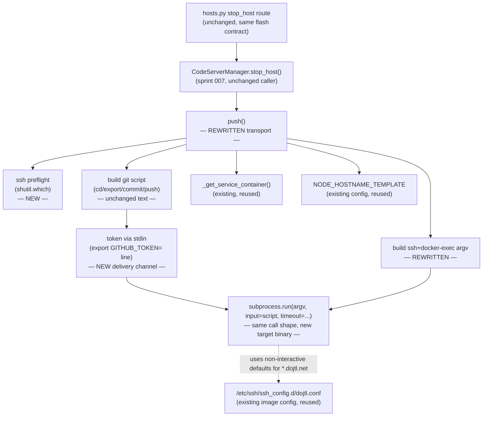
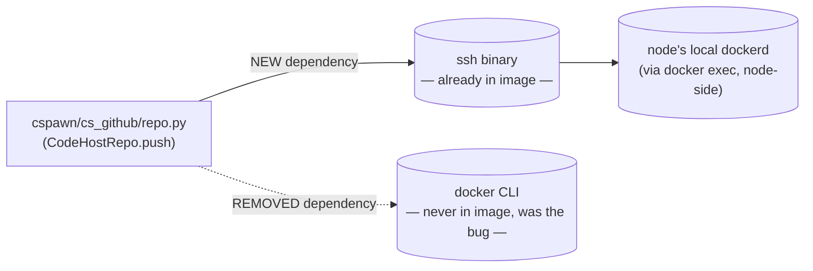

<!-- CLASI: Before changing code or making plans, review the SE process in CLAUDE.md -->

# Architecture Update -- Sprint 011: Fix push-on-stop transport — ssh node docker exec instead of missing docker CLI

## Step 1: Understand the Problem

`CodeHostRepo.push()` (`cspawn/cs_github/repo.py:72-131`) commits and
pushes a student's workspace to GitHub by shelling out to the **`docker`
CLI** with the SSH transport: `docker -H ssh://root@<node> exec -u vscode
-e GITHUB_TOKEN=... <cid> sh -c "<git commands>"`. The deployed spawner
image (`docker/Dockerfile`, `FROM python:3.11-slim`) never installs the
`docker` CLI — only `git`, `ssh`, `cron`, and a handful of system tools.
Every invocation from the deployed container fails with `[Errno 2] No
such file or directory: 'docker'`, surfaced to the student as *"Host
stopped, but your work may not have been fully saved (push failed:
...)"* (`cspawn/main/routes/hosts.py:39-44`). Confirmed live 2026-07-06:
`which docker` inside the running `codeserver_codeserver` container
returns nothing. **Push-on-stop has never worked from the deployed
spawner** — sprint 007 built a correct, well-tested orchestrator
(`CodeServerManager.stop_host()`) around a transport that was broken from
day one in production, which is why the defect slipped past that sprint's
own tests (mocked `subprocess.run`, never exercising the real binary).

**Root cause.** `push()` was switched to the `docker -H ssh://` CLI form
in commit `692537f` ("reliable git push") specifically to avoid a
`BrokenPipeError` that docker-py's `exec_run` throws when its exec
stream/hijack is carried over the SSH transport (`pull()` and
`StudentRepo._run_git_command()`, both still using `exec_run` directly
against a *local* Docker socket via docker-py, do not hit this — they
never go over SSH). The CLI form was never wrong about avoiding the
docker-py-over-SSH hijack; it was wrong about *how* — it re-implemented
the same "hijack the Docker API over an SSH tunnel" problem one layer
down, in the `docker` CLI's own `-H ssh://` transport, which still
performs an SSH-tunneled Docker API call and still depends on a `docker`
CLI binary that the image never shipped.

**Selected fix (Option 3, stakeholder-approved).** Reach the node over a
plain `ssh` connection (already present in the image, keyed via
`/root/.ssh/id_rsa` decoded by `docker/entrypoint.sh` at container start,
and pre-configured for non-interactive use against `*.dojtl.net` hosts via
`docker/ssh-config` → `/etc/ssh/ssh_config.d/dojtl.conf`), and run `docker
exec` **on the node itself**, where a `docker` CLI has always existed
(nodes are Docker Swarm hosts). Because `docker exec` then talks to the
node's own local Docker socket, there is no SSH-tunneled Docker API call
at all — this removes both the missing-CLI failure *and* the
`BrokenPipeError` root cause that motivated the CLI workaround in the
first place, with **no change to the spawner image**. Proven live
2026-07-06: `ssh root@swarm2.dojtl.net "docker ps"` succeeds from inside
the deployed spawner container today.

**Constraints carried into this sprint** (from
`clasi/issues/push-transport-ssh-node-docker-exec.md`):
- `GITHUB_TOKEN` must never appear in any process's argv (not the
  spawner's `ssh` process, not the node's `sshd`/`docker exec` command
  line) — it must travel via the subprocess's **stdin**, not a `-e`/
  `--env-file`-style argument.
- Preserve exact git/push semantics: `cd "$WORKSPACE_FOLDER"`,
  `GIT_TERMINAL_PROMPT=0`, `git commit -a -m"Automated commit" || true &&
  git push "<remote>"<refspec>`, remote built from `JTL_REPO`, run as user
  `vscode`.
- Preserve the `CODEHOST_PUSH_TIMEOUT_S`-bounded timeout wrapping the
  subprocess, and the existing `RuntimeError`-on-failure contract (trimmed
  stderr on non-zero exit; named message on timeout) that every caller
  already handles via `stop_host()`'s best-effort catch.
- Preserve node FQDN resolution via `NODE_HOSTNAME_TEMPLATE.format(nodename=...)`.
- Reuse the image's existing non-interactive SSH posture
  (`StrictHostKeyChecking=no`, no interactive prompts) rather than
  inventing a new one.
- Fail loud: a missing `ssh` binary must raise a named error, not a bare
  `[Errno 2]`.

This sprint touches exactly one method's internals
(`CodeHostRepo.push()`) plus the one new preflight check it needs. It does
not touch `pull()`, `StudentRepo`, the S3/backup path, or any other stop
caller — sprint 007's orchestrator (`stop_host()`) and its nine callers
are consumers of `push()`'s return contract (return code / raised
`RuntimeError`) and require no changes, because that contract is
unchanged.

## Step 2: Identify Responsibilities

| Responsibility | Belongs To | Change |
|---|---|---|
| Verify the transport binary (`ssh`) is available before attempting a push | `push()` (new preflight step) | New — fail loud instead of a bare `[Errno 2]` |
| Build the git commit+push shell script (unchanged text/semantics) | `push()` (existing string-building logic) | Unchanged content; now the payload piped over stdin instead of a `sh -c "<cmd>"` argv argument |
| Deliver `GITHUB_TOKEN` to the remote shell without exposing it in any argv | `push()` (new: token becomes an `export` line prepended to the piped script) | New delivery channel — same net effect (`$GITHUB_TOKEN` available to the remote shell) as today's `-e GITHUB_TOKEN=...`, without the argv exposure |
| Construct the transport subprocess argv (`ssh` + non-interactive options + `docker exec` on the node) | `push()` (existing argv-building logic, replaced) | `docker -H ssh://... exec ...` → `ssh <opts> root@<fqdn> docker exec -u vscode -i <cid> sh -s` |
| Run the subprocess with a bounded timeout and raise on failure | `push()` (existing `subprocess.run` + timeout/error handling) | Unchanged in shape — same `subprocess.run(argv, ..., timeout=...)` call, same `TimeoutExpired`/non-zero-exit handling; input source changes from none to stdin |
| Resolve the target container and its node's hostname | `_get_service_container()` (existing, reused unchanged) | No change |
| Resolve the node's FQDN from its short hostname | `NODE_HOSTNAME_TEMPLATE` config (existing, reused unchanged) | No change |
| Provide non-interactive SSH defaults for `*.dojtl.net` hosts | `docker/ssh-config` → `/etc/ssh/ssh_config.d/dojtl.conf` (existing image config, reused unchanged) | No change — `push()`'s new `ssh` subprocess benefits from this automatically |
| Orchestrate push → stop → delete and tolerate a push failure | `CodeServerManager.stop_host()` (existing, sprint 007, unchanged) | No change — consumes `push()`'s existing return/raise contract |
| Surface a push failure to the end user | `hosts.py::stop_host` route (existing, unchanged) | No change — same flash-message contract |

Every responsibility above lives inside `push()` itself (plus the config
files it already reads); nothing here introduces a new file, module, or
cross-cutting concern. This is a single-module change.

## Step 3: Define Subsystems and Modules

### M1 — Push transport (`cspawn/cs_github/repo.py::CodeHostRepo.push()`)

**Purpose:** Deliver a student's committed workspace to GitHub by running
git commands inside the student's container, reached via the node it
actually runs on.

**Boundary:** Inside — `push()`'s own body: the `ssh`-availability
preflight, script construction (including the token-export line), argv
construction, and the `subprocess.run` call with its timeout/error
handling. Outside — `_get_service_container()` (container/node lookup),
`_git_environment()` (token retrieval from config), `NODE_HOSTNAME_TEMPLATE`
resolution, and every caller of `push()` (`stop_host()` and, transitively,
sprint 007's nine callers) — none of these change, because `push()`'s
external contract (parameters, return value, exceptions raised) is
unchanged. `pull()` and `StudentRepo` (both using docker-py's `exec_run`
against a local socket, never SSH) are explicitly untouched — they don't
share this defect (they're not going over SSH) and are out of scope per
the issue.

**Use cases served:** SUC-001, SUC-002, SUC-003.

## Step 4: Diagrams

### Component diagram

### Dependency graph (external-binary dependency shift)

No cycles: `repo.py` gains no new intra-codebase module dependency (it
already imports `subprocess`; `shutil` is stdlib). The only dependency
shift is at the external-binary level — trading a CLI that was never
installed for one that already is — and it points *away* from the
spawner's own missing tooling toward a binary the node already runs
`docker` against locally. No entity-relationship diagram: this sprint
makes no data-model change (no new/altered columns, tables, or
relationships).

## Step 5: Complete the Document

### What Changed

**`cspawn/cs_github/repo.py::CodeHostRepo.push()`**

- **New preflight:** at the top of `push()`, `shutil.which("ssh") is None`
  raises `RuntimeError("ssh binary not found on PATH — cannot push via
  docker exec")` before any other work (no container lookup, no
  subprocess) — fail loud, matching sprint 009's `_verify_node_provisioning`
  precedent of named failure strings instead of a bare OS error.
- **Script construction (unchanged text, new token line):** the existing
  git script string is unchanged (`cd "$WORKSPACE_FOLDER" && export
  GIT_TERMINAL_PROMPT=0 && git commit -a -m"Automated commit" || true &&
  git push "<remote>"<refspec>`); a new first line, `export
  GITHUB_TOKEN="<token>"`, is prepended. This is the *only* place the
  token's literal value is materialized as text, and that text becomes the
  subprocess's `input=` (stdin), never an argv element.
- **Argv construction (rewritten):** replaces `["docker", "-H", node_uri,
  "exec", "-u", "vscode", "-e", f"GITHUB_TOKEN={token}", cid, "sh", "-c",
  cmd]` with `["ssh", "-o", "StrictHostKeyChecking=no", "-o",
  "UserKnownHostsFile=/dev/null", "-o", "BatchMode=yes", f"root@{node_fqdn}",
  "docker", "exec", "-u", "vscode", "-i", container_id, "sh", "-s"]` — no
  token anywhere in this list; `-i` on `docker exec` keeps its stdin open
  so the piped script reaches the remote shell, `sh -s` reads the whole
  script from stdin. The explicit `-o` flags mirror the image's existing
  `DOCKER_SSH_CMD` posture (non-interactive, no host-key prompts);
  `docker/ssh-config`'s `Host *.dojtl.net` block already applies the same
  defaults by hostname match, so this is defense-in-depth, not a new
  posture.
- **Subprocess call (same shape, new input channel):**
  `subprocess.run(argv, input=script, capture_output=True, text=True,
  timeout=effective_timeout)` — identical `TimeoutExpired`-catch-and-
  reraise-as-`RuntimeError` and non-zero-return-code-raises-`RuntimeError`
  (trimmed stderr) handling as today; only the presence of `input=` is
  new.
- **Everything else in `push()` is unchanged:** `_get_service_container()`
  call, `_git_environment()` call, `effective_timeout` resolution from
  `CODEHOST_PUSH_TIMEOUT_S`, remote/refspec string construction from
  `JTL_REPO`, the node hostname → FQDN resolution via
  `NODE_HOSTNAME_TEMPLATE`, the `proc.returncode` return value.

**No other file changes.** `pull()`, `StudentRepo`, `hosts.py`,
`csmanager.py::stop_host()`, `docker/Dockerfile`, `docker/ssh-config`,
`docker/entrypoint.sh` — none require modification. The image already has
everything this fix needs.

### Why

The constraint list in Step 1 is the "why" in full: this sprint closes a
confirmed, always-broken production path (push-on-stop has never worked
from the deployed spawner) by moving the transport off a CLI binary the
image never shipped and onto one it already has, while simultaneously
removing the SSH-tunneled Docker API hijack that motivated the original,
broken workaround — and it does so without exposing the token in any
process listing, which the CLI-argv approach did.

### Impact on Existing Components

| Component | Impact |
|---|---|
| `CodeServerManager.stop_host()` | No code change. Consumes `push()`'s existing contract (return code on success, `RuntimeError` on failure) unchanged — its own best-effort catch/log behavior (sprint 007) requires nothing new. |
| `hosts.py::stop_host` route | No code change. Same flash-message contract on `result.push_error`. |
| Every other sprint-007 stop caller (autoscale reaper, CLI `host stop`/`sys shutdown`/`host purge`, user teardown, class student removal) | No code change. All call `stop_host()`, which calls `push()` — transitively fixed, not individually touched. |
| `pull()` / `StudentRepo` | No change. They use docker-py's `exec_run` against a local Docker socket (no SSH transport), so they never had this defect — explicitly out of scope per the issue. |
| `docker/Dockerfile` | No change. The fix requires no new image dependency — `ssh` is already installed; `docker` CLI is deliberately still not added (that was the option *not* chosen). |
| Operators debugging a push failure | Behavior improvement: a missing-`ssh` failure now names itself instead of surfacing as a bare `[Errno 2]`; a real push failure's error message changes shape slightly (`ssh`/`docker exec` stderr instead of `docker -H ssh://` stderr) but remains a trimmed-stderr `RuntimeError`, unchanged in kind. |

### Migration Concerns

- **No schema change.** This sprint touches no database model.
- **No deployment sequencing concern.** The fix requires no new package,
  binary, or image layer — `ssh` and its config are already present in
  every currently-deployed spawner image. This can ship as an ordinary
  code deploy with no coordinated infrastructure step.
- **No backward-compatibility concern.** `push()`'s signature
  (`push(self, branch: str = "master", timeout: Optional[float] = None) ->
  int`) and its exception contract are unchanged; every existing caller
  (tested in `test/test_stop_host.py`) continues to work against the new
  internals without modification, because those tests already mock
  `subprocess.run` rather than asserting the transport's exact prior argv
  shape (the one assertion that does need updating is the argv-shape test
  itself, which becomes this sprint's positive test for the new
  transport).
- **First real-world validation.** Because push-on-stop has never
  actually succeeded from the deployed spawner, shipping this fix is the
  first time any stop path's push will succeed end-to-end in production —
  worth a manual smoke test (stop one real host, confirm the commit lands
  on GitHub) alongside the unit-test suite before considering this fully
  verified, though that manual check is execution-time, not a planning
  concern here.

## Step 6: Document Design Rationale

### Decision: Deliver `GITHUB_TOKEN` via an `export` line prepended to the piped stdin script, rather than `docker exec --env-file /dev/stdin`

**Context:** The issue's constraints allow either "pipe the git script
... on stdin" or "`--env-file /dev/stdin`" as acceptable token-safety
mechanisms — both keep the token out of argv. `docker exec` only accepts
one stdin stream per invocation.

**Alternatives considered:**
1. Use `docker exec --env-file /dev/stdin -u vscode <cid> sh -c '<script
   argv arg>'`: the token would arrive via `--env-file`'s stdin read, but
   the git *script* itself would still need to be a `sh -c` argv argument
   — putting the token back out of argv but leaving the *script's shape*
   (and any future secret accidentally added to it) exposed the same way
   the original bug's script text was. It also only supports a single
   `KEY=VALUE` env-file format on stdin, which cannot simultaneously carry
   an arbitrary multi-line script.
2. Pipe the entire script (script text + a prepended `export
   GITHUB_TOKEN=...` line) as one stdin payload to `sh -s`, with no
   command text in argv at all (chosen).

**Choice:** 2. It closes both exposure surfaces (token *and* the specific
commands run) in one channel, matches the issue's primary suggestion
("stdin"), and requires no change to how the script's git commands
reference `${GITHUB_TOKEN}` — the remote shell exports it, then expands it
exactly as today.

**Consequences:** The full script (including the token line) is briefly
present in the spawner process's memory as a Python string before being
written to the pipe — identical to today's behavior where the token is
already assembled into an f-string before being placed in argv; the risk
profile is a strict improvement (removed from argv, still transient
in-process memory, which was already the case).

### Decision: Keep explicit `-o` SSH options in the argv rather than relying solely on `/etc/ssh/ssh_config.d/dojtl.conf`

**Context:** `docker/ssh-config` already sets
`StrictHostKeyChecking no`/`UserKnownHostsFile /dev/null` for `Host
*.dojtl.net`, and every node FQDN produced by `NODE_HOSTNAME_TEMPLATE` in
every current deployment ends in `.dojtl.net` — so the config file alone
would suffice today.

**Alternatives considered:**
1. Rely entirely on the config file; pass no `-o` flags in `push()`'s
   argv. Rejected: silently depends on every future `NODE_HOSTNAME_TEMPLATE`
   value continuing to match `*.dojtl.net`; a `devel`/test environment
   with a differently-shaped hostname would fall back to interactive
   host-key prompting and hang until `CODEHOST_PUSH_TIMEOUT_S` fires,
   trading a fast, clear failure for a slow, confusing one.
2. Pass the same non-interactive `-o` flags explicitly in the argv
   (mirroring the image's own `DOCKER_SSH_CMD` value), plus `BatchMode=yes`
   for defense against any interactive prompt regardless of config-file
   match (chosen).

**Choice:** 2. Explicit and testable (a unit test can assert these flags
are present) without removing the config file, which still helps for any
`ssh` invocation elsewhere in the image that isn't `push()`'s.

**Consequences:** `push()`'s argv is self-sufficient — correct even if
`docker/ssh-config` is ever changed or a node's hostname template changes
shape — at the cost of a few extra, static argv elements.

### Decision: Add the `ssh`-availability preflight inside `push()` itself, not as a separate app-boot check

**Context:** The issue allows either "at push time (or app boot)" for the
fail-loud `ssh` check.

**Alternatives considered:**
1. Check `shutil.which("ssh")` once at app boot (e.g. in `init_app()`) and
   fail app startup if absent. Rejected: over-broad for this sprint —
   `ssh`'s presence is a build-time image property, not a runtime
   condition that changes; a boot-time hard-fail would also affect every
   code path in the app, not just push, for a check whose only current
   consumer is `push()`. Sprint 010 already established the pattern of
   keeping boot-time hooks narrowly scoped to their one real purpose
   (`sweep_node_ops`) rather than adding general-purpose startup checks.
2. Check `shutil.which("ssh")` at the top of `push()`, every call (chosen).

**Choice:** 2. `push()` is not a hot path (invoked once per host stop, not
per-request), so the negligible cost of re-checking `PATH` each time is
irrelevant, and the check lives exactly where its only consumer is —
consistent with this sprint's single-module scope (Step 3).

**Consequences:** No new app-boot behavior, no new `init_app()` parameter,
no risk of the check firing somewhere unrelated to a push attempt.

## Step 7: Flag Open Questions

1. **Manual production smoke test after deploy (not blocking sprint
   planning, execution-time concern):** because push-on-stop has never
   actually succeeded in production, the team should manually stop one
   real host after this ships and confirm the commit lands on GitHub, in
   addition to the unit-test suite — flagged so it isn't skipped as "just
   another refactor."
2. **Unifying push across every stop path's *error handling/observability*
   (explicitly out of scope, tracked separately):** this sprint fixes the
   transport `push()` uses; it does not change how failures are
   aggregated or reported across sprint 007's nine callers. That
   remains the separate, still-open sprint-007 `push-on-host-stop` issue's
   concern if any gaps remain there.
3. **No S3/backup fallback on push failure (explicitly out of scope,
   stakeholder framing already settled by the issue):** if `push()` still
   fails for a real reason (network partition, GitHub outage) after this
   fix, there remains no secondary save mechanism on the stop path. Not
   addressed here — the issue explicitly scopes this out, and it is a
   distinct product decision (whether to add one) rather than a defect in
   this sprint's chosen transport.
