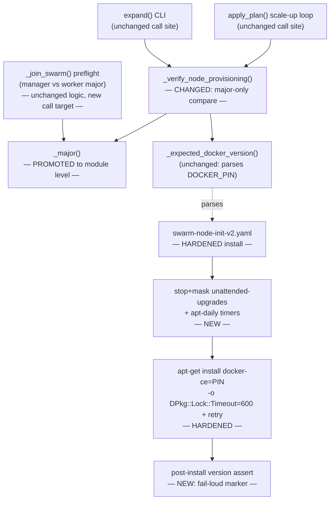
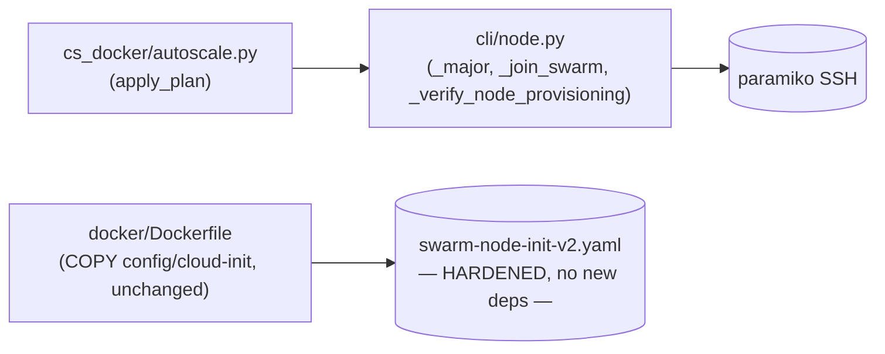

<!-- CLASI: Before changing code or making plans, review the SE process in CLAUDE.md -->

# Architecture Update -- Sprint 012: Node provisioning robustness — major-version verify + race-proof docker-ce install

## Step 1: Understand the Problem

**Incident, confirmed live 2026-07-06.** A `swarm5` node expand was drained
mid-class by `_verify_node_provisioning`'s docker-version check
(`cspawn/cli/node.py:585-654`, the check at 628-640) because the node
reported docker-ce `29.6.0` while the pinned/expected version was `29.6.1`
— a **patch**-level difference that Docker Swarm does not care about (join
and worker operation only require **major**-version compatibility; this is
already the standard `_join_swarm` itself applies at its own pre-join
preflight, `cli/node.py:1564-1604`). Draining swarm5 left the fleet one
node short; the resulting overpacking of codehosts onto swarm2+swarm4
overloaded swarm2 (load 12.9), Swarm rescheduled its tasks, and students
fleet-wide were disconnected. Two independent, compounding defects
produced this:

**Defect A — post-join verify is stricter than the compatibility it's
supposed to guard.** `_verify_node_provisioning`'s check (b) does:

```python
if expected_docker_version not in docker_version_output:
    failures.append(...)
```

— an exact-substring test against the full `X.Y.Z` pin. `_join_swarm`'s
own pre-join preflight (lines 1564-1604) already knows better: it defines
a local `_major(v) -> int | None` closure, extracts the manager's and
worker's major version, and only blocks the join on a **major** mismatch.
Post-join verify re-implements the same "is this worker's docker
compatible with the fleet" question with stricter, wrong logic, using a
private, per-function version string (the cloud-init pin) rather than the
manager's own live version. This sprint changes post-join verify to ask
the *same* question `_join_swarm` already asks, reusing the *same* parsing
so the two can never silently drift out of sync again.

**Defect B — the docker-ce pin install can silently no-op under load.**
The reason swarm5 was on `29.6.0` in the first place:
`swarm-node-init-v2.yaml`'s pin install step
(`apt-get install -y --allow-downgrades --allow-change-held-packages
"docker-ce=${DOCKER_PIN}" "docker-ce-cli=${DOCKER_PIN}"`, cloud-init lines
~99-105) failed on `/var/lib/dpkg/lock-frontend`, held by
`unattended-upgrades` (confirmed live: pid 3179 holding the lock during
provisioning). cloud-init's `runcmd` entries are not `set -e`-guarded
against each other at the shell level the way a hand-written script would
be — a failing `apt-get install` logs an error in cloud-init's own output
and the `runcmd` sequence continues to the next entry
(`apt-mark hold docker-ce docker-ce-cli`, `systemctl enable --now docker`),
so the droplet ends up "cloud-init status: done" while quietly still
running the base image's stock docker-ce (`29.6.0`). Nothing between that
silent failure and post-join verify (minutes later, sometimes under a
drained-node incident) would have caught it. This sprint hardens the pin
install itself — preempting the lock contender, waiting out rather than
failing on a transient lock, retrying, and asserting success — so a
provisioning-time failure surfaces at provisioning time.

**Why both, not either.** Defect A alone (loosening verify to major-only)
would have prevented *this specific* incident's drain, but leaves Defect B
in place: a *real* major-version mismatch caused by the same
`unattended-upgrades` race (e.g. the pin install fails entirely and a
future base image ships docker-ce `28.x`) would still go undetected until
whatever later step first tries to use Swarm and fails a real TLS/API
handshake — the exact class of failure the pre-join preflight exists to
prevent. Defect B alone (hardening the install) reduces how often the pin
install fails, but does not fix that post-join verify is checking the
wrong granularity — a *legitimate* patch-level difference (e.g. a
distro-mirror serving a newer point release the same day) would still
false-positive a healthy node. Both fixes are independent and both are
required for the full guarantee: "a node reaching swarm join either has a
compatible major version, or is caught and never receives load — and the
install path that determines its actual version doesn't silently
degrade under contention."

**Explicitly out of scope** (per the issue and sprint brief): dynamic
"pin to the manager's exact live version" templating (deferred — Defect
A + Defect B together make the current hardcoded-pin approach adequately
robust this sprint); pinning codehosts to their node so Swarm never
migrates them; any change to node capacity/rebalance/host-placement logic.
This sprint ships code + tests only — no deploy (stakeholder is holding
deploy until after class); the fix lands in the next spawner image build.

## Step 2: Identify Responsibilities

| Responsibility | Belongs To | Change |
|---|---|---|
| Resolve a docker version string to its major integer | `_major()` (`cli/node.py`) | **Promoted** from a private closure inside `_join_swarm` to a module-level function, so it has exactly one definition |
| Pre-join preflight: block join on manager/worker major mismatch | `_join_swarm()` (`cli/node.py`) | Unchanged behavior; now calls the module-level `_major()` instead of its own local closure |
| Post-join verify: confirm a joined node's docker-ce is swarm-compatible | `_verify_node_provisioning()` (`cli/node.py`) | **Changed**: docker-version check compares `_major(expected_docker_version)` vs. `_major(actual)` instead of exact substring |
| Determine the pinned/expected docker-ce version from cloud-init | `_expected_docker_version()` (`cli/node.py`) | Unchanged — still returns the pinned `X.Y.Z`; only how callers *compare* it changes |
| Preempt the dpkg-lock contender before installing the docker-ce pin | `swarm-node-init-v2.yaml` `runcmd` (new steps) | New — stop + mask `unattended-upgrades.service`, `apt-daily.timer`, `apt-daily-upgrade.timer` |
| Install the docker-ce pin without failing on a transient dpkg lock | `swarm-node-init-v2.yaml` `runcmd` (changed step) | Changed — `-o DPkg::Lock::Timeout=600` (or equivalent wait) plus a bounded retry-with-backoff wrapper |
| Fail loudly if the pin install did not actually take effect | `swarm-node-init-v2.yaml` `runcmd` (new step) | New — post-install assertion of the installed major version against the pin; clear error/marker on mismatch |
| Selectability of `swarm-node-init-v1.yaml` | `config/{devel,local-prod,prod}/public.env` (read, not changed) | Confirmed: `DO_CLOUD_INIT=swarm-node-init-v2.yaml` in all three — v1 is not reachable in any deployment; left unmodified, finding recorded here |

These group into two independent modules, matching the sprint's two
tickets: **M1** (version-compatibility logic, entirely inside
`cspawn/cli/node.py`) and **M2** (provisioning-time install robustness,
entirely inside `config/cloud-init/swarm-node-init-v2.yaml`). Neither
module's change requires the other — M1 changes what "compatible" means
when *checking* a version; M2 changes how reliably the *right* version
gets installed in the first place. A node fixed by M2 alone would still be
correctly verified by the pre-M1 exact-substring check (it would report
the exact pin). A node still exhibiting a real major mismatch despite M2
(e.g. a distro pin genuinely changes) is exactly what M1's post-join check
is for. This is why the two tickets have no `depends-on` relationship.

## Step 3: Define Subsystems and Modules

### M1 — Docker version-compatibility check (`cspawn/cli/node.py`)

**Purpose:** Decide whether a worker node's docker-ce is compatible enough
with the swarm manager's to safely join and stay joined.

**Boundary:** Inside — the module-level `_major()` helper, `_join_swarm`'s
existing preflight call site (unchanged logic, new call target), and
`_verify_node_provisioning`'s docker-version check (changed comparison).
Outside — `_expected_docker_version()` (unchanged: still resolves the
pinned string from cloud-init), `_ssh_exec`/`_ssh_exec_retry` (unchanged
transport), `apply_plan()`'s call site in `cs_docker/autoscale.py`
(unchanged: it calls `_verify_node_provisioning` the same way; the
behavior change is entirely internal to the function it calls).

**Use cases served:** SUC-001.

### M2 — Docker-CE pin install robustness (`config/cloud-init/swarm-node-init-v2.yaml`)

**Purpose:** Make the docker-ce pin install on a freshly booted node
succeed (or fail loudly) regardless of a concurrent `unattended-upgrades`/
`apt-daily` dpkg-lock contender.

**Boundary:** Inside — the `runcmd` steps that stop/mask the lock
contenders, the pin `apt-get install` invocation itself (lock-timeout +
retry), and a new post-install version-assertion step. Outside — the
`write_files`/UFW-configuration section of the same YAML (unchanged),
`swarm-node-init-v1.yaml` (confirmed unreachable via any deployment's
`DO_CLOUD_INIT`; left as-is), `_create_droplet`/`_resolve_cloud_init_path`
(unchanged — they read whatever file is configured; this sprint changes
that file's *contents*, not how it's selected or shipped), and
`docker/Dockerfile`'s existing `COPY config/cloud-init` + build-time
self-check (unchanged — no new file, no new path).

**Use cases served:** SUC-002.

## Step 4: Diagrams

### Component diagram



### Dependency graph



No cycles. M1 removes a duplicated code path (two independent major-parsing
regexes collapse into one module-level function called from two sites) —
this is a coupling *reduction*, not an addition. M2 adds no new
intra-codebase dependency at all: it is a shell-script-level change inside
a YAML file already shipped by `docker/Dockerfile`'s existing `COPY`; the
Python side (`_resolve_cloud_init_path`, `_create_droplet`) reads the file
as an opaque blob, unaffected by what commands it contains. No
entity-relationship diagram: this sprint makes no data-model change (no
new/altered tables or columns).

## Step 5: Complete the Document

### What Changed

**`cspawn/cli/node.py`**
- `_major(v: str | None) -> int | None` is promoted from a closure defined
  inside `_join_swarm` (current lines ~1566-1573) to a module-level
  function (placed near `_expected_docker_version`/`_verify_node_provisioning`,
  since all three now form one "version compatibility" neighborhood).
  Behavior is unchanged: regex-match a leading integer, return `None` on
  no match or a falsy input.
- `_join_swarm`'s pre-join preflight (lines ~1564-1604) calls the
  module-level `_major()` instead of its own local definition. No other
  change to this preflight — it already only blocks on a major mismatch.
- `_verify_node_provisioning`'s check (b) (lines ~628-640) changes from
  `expected_docker_version not in docker_version_output` to comparing
  `_major(expected_docker_version)` against `_major(docker_version_output)`
  (parsing the actual major out of the free-form `docker --version` string,
  e.g. `"Docker version 29.6.0, build ..."` — the same shape `_join_swarm`
  already parses from `docker version --format '{{.Server.Version}}'`,
  handled by the same `_major()` regex since it only looks for a leading
  integer). Failure only when both majors are resolvable and differ, or
  when the actual major cannot be resolved at all (empty/garbled output —
  treated as a failure, matching today's conservative posture). The
  failure string names both the expected and actual *major* and the full
  version strings, so an operator reading the log still sees the concrete
  versions involved, not just integers. `expected_docker_version is None`
  still skips the check entirely, unchanged.

**`config/cloud-init/swarm-node-init-v2.yaml`**
- New `runcmd` step(s), placed immediately before the existing
  `apt-get update -qq` / pin-install block: stop and mask
  `unattended-upgrades.service`, `apt-daily.service`/`apt-daily.timer`, and
  `apt-daily-upgrade.service`/`apt-daily-upgrade.timer`, so none of them
  can acquire `/var/lib/dpkg/lock-frontend` for the remainder of
  provisioning.
- The pin `apt-get install` invocation changes to include
  `-o DPkg::Lock::Timeout=600` (dpkg/apt's own built-in lock-wait, no
  hand-rolled polling loop needed) and is wrapped in a small bounded
  retry-with-backoff (a `for`/`until` loop already expressible in the same
  `runcmd` shell entry, mirroring the pattern `_ssh_exec_retry` uses in
  Python for the same "transient failure, worth a few attempts" shape).
- The existing `apt-mark hold docker-ce docker-ce-cli` step is preserved
  and now runs unconditionally immediately after the install attempt(s),
  regardless of whether the install actually converged on the pinned
  version — whatever docker-ce/docker-ce-cli build is present afterward is
  held against further automatic-upgrade drift.
- New `runcmd` step after the hold: re-run `docker --version` locally
  and compare its major against `DOCKER_PIN`'s major (reusing the same
  "leading integer" concept as `_major()`, expressed in shell since this
  runs inside cloud-init, not Python); on mismatch, write an unambiguous
  marker (e.g. a sentinel file such as `/var/log/cspawn-docker-pin-failed`
  with the expected/actual versions, plus a clearly-labeled error line in
  cloud-init's own log) and exit non-zero for that `runcmd` entry so
  `cloud-init status` itself reflects the failure — rather than the
  previous behavior of the pin install failing invisibly while the rest of
  `runcmd` (and `cloud-init status: done`) proceeded normally.
- **Resolved 2026-07-06 (was Open Question 1):** a final new `runcmd` step
  unmasks and re-enables `unattended-upgrades.service` and the
  `apt-daily`/`apt-daily-upgrade` timers after the hold, unconditionally —
  nodes keep receiving OS security patches for their lifetime rather than
  staying permanently masked. This is safe specifically because the hold
  (not the masking) is what protects `docker-ce`/`docker-ce-cli`: held
  packages are skipped by `unattended-upgrades` and by
  `apt-get upgrade`/`dist-upgrade` invoked from the `apt-daily-upgrade`
  path, so resuming automatic OS patching cannot silently drift the
  swarm-critical docker-ce version out from under a running node.
- `swarm-node-init-v1.yaml`: confirmed via `grep` across
  `config/{devel,local-prod,prod}/public.env` that `DO_CLOUD_INIT` is
  `swarm-node-init-v2.yaml` in all three — v1 is not selectable in any
  current deployment and contains no docker-ce install at all (it only
  configures UFW). Left unmodified; this finding is the "note it" the
  issue asked for if v1 turns out unreachable.

**No other file changes.** `_create_droplet`, `_resolve_cloud_init_path`,
`_expected_docker_version`, `docker/Dockerfile`, `_wait_for_cloud_init`,
`_ssh_exec`/`_ssh_exec_retry`, and the autoscaler's call sites all remain
exactly as they are today — this sprint's two modules are additive/
corrective within their existing boundaries, not restructuring.

### Why

Restated from Step 1: the swarm5 incident was two compounding, independent
defects — verify checking a stricter granularity than swarm compatibility
actually requires, and the install path that determines a node's real
docker-ce version silently no-opping under a dpkg-lock race. Fixing only
the check (M1) leaves a real future major mismatch caused by the same race
un-prevented at its source; fixing only the install (M2) leaves a
legitimate patch-level difference (from any cause — a mirror update, a
future base-image bump) able to false-positive a healthy node. Both are
required for "a node that reaches swarm join is either compatible, or is
caught — and the path that determines its version doesn't silently
degrade under load," which is the guarantee this sprint restores.

### Impact on Existing Components

| Component | Impact |
|---|---|
| `_join_swarm` pre-join preflight | No behavior change — same major-only comparison, now sourced from a shared function instead of a private closure. |
| `_verify_node_provisioning` | Behavior change (intended): a patch/minor-different-but-major-compatible node now passes where it previously failed. A genuine major mismatch still fails, with a clearer (major-labeled) failure message. |
| `expand()` CLI / `apply_plan()` autoscaler scale-up | No code change at either call site — both already call `_verify_node_provisioning` the same way; they simply stop receiving false-positive failures for patch-level differences. `apply_plan`'s existing "drain and continue the batch" handling for a real verification failure (sprint 009) is unchanged. |
| `swarm-node-init-v2.yaml` provisioning time | Slightly longer worst-case boot time under lock contention (bounded by the lock-timeout + retry budget) in exchange for the install actually completing instead of silently skipping. |
| `unattended-upgrades` / `apt-daily*` timers on swarm worker nodes | Stopped and masked during the provisioning window only (this sprint does not change their state after cloud-init finishes, beyond leaving them masked — see Open Questions for whether re-enabling after provisioning is in scope). |
| `docker/Dockerfile` | No change — the hardened YAML ships via the exact same `COPY config/cloud-init` + build-time self-check already in place; no new file, no new path. |
| `swarm-node-init-v1.yaml` | No change — confirmed unreachable via any deployment's `DO_CLOUD_INIT`. |
| `test/test_node_provisioning_verify.py` | Existing tests that assert exact-substring version matching (e.g. mismatch cases) need updating to assert major-based comparison; existing "all checks pass" / "expected version None skips check" tests are compatible with the new logic (same string parses to the same major) and should continue to pass with the same or a clarified assertion. |
| `test/test_node_cloud_init.py` | Gains new assertions on the rendered YAML content (lock-guard steps present, `Lock::Timeout` or equivalent present, fail-loud marker step present) — no existing test in this file asserts on `runcmd` content today, so these are additive, not replacing assertions. |

### Migration Concerns

- **No database schema change.** No Alembic migration.
- **No backward-incompatible signature changes.** `_verify_node_provisioning`'s
  signature and return type (`list[str]`, empty = healthy) are unchanged;
  `_major()`'s signature is unchanged (only its location moves from a
  closure to module scope, which is not a call-site-visible change for
  `_join_swarm`, and is a *new* usable name for `_verify_node_provisioning`
  and its tests).
- **No deployment this sprint.** Per the sprint brief, the stakeholder is
  holding deploy until after class; this ships as code + tests merged to
  `master`, taking effect the next time the spawner image is built and a
  node is subsequently created — no coordinated infrastructure step is
  needed beyond the normal image-build/deploy cadence.
- **Existing nodes are unaffected.** Both fixes apply to node *creation*
  (M2) and *post-join verification* (M1) — neither re-provisions or
  re-verifies already-running swarm nodes.
- **First real effect is the next `node expand`/autoscale scale-up after
  the next image build**, at which point: (a) a newly created node's
  docker-ce pin install is race-proofed, and (b) any node's post-join
  verify (new or, incidentally, if re-run against an existing node) judges
  compatibility by major, not exact string.

## Step 6: Document Design Rationale

### Decision: Compare docker versions by major only in post-join verify, reusing `_join_swarm`'s existing `_major()` rather than defining a second comparison

**Context:** The issue and stakeholder both specified "major version only"
for the fix. The literal instruction says "reuse `_major`," which already
exists as a working, tested piece of logic — just in the wrong scope
(private to `_join_swarm`).

**Alternatives considered:**
1. Add a second, independent major-parsing helper local to
   `_verify_node_provisioning` (e.g. duplicate the regex inline). Rejected
   explicitly by the issue's own acceptance criteria ("no
   duplicated/inconsistent parsing") — two independently maintained
   regexes for "what is a docker major version" is exactly the kind of
   drift that let Defect A diverge from `_join_swarm`'s already-correct
   logic in the first place.
2. Promote `_major()` to module level and have both `_join_swarm` and
   `_verify_node_provisioning` call the one definition (chosen).

**Choice:** 2.

**Consequences:** One parsing definition, testable once, used by both the
pre-join and post-join gates. A future change to what "major version"
means (unlikely, but e.g. handling a calendar-versioned docker release)
only needs to change in one place.

### Decision: Keep `_expected_docker_version` returning the full pinned `X.Y.Z`; change only the comparison

**Context:** An alternative would be to have `_expected_docker_version`
itself return just the major integer, simplifying `_verify_node_provisioning`'s
call site.

**Alternatives considered:**
1. Change `_expected_docker_version`'s return type to `int | None` (major
   only). Rejected: it's used elsewhere for its full-string value (its
   docstring and existing tests assert the returned `"29.6.1"` shape,
   and a future consumer — e.g. an admin-UI display of "expected pinned
   version" — would lose the human-readable patch info for no benefit,
   since `_major()` is trivially applied by whichever caller needs an
   integer).
2. Leave `_expected_docker_version` unchanged; apply `_major()` at the
   comparison site inside `_verify_node_provisioning` (chosen).

**Choice:** 2. Keeps `_expected_docker_version`'s existing contract and
tests (`test_node_provisioning_verify.py::TestExpectedDockerVersion`)
entirely unchanged — this sprint touches zero of those tests — and keeps
"reduce to major" as an explicit, visible step at the one place that
currently needs it.

**Consequences:** `_verify_node_provisioning` does two `_major()` calls
(expected, actual) instead of receiving pre-reduced integers; negligible
cost, maximum clarity at the call site.

### Decision: Race-proof the pin install with stop+mask, lock-timeout, and retry — not a single fix in isolation

**Context:** The issue lists four hardening measures (preempt the lock
contender, wait instead of fail, retry with backoff, fail loud on
mismatch). Any one alone would have reduced the swarm5 failure
probability; none alone eliminates the failure mode.

**Alternatives considered:**
1. Only add `-o DPkg::Lock::Timeout=600` (wait out the lock) without
   stopping `unattended-upgrades`. Rejected: `unattended-upgrades` can run
   for longer than any reasonable timeout budget if it's mid-upgrade of
   another package when cloud-init's window opens; stopping/masking it
   removes the contention instead of merely tolerating it.
2. Only stop/mask the contenders, no lock-timeout/retry. Rejected: does
   not protect against a *different* lock holder (e.g. a manual
   `apt-get` an operator runs during a debugging SSH session, or a
   leftover process from the base image's own first-boot package
   configuration) that stop/mask doesn't target.
3. All four measures together (chosen) — preempt the known, common
   contender; tolerate any *other* transient holder via lock-timeout;
   retry to absorb any remaining transient apt failure; and assert the
   outcome so a failure that survives all three mitigations is never
   silent again.

**Choice:** 3. Defense in depth for a failure mode that, left unmitigated
even partially, cascades into a fleet-wide incident (as demonstrated
2026-07-06) — the cost (a few more `runcmd` lines, a small bounded amount
of extra boot time in the worst case) is low relative to the blast radius
of a repeat.

**Consequences:** `swarm-node-init-v2.yaml` grows by roughly a dozen lines
of `runcmd` shell; no new package dependencies (dpkg's `--
Lock::Timeout` and `systemctl stop/mask` are both already-present distro
tooling). Test coverage for this sprint necessarily asserts on YAML/shell
*content* (that the right steps are present) rather than executing real
apt/dpkg — consistent with how `test_node_cloud_init.py` already tests
this file today (content assertions, not live provisioning).

### Decision: Leave `swarm-node-init-v1.yaml` unmodified

**Context:** The issue says to apply the same hardening to v1 only if it
remains selectable.

**Alternatives considered:**
1. Harden v1 defensively anyway, in case it becomes selectable again in
   the future. Rejected: v1 contains no docker-ce install step at all (it
   only configures UFW) — there is nothing in it for this sprint's
   hardening to apply *to*; adding a docker-ce install to v1 would be
   scope creep unrelated to this sprint's defect.
2. Confirm non-selectability, leave v1 as-is, record the finding (chosen).

**Choice:** 2. Matches the issue's own conditional instruction and avoids
inventing new behavior in a file that isn't part of the incident.

**Consequences:** If a future sprint reintroduces v1 as a selectable
option, whoever does so is responsible for evaluating whether it needs the
same docker-ce pin (and this sprint's hardening) at that time — flagged in
Step 7.

## Step 7: Flag Open Questions

1. **RESOLVED 2026-07-06 (stakeholder decision).** Should
   `unattended-upgrades`/`apt-daily*` be re-enabled after provisioning
   completes, or stay masked for the node's lifetime? **Decision:**
   re-enable them after the docker-ce pin install completes, so nodes keep
   receiving OS security patches. To make this safe, the existing
   `apt-mark hold docker-ce docker-ce-cli` step is preserved and now runs
   unconditionally right after the install — held packages are skipped by
   `unattended-upgrades`/`apt-daily-upgrade`, so resuming automatic OS
   patching cannot silently drift docker-ce's version out from under a
   running swarm node. The small residual window this reopens (a *later*
   manual `apt-get` by an operator could still race a dpkg lock) is
   accepted: it only affects operator-initiated actions, not unattended
   provisioning, and is outside this sprint's incident scope. Baked into
   ticket 002's plan and acceptance criteria; see Step 5 (M2 "What
   Changed") above for the mechanics.
2. **Bound on the retry/backoff budget and lock-timeout value:**
   `DPkg::Lock::Timeout=600` (10 minutes) and "a few retries with backoff"
   are judgment calls carried over from the issue's phrasing, not derived
   from an SLA. If cloud-init's overall boot budget elsewhere (e.g.
   `_wait_for_cloud_init`'s own timeout, `cli/node.py:510`, default 600s)
   needs to grow to comfortably exceed a worst-case lock-wait + retry
   sequence, that's a tuning pass for ticket 002, not a design blocker.
3. **Fail-loud marker format:** this document specifies "a sentinel file
   plus a clearly-labeled cloud-init log line" as the shape of the
   fail-loud signal, but doesn't mandate an exact filename/format. Ticket
   002 should pick a concrete, greppable convention (e.g.
   `/var/log/cspawn-docker-pin-failed`) and document it as it would in a
   fleet runbook, since operators reading `/var/log/cloud-init-output.log`
   after a future incident are the actual consumer of this signal.
