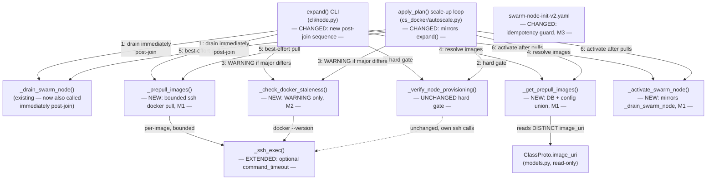
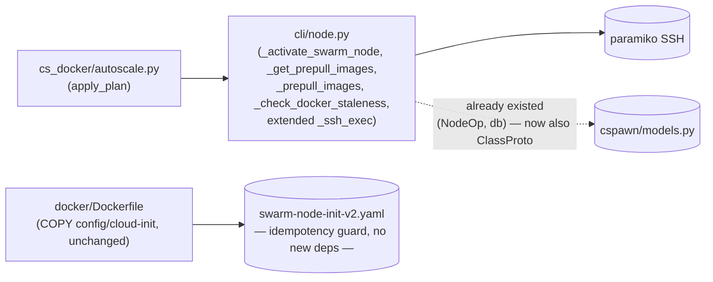

<!-- CLASI: Before changing code or making plans, review the SE process in CLAUDE.md -->

# Architecture Update -- Sprint 013: Warm new nodes — pre-pull codehost images at expand + snapshot staleness check + cloud-init idempotency

## Step 1: Understand the Problem

**Incident, confirmed live 2026-07-06.** A freshly-joined swarm node has an
empty local Docker image cache. The moment it joins, Docker Swarm marks it
`Availability=active` by default and the scheduler is free to place hosts on
it. Every host that lands there blocks in `Preparing` while the node pulls
the ~1.5GB compressed code-server image from ghcr, and Caddy 503s those
students for the duration of the pull. This is now solvable because a new
golden DO snapshot (id `235956540`, docker-ce 29.6.1 baked and
`apt-mark hold`ed, built by `scripts/build-golden-node-snapshot.sh`, see
`docs/golden-node-snapshot.md`) removes the *docker-ce install* from the
node's boot-time critical path — but the snapshot deliberately does **not**
bake the code-server image itself (so a `make release` of
`docker-codeserver-python` never requires a snapshot rebuild). The gap this
sprint closes: nothing today warms a new node's image cache *before* it goes
active.

A second, related risk the golden-snapshot model introduces: the snapshot's
baked docker-ce version is frozen at snapshot-build time. As the swarm
manager is upgraded over months, the snapshot can silently drift out of sync.
`_verify_node_provisioning` (sprint 009/012) already hard-fails a real major
mismatch and drains the node — but its failure message ("docker version
mismatch: expected X, got Y") does not tell an operator *why* this happened
on a node that should have been correctly baked, or what to do next. This
sprint adds a named diagnostic for exactly that scenario.

Third: the sprint-012 hardened docker-ce pin block in
`config/cloud-init/swarm-node-init-v2.yaml` runs an `apt-get update` +
install/hold round-trip unconditionally on every boot. On a golden-snapshot
node this is a near-no-op today, but it is still a real network/apt round
trip (and, per the issue, an unnecessary one) every single time a node
expands from the snapshot. This sprint adds a precheck so the block is a
true no-op when docker-ce already matches the pin's major, while leaving the
complete sprint-012 hardened path untouched for a node that actually needs
it (missing docker, or a real wrong-major docker).

**Key finding that changes this sprint's blast radius:** `apply_plan()`
(`cspawn/cs_docker/autoscale.py:904-1071`, the autoscaler's scale-up path)
does **not** call the `expand()` CLI command. It duplicates the
create/configure/join/verify sequence inline — importing `_create_droplet`,
`_configure_node`, `_join_swarm`, `_verify_node_provisioning`,
`_expected_docker_version`, `_manager_docker_version`, `_find_swarm_node`,
`_drain_swarm_node`, `_ensure_priv_key` directly from `cspawn.cli.node`
(autoscale.py:970-981) and calling them the same way `expand()` does. This
is already the codebase's existing pattern: sprint 009/012's
verify-then-drain-on-failure logic is itself duplicated between these two
call sites, not extracted into one shared orchestration function. This
sprint's new behavior (drain→verify→pre-pull→activate,
staleness-WARNING) does **not** come "for free" on the autoscaler path — it
must be wired into `apply_plan`'s scale-up loop explicitly, the same way the
existing verify/drain wiring was. Both call sites are in this sprint's scope
(ticket 001/002 plans cover both).

**Explicitly out of scope** (per the issue and sprint brief): baking the
code-server image into the snapshot (deliberately pre-pulled instead);
dynamic "pin to manager's exact live version" templating (already shipped,
sprint 012); rebalancing/host-pinning/capacity policy; the deploy-time
`DO_IMAGE=235956540` config change and single-node validation test
(operator action after this sprint's code merges — see
`docs/golden-node-snapshot.md`); a new CLI surface for manually re-activating
a drained node.

## Step 2: Identify Responsibilities

| Responsibility | Belongs To | Change |
|---|---|---|
| Set a swarm node's availability to `active` (idempotent) | `_activate_swarm_node()` (new, `cli/node.py`) | **New** — the exact structural mirror of the existing `_drain_swarm_node()` (high-level `.update()` → capitalized-kwarg fallback → low-level API fallback) |
| Resolve the set of image URIs to warm on a new node | `_get_prepull_images()` (new, `cli/node.py`) | **New** — `SELECT DISTINCT image_uri FROM class_proto` (requires an active Flask app context) unioned with the optional `NODE_PREPULL_IMAGES` config allowlist |
| Pull one or more images on a node over SSH, best-effort, bounded by timeout | `_prepull_images()` (new, `cli/node.py`) | **New** — loops `ssh root@<ip> docker pull <image>` via `_ssh_exec`, catching and logging (not raising) any failure or timeout per image |
| Bound a single SSH-executed command by an overall deadline (not just connection time) | `_ssh_exec()` (`cli/node.py`) | **Extended** — new optional `command_timeout: float \| None = None` parameter; `None` preserves every existing call site's behavior exactly |
| Emit a named diagnostic when a node's docker-ce major differs from the manager's | `_check_docker_staleness()` (new, `cli/node.py`) | **New** — SSH `docker --version`, compare majors via the existing shared `_major()`, WARNING naming golden-snapshot staleness + remedy when they differ; never raises, never blocks |
| Sequence drain → verify → staleness-check → pre-pull → activate around a newly-joined node | `expand()` CLI (`cli/node.py`) | **Changed** — new call-site wiring added to the existing post-join block; `_verify_node_provisioning`'s own behavior is unchanged |
| Sequence the identical drain → verify → staleness-check → pre-pull → activate around each newly-joined node in a scale-up batch | `apply_plan()` scale-up loop (`cs_docker/autoscale.py`) | **Changed** — new call-site wiring, mirroring `expand()`'s; new imports added to the existing `from cspawn.cli.node import (...)` lazy-import block |
| Skip the docker-ce pin install/hold round-trip when docker already matches | `swarm-node-init-v2.yaml` `runcmd` (changed block) | **Changed** — new precheck guards the existing sprint-012 hardened sequence; the sequence itself (lock-guard, retry, hold, fail-loud assertion, unmask/re-enable) is otherwise byte-for-byte unchanged in the fall-through branch |

These group into three independent modules, matching the sprint's three
tickets. **M1** (pre-pull + activate, entirely inside `cspawn/cli/node.py`
and `cspawn/cs_docker/autoscale.py`), **M2** (staleness WARNING, entirely
inside the same two files, reusing M1's SSH plumbing but logically
independent — it can ship without M1 and vice versa), and **M3** (cloud-init
idempotency, entirely inside `config/cloud-init/swarm-node-init-v2.yaml`, no
Python change at all). M1 and M2 both touch `expand()`/`apply_plan()`'s
post-join sequence but are separable: M2 is a pure read-only diagnostic that
can be added or removed without affecting M1's drain/pull/activate behavior,
and M1 doesn't depend on M2 having run. M3 has zero dependency on M1/M2 — it
is a shell-level change to a file that Python only ever reads as an opaque
blob (`_resolve_cloud_init_path`, `_create_droplet`), so it ships
independently of whether M1/M2 are present in a given build.

## Step 3: Define Subsystems and Modules

### M1 — Node warm-up: drain, pre-pull, activate (`cspawn/cli/node.py`, `cspawn/cs_docker/autoscale.py`)

**Purpose:** Guarantee a newly-joined node's code-server image cache is
warmed before the node can be scheduled.

**Boundary:** Inside — `_activate_swarm_node()`, `_get_prepull_images()`,
`_prepull_images()`, the extended `_ssh_exec(..., command_timeout=...)`
parameter, and the new call-site sequencing in `expand()` and `apply_plan()`
(scale-up loop only — scale-down is untouched). Outside —
`_verify_node_provisioning()` (called exactly as before, unchanged
contract), `_drain_swarm_node()` (reused as-is, now also called earlier in
the happy path in addition to its existing failure-path call), `_join_swarm`
and `_create_droplet` (unchanged — this module only adds behavior *after*
swarm membership is confirmed), `ClassProto` (read-only column access, no
schema change), the scale-down path and `graceful_remove_node` (untouched).

**Use cases served:** SUC-001.

### M2 — Snapshot staleness diagnostic (`cspawn/cli/node.py`, `cspawn/cs_docker/autoscale.py`)

**Purpose:** Tell an operator, in one WARNING log line, that a docker-ce
major mismatch on a freshly-joined node likely means a golden snapshot has
drifted, and what to run to fix it.

**Boundary:** Inside — `_check_docker_staleness()` and its call-site wiring
in `expand()`/`apply_plan()`. Outside — `_verify_node_provisioning()`'s
pass/fail verdict and drain-on-failure behavior (unchanged hard gate;
M2 never affects whether the node is drained or activated), `_major()`
(reused, not duplicated — same parsing function M1's manager-version
comparisons already rely on via `_verify_node_provisioning`).

**Use cases served:** SUC-002.

### M3 — Cloud-init docker-ce pin idempotency (`config/cloud-init/swarm-node-init-v2.yaml`)

**Purpose:** Make the docker-ce pin block a true no-op when the node already
has the correct major installed, without weakening the sprint-012 hardened
install/fail-loud path for any node that actually needs it.

**Boundary:** Inside — a new precheck wrapping the existing `runcmd` steps
(stop/mask contenders, `apt-get update`, install-with-retry, hold, fail-loud
assertion, unmask/re-enable). Outside — the `write_files`/UFW-configuration
section (unchanged), the do-agent install and sshd-restart `runcmd` entries
(unchanged), `swarm-node-init-v1.yaml` (still confirmed unreachable via any
deployment's `DO_CLOUD_INIT`, per sprint 012's finding — untouched),
`_resolve_cloud_init_path`/`_create_droplet` (unchanged — they read whatever
file is configured; this sprint changes that file's *contents* only).

**Use cases served:** SUC-003.

## Step 4: Diagrams

### Component diagram

### Dependency graph

No cycles. **No new module-level dependency edge is introduced**:
`cspawn/cli/node.py` already imports from `cspawn.models` today (the
existing `_create_droplet` node-op write-back path does
`from cspawn.models import NodeOp, db`) — this sprint's `_get_prepull_images`
adds `ClassProto` to that same lazy, function-local import, not a new
top-level dependency. `cs_docker/autoscale.py` already depends on
`cli/node.py` for the identical reason `_verify_node_provisioning`/
`_drain_swarm_node` are already imported there. M3 (cloud-init) introduces no
intra-codebase dependency at all — it is a shell-level change inside a YAML
file already shipped by `docker/Dockerfile`'s existing `COPY`; the Python
side reads it as an opaque blob, unaffected by what commands it contains. No
entity-relationship diagram: this sprint makes no data-model change (no
new/altered tables or columns — `ClassProto.image_uri` is read-only, already
existing).

## Step 5: Complete the Document

### What Changed

**`cspawn/cli/node.py`**

- **New:** `_activate_swarm_node(manager_client, node_obj, log=None) -> None`
  — placed immediately after `_drain_swarm_node()` in the "Shared helpers"
  section. Structurally identical to `_drain_swarm_node`: idempotent
  (no-ops if already `active`), tries the high-level `node_obj.update
  (availability="active")`, falls back to the capitalized-kwarg form, then
  to the low-level `manager_client.api.update_node(...)` form. Logs and
  swallows any failure (best-effort — matching `_drain_swarm_node`'s
  existing posture) rather than raising.
- **New:** `_get_prepull_images(cfg: dict) -> list[str]` — must be called
  from within an active Flask app context (established by the caller, the
  same convention `rebalance()` already uses via `get_app(ctx)` +
  `with app.app_context():`). Queries
  `db.session.query(ClassProto.image_uri).distinct()`, unions it with the
  optional `NODE_PREPULL_IMAGES` config value (a comma-separated string,
  split/stripped/de-duplicated — absent or empty means no additional
  images), and returns a stable, de-duplicated list. Never raises: a DB
  query failure is caught, logged as a WARNING, and the function falls back
  to just the configured allowlist (or an empty list).
- **New:** `_prepull_images(ip: str, key_path: Path, images: list[str], *, timeout: float = 300.0, log=None) -> dict[str, bool]`
  — for each image, runs `ssh root@<ip> docker pull <image>` via
  `_ssh_exec(ip, "root", key_path, f"docker pull {image}", command_timeout=timeout)`
  (see `_ssh_exec` change below). Catches any exception (including a timeout)
  or non-zero exit per image, logs a WARNING naming the image and the
  failure, and continues to the next image — never raises, never aborts
  the batch over one bad image. Returns `{image: success}` so callers/tests
  can inspect per-image outcome without depending on log-scraping.
- **Extended:** `_ssh_exec(host, username, key_path, cmd, *, connect_timeout: int = 15, command_timeout: float | None = None)`
  — when `command_timeout` is set, the channel returned by
  `ssh.exec_command(cmd)` gets `.settimeout(command_timeout)` applied before
  `recv_exit_status()`/`.read()`, so a wedged remote command (a hung
  `docker pull`) raises `socket.timeout` instead of blocking indefinitely.
  `command_timeout=None` (the default, used by every existing call site —
  `_verify_node_provisioning`, `_wait_for_cloud_init`, etc.) preserves
  today's behavior exactly: no channel timeout is set, matching current
  code. This is purely additive — no existing call site changes its call
  signature.
- **New:** `_check_docker_staleness(ip: str, key_path: Path, *, expected_docker_version: str | None, log=None) -> None`
  — skips entirely when `expected_docker_version is None` (nothing to
  compare against, matching `_verify_node_provisioning`'s own skip
  condition). Otherwise runs `docker --version` over SSH (best-effort;
  any SSH failure is treated as "can't compare," logged at most as a
  debug/info line, not a WARNING — the loud path is reserved for a genuine,
  resolvable major mismatch), computes both majors via the existing shared
  `_major()`, and when both are resolvable and differ, logs:
  `log.warning("[expand] Node %s docker-ce major %s differs from manager "
  "major %s; if this node was provisioned from a golden snapshot, its "
  "baked docker-ce may have drifted -- rebuild it via "
  "scripts/build-golden-node-snapshot.sh (see docs/golden-node-snapshot.md)", ...)`.
  Never raises. This function does **not** feed into
  `_verify_node_provisioning`'s pass/fail verdict in any way — it is called
  independently, alongside it.
- **Changed:** `expand()`'s post-join block (currently
  `cli/node.py:2620-2667`) gains, inside the existing
  `if last_ip and last_shortname:` gate:
  1. Immediately after the "Verifying node appears in swarm membership"
     loop succeeds (before `_verify_node_provisioning` runs): resolve the
     node object via the existing `_find_swarm_node(manager_client,
     last_fqdn, last_shortname)` and call `_drain_swarm_node(manager_client,
     node_obj, log=log)`. This is new — today `_drain_swarm_node` is only
     called reactively, inside the verify-failure branch.
  2. `_verify_node_provisioning(...)` runs exactly as today. On failure, the
     existing drain-and-abort path runs unchanged (its own
     `_drain_swarm_node` call is now a harmless idempotent no-op in the
     common case, since step 1 already drained the node — it remains as a
     second attempt for the case where step 1's drain itself failed).
  3. On verify success: call `_check_docker_staleness(last_ip,
     verify_key_path, expected_docker_version=<the same value already
     computed for the verify call>, log=log)`.
  4. Resolve images once via `_get_prepull_images(cfg)` (inside a
     `with app.app_context():` block obtained via `get_app(ctx)`, the same
     pattern `rebalance()` already uses — see M1 boundary note).
  5. Call `_prepull_images(last_ip, verify_key_path, images,
     timeout=cfg.get("NODE_PREPULL_TIMEOUT_S", 300), log=log)`.
  6. Call `_activate_swarm_node(manager_client, node_obj, log=log)`
     regardless of individual pull outcomes in step 5 (best-effort — a pull
     failure never prevents activation).
- **Changed:** `apply_plan()`'s scale-up loop
  (`cs_docker/autoscale.py:904-1071`) gains the identical sequence
  (drain-immediately-post-join, then the existing verify call, then
  staleness-check, then image resolution + pre-pull, then activate) inside
  the existing `for tier in nodes_to_add:` loop, per node — except image
  resolution (`_get_prepull_images`), which is computed **once** before the
  loop starts (not per node), since the image set doesn't change across a
  single batch. The new helper functions are added to the existing
  `from cspawn.cli.node import (...)` lazy-import block
  (autoscale.py:970-981), matching how `_verify_node_provisioning`/
  `_drain_swarm_node`/etc. are already imported there. `apply_plan`'s
  existing `app` parameter (already threaded through by `run_autoscale`,
  currently used only for scale-down) is reused for the
  `with app.app_context():` block; if `app is None` (a caller that doesn't
  supply one), image resolution is skipped with a WARNING and pre-pull
  falls back to just the configured `NODE_PREPULL_IMAGES` allowlist (or no
  images) — the drain/verify/staleness/activate sequence is unaffected.

**`config/cloud-init/swarm-node-init-v2.yaml`**

- The three existing `runcmd` entries that implement the sprint-012 hardened
  docker-ce pin (the lock-guard/mask entry, the install-retry-hold-assert
  entry, and the unmask/re-enable entry — currently lines ~138-168) are
  consolidated into a single guarded `runcmd` entry (this is safe: the
  existing `test/test_node_cloud_init.py::_v2_runcmd_text()` helper already
  joins **all** `runcmd` entries into one string before asserting on
  content/order, so consolidating entries does not change what any existing
  test observes). The new entry:
  1. Resolves `DOCKER_PIN`/`EXPECTED_MAJOR` exactly as today (still via
     `__DOCKER_VERSION__` substitution, unchanged).
  2. Runs a precheck: `ACTUAL="$(docker --version 2>/dev/null || true)"`,
     `ACTUAL_MAJOR="$(echo "$ACTUAL" | grep -oE '[0-9]+' | head -n1)"` — the
     same shell idiom the existing fail-loud assertion already uses, reused
     rather than duplicated with different logic.
  3. If `ACTUAL_MAJOR` is non-empty and equals `EXPECTED_MAJOR`: logs a
     clear "docker-ce already at major N, matches pin — skipping
     install/hold round-trip" line and takes no further action. `apt-get
     update`, the lock-guard stop/mask, the install-retry loop, the
     `apt-mark hold`, and the unmask/re-enable are all skipped in this
     branch (moving `apt-get update -qq`, previously its own standalone
     `runcmd` entry, inside this guard too — it is only needed as a
     precondition for the install path).
  4. Else (docker missing, or present with a different major): runs the
     complete sprint-012 sequence unchanged — `apt-get update -qq`,
     stop+mask lock contenders, install-with-retry
     (`-o DPkg::Lock::Timeout=600`, bounded retry loop), unconditional
     `apt-mark hold`, the post-install major assertion (fail-loud marker
     file + `exit 1` on mismatch, preserving the "no `set -e`" continue-on-
     error behavior for the rest of `runcmd`), and unmask/re-enable of
     `unattended-upgrades`/`apt-daily*`.
- No change to `write_files`, the UFW configuration script, the do-agent
  install, or the sshd-restart step.

**No other file changes.** `_create_droplet`, `_resolve_cloud_init_path`,
`_expected_docker_version`, `_manager_docker_version`, `_major`,
`_verify_node_provisioning`'s own internal logic, `_join_swarm`,
`docker/Dockerfile`, and the scale-down path in `apply_plan` all remain
exactly as they are today.

### Why

Restated from Step 1: a new node's empty image cache combined with Swarm's
default "active on join" behavior is what produces the cold-pull 503 herd;
closing it requires draining before any host can land and only re-activating
once the image is warm (M1). The golden-snapshot model this integrates with
introduces a new, narrow drift risk (baked docker-ce vs. manager docker-ce
over time) that the existing hard gate already catches but doesn't explain —
M2 makes that failure mode self-diagnosing. The existing hardened cloud-init
install (sprint 012) is unconditionally re-run at every boot even when it's
already a no-op on a snapshot node — M3 removes that waste without touching
the hardening itself. All three are independent: a fleet could adopt any one
without the others (e.g., M3 ships value even before the fleet ever switches
`DO_IMAGE` to the golden snapshot, since a from-scratch base-image node with
already-correct docker would also benefit — though in practice this is rare
without the snapshot).

### Impact on Existing Components

| Component | Impact |
|---|---|
| `_verify_node_provisioning` | No signature or behavior change. Still the sole hard gate on a major mismatch; still called the same way from both `expand()` and `apply_plan()`. |
| `_drain_swarm_node` | No signature or behavior change. Now called from **two** points in the happy-path sequence (immediately post-join, and — unchanged — reactively on verify failure) instead of only the failure path. Its existing idempotency (no-op if already drained) is exactly what makes this safe. |
| `_ssh_exec` | Backward-compatible signature extension (`command_timeout: float \| None = None`). Every existing call site (`_verify_node_provisioning`, `_wait_for_cloud_init`, etc.) is unaffected — they don't pass the new parameter, so they get the exact same behavior as today. |
| `expand()` CLI | New sequencing added inside the existing `if last_ip and last_shortname:` post-join block. The pre-existing summary/output behavior for `--create-only`/`--configure`/`--join` standalone invocations is unaffected — the new sequence only runs on the same condition the existing verify already requires. |
| `apply_plan()` scale-up loop | New sequencing added per node in the existing `for tier in nodes_to_add:` loop, plus one new image-resolution call before the loop. Scale-down path (`plan.remove_nodes`) is completely untouched. |
| `cspawn/models.py` / `ClassProto` | Read-only new caller (`_get_prepull_images`). No schema change, no new column, no new relationship. |
| `swarm-node-init-v2.yaml` | Consolidates 4 existing `runcmd` entries (`apt-get update -qq` plus the 3 sprint-012 pin-hardening entries) into 1 guarded entry. Behavior is identical in the fall-through (install) branch; new behavior is the skip branch. |
| `test/test_node_provisioning_verify.py` | `TestExpandVerificationSuccess`/`TestExpandVerificationFailure` and the shared `_invoke_expand()` fixture need new mocks for `_get_prepull_images`, `_prepull_images`, `_activate_swarm_node`, `_check_docker_staleness` (and, since drain is now also called in the success path, `mocks["drain_swarm_node"]` assertions in the *success* tests need updating — today `test_success_exits_zero_with_unchanged_summary` asserts `drain_swarm_node.assert_not_called()`, which will no longer hold once M1 ships). New test classes for the new ordering/best-effort/staleness-WARNING behavior. |
| `test/test_autoscale.py` | `TestApplyPlanScaleUpVerification` gains equivalent new test classes/cases mirroring the `expand()` additions, patched at `cspawn.cli.node.*` (matching this file's own documented convention — patching `cspawn.cs_docker.autoscale.*` would not intercept the lazily-imported calls). |
| `test/test_node_cloud_init.py` | `TestSwarmNodeInitV2DockerPinHardening` gains new assertions for the precheck/skip branch; existing assertions (which already operate on the full joined `_v2_runcmd_text()`) should continue to pass unmodified for the fall-through branch since its content is unchanged, only its position within one consolidated entry differs. |
| `test/test_node_op_cli.py` | No change expected — `TestOpRunExpand` mocks `expand` as a whole command (`patch("cspawn.cli.node.expand", expand_cmd)`), so it does not exercise `expand()`'s internals and is unaffected by this sprint's changes to that function's body. |

### Migration Concerns

- **No database schema change.** No Alembic migration. `ClassProto.image_uri`
  is read-only in this sprint.
- **No backward-incompatible signature changes.** `_verify_node_provisioning`,
  `_drain_swarm_node`, `_major`, `_manager_docker_version`,
  `_expected_docker_version` are all unchanged. `_ssh_exec` gains one
  optional, default-`None` parameter — every existing call site compiles
  and behaves identically without modification.
- **New optional config keys**, both backward-compatible by omission:
  `NODE_PREPULL_IMAGES` (comma-separated image URIs, additive to the
  DB-derived list; absent = no additional images) and
  `NODE_PREPULL_TIMEOUT_S` (per-image pull timeout in seconds; absent =
  the in-code default). No config file in `config/{devel,local-prod,prod}/`
  needs to change for this sprint to merge — both are opt-in.
- **No deployment this sprint.** Per the sprint brief, this ships as code +
  tests merged to `master`; it takes effect the next time the spawner image
  is built and a node is subsequently expanded — no coordinated
  infrastructure step is required beyond the normal image-build/deploy
  cadence. Setting `DO_IMAGE=235956540` and the single-node validation test
  are explicitly deferred to a deploy-time step outside this sprint (see
  `docs/golden-node-snapshot.md`).
- **Existing nodes are unaffected.** All three changes apply to node
  *creation*/*expansion* (M1, M2) and node *first boot* (M3) — none
  re-provisions, re-verifies, or re-drains an already-running swarm node.
- **First real effect** is the next `node expand`/autoscale scale-up after
  the next spawner image build: (a) a newly created node drains
  immediately on join and doesn't re-activate until its image cache is
  warmed (or a best-effort attempt has been logged), (b) a docker major
  mismatch on that node additionally produces a named, actionable WARNING,
  and (c) if that node's droplet happens to boot from a docker-preinstalled
  image with a matching major (i.e., the golden snapshot, once
  `DO_IMAGE` is switched at deploy time), its cloud-init boot skips the
  pin round-trip entirely.

## Step 6: Document Design Rationale

### Decision: Duplicate the new drain→verify→staleness→pre-pull→activate sequencing across `expand()` and `apply_plan()`, rather than extracting one shared orchestration function

**Context:** `apply_plan()` does not call `expand()` — it independently
duplicates the create/configure/join/verify sequence against the same
`cspawn.cli.node` helper functions (confirmed by reading
`autoscale.py:904-1071`). This sprint's new behavior must therefore be wired
into both call sites.

**Alternatives considered:**
1. Extract a single new orchestration function (e.g.
   `_finish_node_provisioning(ctx, manager_client, cfg, app, ip, fqdn,
   shortname, log)`) encapsulating drain→verify→staleness→pre-pull→activate,
   called identically from both `expand()` and `apply_plan()`. Rejected for
   this sprint: it would require restructuring both call sites' existing,
   well-tested control flow (including their differing failure-handling —
   `expand()` raises `click.ClickException` and aborts the whole command;
   `apply_plan()` records an error string and `continue`s to the next node
   in the batch) into one function with two failure-handling strategies,
   which is a larger, riskier change than this sprint's stated "keep changes
   surgical" constraint, and would go beyond fixing this sprint's three
   specific gaps.
2. Duplicate only the new sequencing (~10-15 lines per call site), while
   sharing every underlying helper *function* (`_get_prepull_images`,
   `_prepull_images`, `_activate_swarm_node`, `_check_docker_staleness`) —
   chosen. This mirrors the codebase's own existing precedent: the
   verify-then-drain-on-failure sequence from sprint 009/012 is already
   duplicated between these exact two call sites, and has been for two
   prior sprints without issue.

**Choice:** 2.

**Consequences:** Two call sites to keep in sync if this exact sequencing
changes again in the future. This is an accepted, explicitly-flagged
duplication (see Step 7), not an oversight — a future sprint that wants to
unify `expand()` and `apply_plan()`'s shared post-join logic into one
orchestration function can do so at that time, addressing both this
sprint's and the pre-existing verify/drain duplication together.

### Decision: Extend `_ssh_exec` with an optional `command_timeout` parameter rather than adding a parallel SSH helper for `docker pull`

**Context:** `docker pull` needs a bounded overall command deadline (per the
issue: "wrap with a sane timeout so a wedged pull can't hang expand");
today's `_ssh_exec` only bounds the *connection* (`connect_timeout`), not
command execution.

**Alternatives considered:**
1. A new, standalone SSH helper duplicating `_ssh_exec`'s paramiko
   connect/exec-command/read boilerplate, adding its own timeout handling.
   Rejected: duplicates already-correct, already-tested connection logic —
   exactly the kind of parallel-implementation drift this codebase's own
   sprint-012 rationale explicitly warned against for `_major()`.
2. Add an optional, default-`None` `command_timeout` parameter to
   `_ssh_exec` itself, applied via `stdout.channel.settimeout(...)` before
   reading the command's output/exit status — chosen. `None` is a complete
   no-op for every existing call site.

**Choice:** 2.

**Consequences:** One additional optional parameter on a widely-used,
already-tested helper. Zero existing call site needs to change; only the
new `_prepull_images` call site passes a concrete value.

### Decision: `NODE_PREPULL_IMAGES` is additive (a union with the DB-derived list), not a full override

**Context:** The issue's own wording — "plus an optional `NODE_PREPULL_IMAGES`
config allowlist/override for explicit control" — is ambiguous between
"adds to" and "replaces."

**Alternatives considered:**
1. Override semantics: when set, `NODE_PREPULL_IMAGES` entirely replaces the
   `SELECT DISTINCT image_uri FROM class_proto` result. Rejected: creates a
   foot-gun where an operator setting this config for one narrow purpose
   (e.g., warming an image not yet referenced by any `ClassProto`) silently
   stops warming every other class's image, with no local signal that
   coverage narrowed — exactly the kind of silent-drift risk this sprint
   (and the golden-snapshot integration generally) is trying to eliminate
   elsewhere.
2. Union semantics: the DB-derived list is always included;
   `NODE_PREPULL_IMAGES` only adds to it — chosen. Strictly safer default.

**Choice:** 2.

**Consequences:** An operator cannot use `NODE_PREPULL_IMAGES` to
intentionally shrink pre-pull coverage below what `class_proto` implies (if
that's ever genuinely wanted — e.g., to exclude a known-broken image from
warming — this sprint doesn't support it). Flagged as a stakeholder-
confirmable choice in Step 7, since the issue's own wording left it open.

### Decision: Drain the node immediately after swarm-membership is confirmed, before `_verify_node_provisioning` runs — not only reactively on a verify failure (today's behavior)

**Context:** A freshly-joined worker defaults to `Availability=active` in
Docker Swarm the moment it joins. `_verify_node_provisioning` itself takes
real wall-clock time (three SSH connect attempts with a retry delay, plus
two more SSH round-trips) during which today's node is fully active,
unverified, and cold.

**Alternatives considered:**
1. Drain only after verify passes, immediately before pre-pull (i.e., leave
   the pre-verify window exactly as it is today). Rejected: leaves open
   exactly the race this sprint exists to close — an active, cold,
   unverified node could still receive a scheduled host during verify's own
   multi-second SSH check sequence.
2. Drain immediately post-join, before verify runs at all — chosen. Verify's
   existing failure-path drain call becomes a harmless idempotent no-op in
   the common case (already drained); in the success case, the node is
   provably drained across the entire verify+staleness-check+pre-pull
   window, not merely the pre-pull window.

**Choice:** 2.

**Consequences:** One new, early `_find_swarm_node` + `_drain_swarm_node`
call pair added to the happy path (previously these only ran on the failure
branch) in both `expand()` and `apply_plan()`. Both are pre-existing,
already-tested helpers being called earlier — low risk, and it closes a
race this sprint would otherwise only partially fix.

## Step 7: Flag Open Questions

1. **`NODE_PREPULL_IMAGES` union-vs-override semantics** (see Design
   Rationale above): this document chooses union (additive) as the safer
   default given the issue's ambiguous wording. If an operator genuinely
   needs to *exclude* a `class_proto` image from pre-pull (e.g., a
   known-broken tag), this sprint does not support that — flagging for
   stakeholder confirmation that union is the intended behavior.
2. **Per-image pre-pull timeout default.** This document proposes
   `NODE_PREPULL_TIMEOUT_S` default 300s (5 minutes) as a starting judgment
   call, not derived from a measured pull time of the actual ~1.5GB
   compressed image on a fresh droplet's network. Ticket 001 should treat
   this as a placeholder; the deploy-time single-node validation step
   (out of this sprint's scope, see `docs/golden-node-snapshot.md`) will
   produce a real measurement that may warrant tuning this default in a
   later sprint.
3. **`apply_plan`'s scale-up loop has no explicit swarm-membership-wait**
   (unlike `expand()`, which polls `manager_client.nodes.list()` for up to
   300s before proceeding). This sprint does not add one — it's out of
   scope and changing it risks altering existing scale-up timing behavior
   unrelated to this sprint's three parts. Flagged in case a future
   incident traces back to this asymmetry between the two call sites.
4. **No louder-than-WARNING signal when `_activate_swarm_node` itself
   fails** after a successful pre-pull. There is currently no CLI/admin
   surface to manually re-activate a stuck-drained node (the top-level
   `node drain`/`add`/`rm` CLI commands in `cli/node.py` are pre-existing
   dead stubs — `pass` bodies, unrelated to and unmodified by this sprint).
   This sprint keeps activation failure at WARNING level, matching
   `_drain_swarm_node`'s existing best-effort logging posture. An operator
   would need `docker node update --availability active <node>` directly
   on the manager to recover. Flagged as a residual operational gap, not a
   blocker for this sprint.
