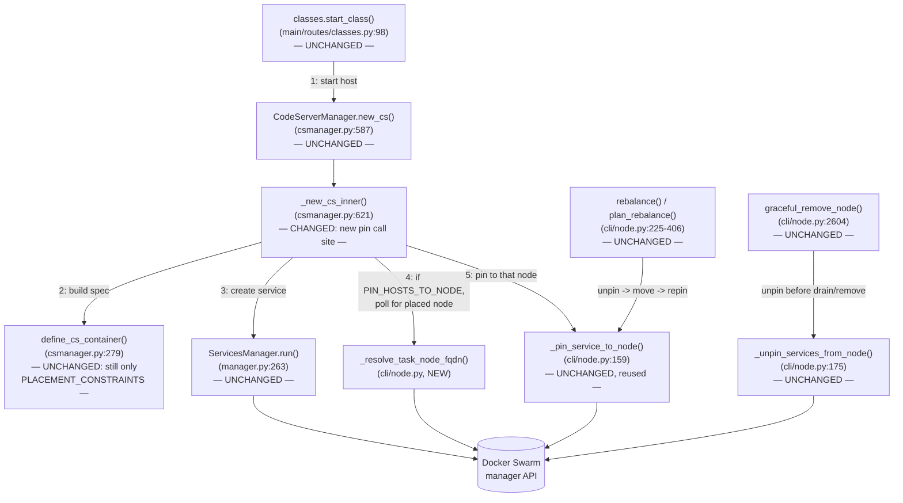
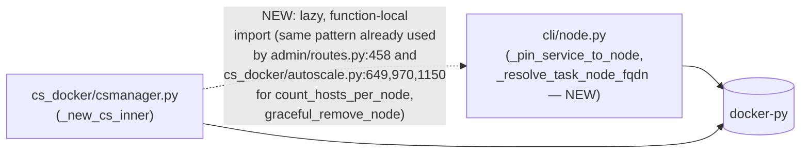

<!-- CLASI: Before changing code or making plans, review the SE process in CLAUDE.md -->

# Architecture Update -- Sprint 014: Pin codehosts to their node so Swarm never migrates them

## Step 1: Understand the Problem

**Incident, 2026-07-06.** Codehost services are created with
`constraints=["node.role==worker"]` (`config/{prod,local-prod}/public.env`'s
`PLACEMENT_CONSTRAINTS`, read in `define_cs_container()`,
`cspawn/cs_docker/csmanager.py:447-453`). This tells Swarm "any worker will
do" — forever, not just at creation. Swarm is therefore free to reschedule a
running host onto a different worker whenever it judges the current node
unhealthy (heartbeat timeout, overload, reboot). Every such reschedule
recreates the container, dropping that student's VNC/code-server session; a
node under real trouble can drop many hosts at once, which then land on and
overload a neighbour, cascading. That is exactly what happened: swarm2
overloaded, its ~14 hosts stampeded onto swarm4.

The fix is a hard per-service placement constraint,
`node.hostname==<node-fqdn>`, which Swarm cannot violate — a pinned host
either stays on its node or sits `Pending` until that node returns. This
mechanism already exists and is already proven in production: `node
rebalance` (`cspawn/cli/node.py:225-341`) uses `_pin_service_to_node()`
(`node.py:159-172`) to force a host onto a chosen target node, and node
removal/drain (`graceful_remove_node`, `node.py:2604-2710`) already calls
`_unpin_services_from_node()` (`node.py:175-214`) first so a pinned host is
never left orphaned when its node is deliberately retired. **This sprint's
job is to make every *newly created* codehost carry that same
`node.hostname==` constraint from the moment it starts** — not to invent a
new pinning mechanism.

**The design fork — DECIDED.** The one design question this sprint had to
settle was *when* the target node is decided:

- **A — decide the node before creating the service.** The spawner picks
  the node itself (some capacity/least-loaded selection) and creates the
  service already carrying `node.hostname==<node>`. No post-create restart.
- **B — let Swarm place it, then pin where it landed.** Create with today's
  `node.role==worker` constraint (unchanged), read back which node Swarm's
  own scheduler assigned the task to, then call the existing
  `_pin_service_to_node()` against that node. One extra Swarm-triggered
  task reschedule immediately after creation (container recreates on the
  *same* node it already started on).

**Approach B is the confirmed decision**, recorded in the linked issue
(`clasi/issues/pin-codehosts-to-node-no-migration.md`, "DECISION
(2026-07-08): Approach B — let Swarm place, then pin") and reconfirmed by
the team-lead for this planning pass. It is not reopened in this document.
Steps 2-5 specify B's design in full. A's evaluation and why it was not
chosen is preserved below in the Design Rationale (Step 6) in enough detail
that a future sprint could revisit it as an optimization, but it is not a
live decision here.

**Where the host is created.** `CodeServerManager._new_cs_inner()`
(`csmanager.py:621-711`), called from `CodeServerManager.new_cs()`
(`csmanager.py:587-607`), which is called synchronously from
`main.routes.classes.start_class` (`cspawn/main/routes/classes.py:98`,
`s, ch = ca.csm.new_cs(user=current_user, proto=proto, class_=class_)`) —
the Flask request handler behind "Start" (UC-003). Inside `_new_cs_inner`,
the service is created at `s: CSMService = self.run(**container_def)`
(`csmanager.py:668`). That line is the precise insertion point for B's
post-create pin step.

**Explicitly out of scope:** capacity/tier policy itself (already a
separate, improved concern — see `new-node-cold-image-pull-503-herd`),
retroactively pinning hosts that already exist before this sprint ships
(they get pinned the next time they're recreated or explicitly
rebalanced — see Migration Concerns), and any change to
`_pin_service_to_node`, `_unpin_services_from_node`, `_service_constraints`,
`plan_rebalance`, `rebalance`, or `graceful_remove_node` — all four are
reused completely unchanged.

## Step 2: Identify Responsibilities

| Responsibility | Belongs To | Change |
|---|---|---|
| Decide *whether* new-host pinning is active for this deployment | `CodeServerManager._new_cs_inner()` (`csmanager.py`) | **New** — reads `PIN_HOSTS_TO_NODE` config (default on), same `getattr(config, ..., default)` idiom already used for `PLACEMENT_CONSTRAINTS` |
| Discover which node Swarm assigned a just-created service's task to | `_resolve_task_node_fqdn()` (new, `cli/node.py`) | **New** — bounded poll of the raw docker-py service's `.tasks()` for a `NodeID`, then resolves it to a hostname via `client.nodes.get(node_id)` |
| Apply a hard `node.hostname==` constraint to a service | `_pin_service_to_node()` (`cli/node.py:159`) | **Unchanged** — reused exactly as `rebalance()` already uses it |
| Strip a node's pins so it is never orphaned on removal/drain | `_unpin_services_from_node()` (`cli/node.py:175`), `graceful_remove_node()` (`cli/node.py:2604`) | **Unchanged** — already runs unpin-before-drain/remove; this sprint adds confirming test coverage only |
| Relocate hosts across nodes, replacing whatever pin (if any) a host has | `plan_rebalance()`, `rebalance()` (`cli/node.py:225-406`) | **Unchanged** — already reads live placement and calls `_pin_service_to_node()` generically; this sprint adds confirming test coverage only |
| Record which node a new host landed on, immediately (not just after the next `sync()`) | `CodeHost` row population in `_new_cs_inner()` (`csmanager.py:687-708`) | **Changed** — `node_name` set from the resolved fqdn at creation time instead of staying `None` until a later sync |

These are two small, tightly related additions (one new helper function in
`cli/node.py`'s existing "Shared helpers" section, and one new call site plus
one field assignment in `csmanager.py`), not a new module. Everything else
in the "must-handle" list (config toggle default, drain/remove safety,
rebalance compatibility, idempotency, codehost-only scope) is already
satisfied by existing, unchanged code — confirmed with reasoning and test
obligations in Steps 3-5.

## Step 3: Define Subsystems and Modules

### M1 — New-host placement pin (`cspawn/cs_docker/csmanager.py`, `cspawn/cli/node.py`)

**Purpose:** Give every newly created codehost a hard, node-specific
placement constraint before its first student ever connects.

**Boundary:** Inside — the new `_resolve_task_node_fqdn()` helper in
`cli/node.py`; the new call site in `_new_cs_inner()` (a lazy,
function-local import of `_pin_service_to_node` and
`_resolve_task_node_fqdn` from `cspawn.cli.node`, guarded by the
`PIN_HOSTS_TO_NODE` config flag); the `CodeHost.node_name` early-population
change. Outside — `define_cs_container()` (completely untouched: it still
only ever sets `PLACEMENT_CONSTRAINTS`, i.e. `node.role==worker`; the pin is
layered on *after* creation, not baked into the container spec builder),
`_pin_service_to_node()` / `_service_constraints()` (reused, zero changes),
`ServicesManager.run()` (unchanged — it already forwards whatever
`constraints` it's given).

**Use cases served:** SUC-001, SUC-002, SUC-005.

### M2 — Node lifecycle already handles pinned hosts correctly (`cspawn/cli/node.py`, no code change)

**Purpose:** Confirm — with tests, not new code — that a codehost pinned by
M1 is (a) unpinned before its node is deliberately drained/removed, and (b)
correctly relocated by `node rebalance`.

**Boundary:** Inside — new test coverage only, in the style of
`test/test_node_unpin.py` and `test/test_node_rebalance.py`. Outside —
`_unpin_services_from_node`, `graceful_remove_node`, `plan_rebalance`,
`rebalance` themselves (all unchanged; see Step 6 for why no behavior change
is needed here).

**Use cases served:** SUC-003, SUC-004.

M1 and M2 are independent: M2's tests would pass against a hand-built
pinned-service fixture even if M1 never shipped (they test *existing*
unpin/rebalance code against "a service with a `node.hostname==` pin," which
is exactly what M1 produces, but M2 doesn't depend on M1's code to exist —
only on its *output shape*).

## Step 4: Diagrams

### Component diagram



### Dependency graph



No cycle: `cli/node.py` has no import of `cspawn.cs_docker.csmanager`
anywhere (confirmed by search), so `csmanager.py` depending on `cli/node.py`
is a one-directional edge. It is also not a *new kind* of edge for this
codebase — `cspawn/admin/routes.py:458` and `cspawn/cs_docker/autoscale.py`
(lines 649, 970, 1150) already do exactly this: a lazy, function-local
`from cspawn.cli.node import count_hosts_per_node` /
`graceful_remove_node` from app-layer code, specifically to avoid paying
`cli/node.py`'s module-level `click`/`digitalocean`/`paramiko` import cost
at Flask start-up. This sprint's new call follows that same established
convention rather than inventing a different one (see Step 6). No
entity-relationship diagram: no schema change (`CodeHost.node_id`/
`node_name` already exist; this sprint only changes *when* `node_name` gets
set, not the schema).

## Step 5: Complete the Document

### What Changed

**`cspawn/cli/node.py`** (new addition to the existing "Shared helpers"
section, alongside `_pin_service_to_node`/`_unpin_services_from_node`/
`_service_constraints` — same responsibility group, same place)

- **New:** `_resolve_task_node_fqdn(client, service, *, timeout=10.0, poll_interval=0.5, log=None) -> str | None`.
  `service` is the raw docker-py `Service` object (i.e. `CSMService.o`, per
  `cs_docker/proc.py:36`). Polls `service.tasks()` — not
  `container_tasks`/`containers`, which only surface a task once it has a
  *container*; a `NodeID` is assigned at scheduling time, well before the
  container starts, and pinning should happen as early as possible — for a
  task with a top-level `NodeID` key (`t.get("NodeID")`, the same field
  `count_hosts_per_node()` and `container_tasks` already read — it is a
  sibling of `Status`/`Spec` on the task dict, not nested inside `Status`).
  Once found, resolves it via
  `client.nodes.get(node_id).attrs["Description"]["Hostname"]` (the exact
  hostname string `_pin_service_to_node`/`_unpin_services_from_node` already
  expect and normalize). Returns `None`, logging a WARNING, if no task gets
  a `NodeID` within `timeout` — this is a bounded, best-effort lookup, never
  a hard failure. Never raises.

**`cspawn/cs_docker/csmanager.py`**

- **Changed:** `_new_cs_inner()` (`csmanager.py:621-711`), immediately
  after `s: CSMService = self.run(**container_def)` succeeds
  (`csmanager.py:668`), gains:

  ```python
  s: CSMService = self.run(**container_def)
  node_fqdn = None
  if _truthy(getattr(self.config, "PIN_HOSTS_TO_NODE", True)):
      try:
          from cspawn.cli.node import _pin_service_to_node, _resolve_task_node_fqdn
          node_fqdn = _resolve_task_node_fqdn(self.client, s.o, log=logger)
          if node_fqdn:
              _pin_service_to_node(s.o, node_fqdn)
          else:
              logger.warning("Could not resolve placement node for %s in time; host not pinned", username)
      except Exception as e:
          logger.warning("Failed to pin new host %s to its node: %s", username, e)
  ```

  This whole block is inside the *existing* `try:` that also catches
  `docker.errors.APIError` for the 409-already-exists case
  (`csmanager.py:666-684`) — safe only because it swallows every exception
  itself (the bare `except Exception` above); it must never let an
  exception escape into the surrounding `except docker.errors.APIError`
  handler, which exists solely for `self.run()`'s own errors and would
  misinterpret a pin failure as "service already exists." This is a
  deliberate, load-bearing detail, not an oversight (see Step 6).

  The 409-recovery branch (`csmanager.py:670-680`, which returns an
  *existing* service found via `_get_by_username_raw` without ever calling
  `self.run()`) deliberately does **not** run this block. That service's
  actual creator (the request that won the race) already ran it, or is
  about to; re-pinning here would just trigger a second, redundant
  Swarm reschedule of a host that's already pinned.

- **Changed:** the `CodeHost` row built at `csmanager.py:687-708` gets
  `node_name = node_fqdn` (when resolved) instead of leaving it `None` until
  the next `sync()`/`to_model()` container resolution. Free, since we
  already have the value in hand; makes the admin roster (UC-005) show the
  correct node immediately instead of blank until the next sync pass.

- **New (small, local):** a `_truthy(value, default)` helper (or inlined
  equivalent), mirroring `cs_docker/autoscale.py`'s existing `_cfg_bool()`
  idiom (`"true"/"1"/"yes"` → `True`) — duplicated rather than imported from
  `autoscale.py`, for the same reason M1 doesn't import from
  `autoscale.py`: that module is far heavier (DB-backed cooldown state,
  tier config) than the five-line boolean parse warrants pulling in.

**Config**

- **New key:** `PIN_HOSTS_TO_NODE` (bool, default `true`). Undocumented in
  `config/*/public.env` today is fine — `getattr(config, ..., True)` means
  omission is the "on" (recommended) state; an operator sets it to `false`
  in a deployment's `public.env` to fully restore today's behavior
  (`node.role==worker` only, Swarm free to migrate).
- **New key (tunable):** `PIN_HOST_PLACEMENT_TIMEOUT_S` (float, default
  `10.0`), forwarded to `_resolve_task_node_fqdn`'s `timeout`. Flagged as a
  placeholder default in Step 7 — not measured against real Swarm scheduling
  latency yet.

**No changes** to `_pin_service_to_node`, `_unpin_services_from_node`,
`_service_constraints`, `plan_rebalance`, `rebalance`, `graceful_remove_node`,
`define_cs_container`, `ServicesManager.run`, or the `CodeHost` schema.

### Why

Restated from Step 1: an unbounded `node.role==worker` constraint lets Swarm
migrate a running host at any time, and a node in trouble can cascade that
migration onto its neighbours. A `node.hostname==` constraint is the
existing, already-proven mechanism to prevent that (rebalance and
remove/drain already use it); this sprint's only job is to apply it at
create time too. Approach B (pin-after-placement) was chosen over Approach
A (pin-before-placement) because it reuses Swarm's own scheduler — which is
already atomic, resource-aware, and battle-tested — instead of re-deriving a
parallel, race-prone version of it inside the request path (full reasoning
in Step 6).

### Impact on Existing Components

| Component | Impact |
|---|---|
| `define_cs_container()` | **None.** Still only ever sets `PLACEMENT_CONSTRAINTS` (`node.role==worker`); the pin is layered on after `run()`, in a different function. |
| `ServicesManager.run()` | **None.** Already forwards any `constraints` kwarg; this sprint never passes one at create time for B. |
| `_pin_service_to_node`, `_unpin_services_from_node`, `_service_constraints` | **None.** Reused exactly as `rebalance()`/`graceful_remove_node()` already call them. Their existing normalization (replace, don't accumulate, any prior `node.hostname==`) is exactly what makes repeated/idempotent host-start calls safe. |
| `graceful_remove_node()` / node drain / `node stop` | **None** in behavior. A create-time-pinned host is unpinned by the same `_unpin_services_from_node()` call that already runs before drain/remove — confirmed by reading `node.py:2681` (unpin runs unconditionally, before the `if node_obj:` branch at `node.py:2683`, regardless of whether the pin came from `rebalance` or from this sprint's new create-time path). New test coverage only. |
| `rebalance()` / `plan_rebalance()` | **None.** Live placement is read from `svc.tasks()` at call time regardless of any existing constraint, and `_pin_service_to_node()` already replaces whatever `node.hostname==` constraint is present. A fully-pinned fleet rebalances exactly like today's partially-pinned one. New test coverage only. |
| `CodeHost` model | No schema change. `node_name` is populated earlier (at create, not at next sync) for newly created hosts only; existing rows and their sync path are unaffected. |
| Flask app import graph | One new lazy, function-local import (`csmanager.py` → `cli.node`), matching the precedent already set by `admin/routes.py:458` and `cs_docker/autoscale.py` (lines 649, 970, 1150). No new top-level import, no new dependency in `pyproject.toml` (`click`, `paramiko`, `python-digitalocean` are already installed dependencies of this single package). |
| `test/test_node_unpin.py`, `test/test_node_labels.py`, `test/test_admin_nodes_routes.py` | No change required to existing tests — none of them assert on `csmanager.py`'s creation path. New tests are additive (Tickets 2 and 3, proposed below). |
| Host/stop tests (`test/test_node_missing.py` and siblings covering `_new_cs_inner`) | Need new mocks for the pin call site (mirroring how `test_autoscale.py` mocks `cli.node.*` helpers) so existing create-path tests aren't broken by the new (default-on) pin attempt reaching real Docker. |

### Migration Concerns

- **No database migration.** `CodeHost.node_id`/`node_name` already exist.
- **Existing (already-running) hosts are not retroactively pinned.** A host
  created before this sprint ships keeps its original
  `node.role==worker`-only constraint until it is next recreated (stopped
  and started again) or explicitly moved by `node rebalance` (which pins
  wherever it relocates it to). This sprint does not add a one-time backfill
  migration to pin the existing fleet — flagged as an explicit open question
  in Step 7, not a silent gap.
- **Deploy sequencing:** none required. `PIN_HOSTS_TO_NODE` defaults on, so
  the very next code-server host started after this sprint's image deploys
  is pinned; no config change is required in `config/{prod,local-prod}/
  public.env` to activate it (an operator who wants the old behavior back
  sets `PIN_HOSTS_TO_NODE=false` there).
- **Reversible in one config edit, no restart-order dependency** — setting
  the flag off stops new pins immediately; it does not retroactively unpin
  already-pinned hosts (those still need `node rebalance` or a
  stop/restart to shed their pin, exactly as today's rebalance-created pins
  behave).

## Step 6: Document Design Rationale

### Decision: Recommend Approach B (pin after Swarm places it) over Approach A (spawner picks the node up-front)

**Context:** Both approaches end at the same place — a codehost service
with a `node.hostname==<node>` constraint. They differ only in whether the
spawner or Swarm decides *which* node, and therefore in how much new
selection logic this sprint must write and keep correct.

**Alternatives considered:**

1. **Approach A.** At host-start, the spawner would need its own node
   selection: list eligible workers (worker role, active availability —
   `rebalance()`'s existing `eligible` computation, `node.py:252-265`),
   read current load (`count_hosts_per_node()`, `node.py:53-84`), and pick
   one. Two problems surfaced by actually reading the reuse candidates,
   not just assuming they exist:

   - **`plan_rebalance()`/`rebalance()` do *not*, in fact, already do
     "capacity-aware selection."** They level *raw host counts* across
     eligible nodes — nothing in `plan_rebalance` (`node.py:342-406`) reads
     `cs.capacity` at all. The only code that actually knows about
     per-node `cs.capacity` and "how full is full" is
     `cspawn/cs_docker/autoscale.py` (`capacity_for_node` at line 201,
     the `NodeView`/`ClusterState` dataclasses at lines 112-143, and the
     `assess_cluster()` builder at line 224), a materially larger, stateful module (DB-backed
     cooldown state, tier config, its own scale-up/down decision logic)
     built for a periodic control loop, not a per-request node picker. A
     faithful "capacity-aware" Approach A would need to pull that module
     (or reimplement a slice of it) into the synchronous host-creation
     request path — a much bigger, riskier piece of new code than the
     issue's framing ("reuse the rebalance path's capacity-aware
     selection") suggests, because that selection doesn't actually exist
     at the rebalance layer.
   - **A client-side "read count, pick min, create" selection is not
     atomic across concurrent requests.** `count_hosts_per_node()` is a
     point-in-time read; nothing serializes "read → decide → create"
     across two Flask request threads. `new_cs()`'s own semaphore
     (`self._docker_sem`, `csmanager.py:512`) bounds concurrent
     Docker/SSH calls (default concurrency 4) — it does **not** serialize
     node-selection decisions, so up to 4 concurrent host-starts could all
     read "node X is least loaded" and all pick node X. This is not a
     theoretical edge case for this codebase: UC-007's own load test
     starts hosts "for all 20 students in parallel," and the actual
     2026-07-06 incident happened at exactly the many-students-at-once
     moment a class starts. Swarm's real scheduler avoids this because
     task placement is a single, serialized decision inside the manager's
     own raft-backed state; an app-side re-derivation of "least loaded"
     does not get that for free and would need its own new lock — adding
     complexity and a new failure mode (lock contention/deadlock risk)
     that doesn't exist today.
   - Additionally, `count_hosts_per_node()` only counts `jtl.codeserver`
     tasks — a narrower view of "load" than Swarm's own scheduler (which
     weighs all services/reservations on a node). Approach A's placement
     would systematically diverge from Swarm's actual spread behavior for
     any node running other services.
   - "All nodes full" handling would also be a genuinely new decision for
     Approach A (refuse the start? place anyway and let the node get
     overloaded, same as today?) — not something that falls out of reuse.

2. **Approach B (chosen).** Let `services.create()` (unchanged
   `node.role==worker` constraint) place the task exactly as it does today
   — atomically, resource-aware, inside Swarm's own manager, immune to the
   client-side race described above — then read back *where it actually
   landed* (`_resolve_task_node_fqdn`, new, ~15 lines) and pin it there with
   the existing, already-tested `_pin_service_to_node`. "All nodes full"
   is not a new decision: Swarm still does whatever it does today (task
   sits pending if genuinely nothing is schedulable) — completely
   unchanged, zero new code.

**Choice:** B.

**Consequences:** Every new host takes one extra Swarm-triggered task
reschedule immediately after creation (the same mechanism `rebalance()`
already relies on and has been used in production for since sprint 008) —
a brief container recreate on the *same* node it just started on, before
the student's first `is_ready` poll typically resolves. Because
`_pin_service_to_node`'s constraint targets the exact node the task is
already running on, and that node was, by definition, schedulable a moment
ago, the reschedule lands back on the same node in the overwhelming
majority of cases; the only failure window is the same node becoming
unavailable in the split second between "read its NodeID" and "call
update()" — an accepted, extremely narrow edge case, not designed around
further in this sprint (see Step 7). If a future sprint wants Approach A
specifically to eliminate this one restart, this section's alternatives
list is the starting point — including the finding that it would first
need to import `autoscale.py`'s capacity model and add a new
node-selection lock, not just reuse `rebalance()`.

### Decision: Reuse `_pin_service_to_node` via a lazy, function-local import from `cspawn.cli.node`, not a new shared module

**Context:** `_pin_service_to_node` lives in `cspawn/cli/node.py`, a CLI/ops
module with heavy module-level imports (`click`, `digitalocean`,
`paramiko`). `csmanager.py` is on the Flask request path (every "Start"
click). A textbook layering read (`[Presentation] → [Domain] → [Infra]`)
would flag a domain module importing a CLI-tooling module as backwards.

**Alternatives considered:**

1. Extract `_service_constraints`/`_pin_service_to_node`/
   `_unpin_services_from_node` into a new, dependency-light module (e.g.
   `cspawn/cs_docker/placement.py`) that both `cli/node.py` and
   `csmanager.py` import, restoring "clean" layering. Rejected: this
   codebase already has an established, working precedent for exactly this
   situation — `cspawn/admin/routes.py:458` and
   `cspawn/cs_docker/autoscale.py` (lines 649, 970, 1150) already do a
   lazy, function-local `from cspawn.cli.node import count_hosts_per_node`
   / `graceful_remove_node` from app-layer code, specifically to defer
   `cli/node.py`'s heavier imports past Flask start-up. Introducing a
   second, different pattern for the same problem this sprint (a new
   module) is more code, more risk, and inconsistent with the codebase's
   own convention, for a purity gain the codebase has already decided not
   to insist on elsewhere.
2. Duplicate `_pin_service_to_node`'s ~10 lines directly inside
   `csmanager.py`. Rejected outright — the issue is explicit ("reuse, do
   NOT reinvent"), and duplication is exactly the drift risk this
   architecture's own principles warn against (two copies of "how to set a
   node pin" to keep in sync).
3. Lazy, function-local import from `cli.node`, matching the existing
   `admin/routes.py`/`autoscale.py` convention — chosen.

**Choice:** 3.

**Consequences:** `csmanager.py` gains one new cross-package dependency
edge, but it is a *lazy* one (deferred to first call, not paid at Flask
start-up) and structurally identical to two edges that already exist
elsewhere in this codebase. No new module, no new test-patching surface
beyond what `test_autoscale.py` already demonstrates for this exact
pattern.

### Decision: The new pin block must catch all its own exceptions

**Context:** The natural insertion point — right after
`s: CSMService = self.run(**container_def)` — sits inside the `try:` whose
`except docker.errors.APIError` exists solely to catch `self.run()`'s own
409-already-exists error (`csmanager.py:670-684`). If the new pin code
raised an uncaught `docker.errors.APIError` (e.g. from `svc.update()`
inside `_pin_service_to_node`), it would be misrouted into that 409-recovery
branch — a confusing failure mode unrelated to the actual problem.

**Alternatives considered:**

1. Wrap the whole block in its own `try/except Exception` that only logs a
   WARNING — chosen. Matches this codebase's existing best-effort posture
   for non-critical post-creation steps (`stop_host`'s push/stop/delete
   steps, `_prepull_images`, `_check_docker_staleness` all follow the same
   "log and continue" shape).
2. Move the pin call outside the existing `try/except`, after it fully
   resolves. Rejected: this would also require handling the 409-recovery
   branch's returned `s` (to decide "is this a fresh creation or a reused
   existing service" so the redundant-pin problem described in Step 5 is
   avoided) with an extra branch flag threaded through — more surface area
   for the same outcome as option 1, which already naturally lives only in
   the success path.

**Choice:** 1.

**Consequences:** Pin failures are always best-effort and visible only as a
WARNING log line — consistent with "never block host creation on a
best-effort step," but means an operator must watch logs (or a future
metrics/alerting ticket, out of scope here) to notice a host that didn't
get pinned.

### Decision: A deliberate node drain/removal unpins-and-lets-the-host-move; only *uncontrolled* node trouble leaves a pinned host `Pending`

**Context:** The sprint brief asks this sprint to "decide + document"
whether a drained-for-maintenance node's pinned hosts should unpin-and-move
or stay pending.

**Alternatives considered:**

1. Leave a pinned host `Pending` even during an operator-initiated,
   deliberate drain/remove (`node stop`/`graceful_remove_node`) — i.e.
   treat *all* node-goes-away events identically. Rejected: this is the
   wrong policy for a maintenance drain, whose entire purpose is to empty
   the node; leaving hosts stuck defeats the operator's own action, and
   there is no "uncontrolled failure" to protect against here.
2. Unpin before draining/removing, so Swarm is free to reschedule the
   now-unconstrained tasks elsewhere as part of the normal drain-triggered
   rescheduling — which is **already exactly what
   `graceful_remove_node()` does** (`node.py:2681`: `
   _unpin_services_from_node(...)` runs unconditionally, before the
   `_drain_swarm_node`/`_wait_node_tasks_drained`/`node_obj.remove` sequence
   (which starts at `node.py:2683`),
   regardless of whether the swarm-side node object was even found).
   Chosen — because it's already the codebase's behavior, not because this
   sprint is introducing it.

**Choice:** 2 (confirmed as existing behavior; not changed by this sprint).

**Consequences:** The distinction this sprint's pin actually protects is:
*uncontrolled* node trouble (heartbeat timeout, crash, overload — Swarm's
own health-driven rescheduling) → host stays put/`Pending`, no cascade;
*deliberate* operator maintenance (`node stop`, `node rm`) → host is
unpinned first and free to move, exactly as an operator draining a node for
maintenance would want. This needs a regression test (proposed Ticket 2)
proving a create-time-pinned host is unpinned by `graceful_remove_node`,
not new production code.

## Step 7: Flag Open Questions

1. **A vs. B — RESOLVED, not open.** Approach B is the confirmed decision
   (Step 1, Step 6); Steps 2-5 are written against B. Retained here only so
   a future revision has a pointer to Step 6's alternatives analysis if a
   later sprint wants to revisit A specifically to remove B's one
   post-create restart.
2. **Existing (pre-sprint) hosts are not retroactively pinned.** Is a
   one-time "pin every currently-running codehost to its current node"
   migration/CLI command wanted as a follow-up, or is "pinned on next
   natural recreate, or via `node rebalance`" acceptable? This document
   assumes the latter (no backfill in this sprint's scope) but flags it for
   confirmation.
3. **`PIN_HOST_PLACEMENT_TIMEOUT_S` default (10s) is a placeholder**, not
   measured against real Swarm task-assignment latency in this deployment.
   Likely to resolve in well under a second in practice (task `NodeID`
   assignment happens at scheduling time, before image pull/container
   start), but the ticket implementing this should treat the default as
   provisional.
4. **No louder-than-WARNING signal when a host fails to get pinned**
   (timeout, or `_pin_service_to_node` itself raising). There is currently
   no metric/alert surface for this — an operator would only discover an
   unpinned host by reading logs or by it later migrating during node
   trouble. Flagged as a residual operational gap, not a blocker.
5. **The pre-existing `csmanager.py → cli.node` layering question** (a
   domain/request-path module importing a CLI-tooling module, even lazily)
   is accepted in this sprint because it already matches established
   codebase convention (`admin/routes.py`, `autoscale.py`). A future sprint
   that wants to extract a genuinely shared, dependency-light "Swarm
   placement" module could address this and the two pre-existing call
   sites together — out of scope here to avoid unrelated churn.

## Implementation Tickets

Approach B is confirmed (Step 1), the architecture self-review verdict is
APPROVE (`architecture_review` gate recorded passed), and
`stakeholder_approval` was recorded 2026-07-08 (team-lead decisions: no
retroactive backfill; `PIN_HOST_PLACEMENT_TIMEOUT_S` default 10s;
`PIN_HOSTS_TO_NODE` default on; pin failure → WARNING, never blocks host
creation — all baked into the tickets below). Three tickets were created
via `create_ticket`, sequenced by dependency (001 first; 002 and 003 both
depend only on 001 and can run in either order relative to each other, but
are listed in the sprint's suggested execution order):

1. **Pin new codehosts to their placement node at creation** — the M1
   change in full: `_resolve_task_node_fqdn()` in `cli/node.py`, the new
   call site + `PIN_HOSTS_TO_NODE`/`PIN_HOST_PLACEMENT_TIMEOUT_S` config
   handling + early `node_name` population in `csmanager.py`'s
   `_new_cs_inner()`. Tests (mocked Docker client, matching
   `test_node_unpin.py`'s style): pin applied when enabled; skipped when
   disabled; best-effort no-crash on resolve-timeout and on
   `_pin_service_to_node` raising; not re-applied on the 409-recovery path;
   idempotent across a retried start; and a mocked-Swarm regression proving
   a pinned service's task is not reassigned when another node's
   availability changes (SUC-002). No dependencies.
2. **Confirm node remove/drain never orphans a create-time-pinned host** —
   regression tests proving `graceful_remove_node`/`_unpin_services_from_node`
   correctly unpin a host pinned by Ticket 1's new path (not just
   rebalance-set pins), plus doc note capturing the Step 6 "deliberate
   drain unpins-and-moves" policy. No production code change expected.
   Depends on Ticket 1.
3. **Confirm `node rebalance` still relocates a create-time-pinned host** —
   regression test running `rebalance()`/`plan_rebalance()` against a fleet
   where every host was pinned via Ticket 1's path, proving unpin→move→repin
   still works with no accumulation of constraints. No production code
   change expected. Depends on Ticket 1.

Full acceptance criteria and implementation plans live in
`tickets/001-pin-new-codehosts-to-their-placement-node-at-creation.md`,
`tickets/002-confirm-node-remove-drain-never-orphans-a-create-time-pinned-host.md`,
and `tickets/003-confirm-node-rebalance-still-relocates-a-create-time-pinned-host.md`
(all `status: open`).
